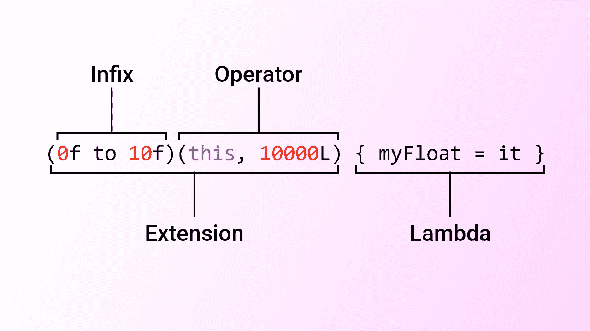

# 神级科特林函数

> 原文：<https://medium.com/codex/the-god-level-kotlin-function-e287a0df8bed?source=collection_archive---------1----------------------->

## 中缀、扩展、运算符和 Lambda 函数

去年，我为一家公司编写了一个自定义视图，我制作了**神级函数**，在这里你可以使用 Kotlin 给我们的每一种类型的函数。为了更好地理解本文，有一个小的先决条件——您应该知道如何在自定义视图中动态显示值。如果你不知道这个话题，你可以浏览一下我几天前发表的这篇文章:

[](/codex/the-math-required-for-android-development-558c706aa97) [## Android 开发所需的数学知识

### 轻松掌握 Android 中复杂的用户界面

medium.com](/codex/the-math-required-for-android-development-558c706aa97) 

[Adrien Converse](https://unsplash.com/@adrienconverse?utm_source=medium&utm_medium=referral) 在 [Unsplash](https://unsplash.com?utm_source=medium&utm_medium=referral) 上拍摄的照片

Kotlin 引入了许多不同类型的函数:

1.  中缀函数
2.  扩展功能
3.  λ函数
4.  操作员功能

还有更多…

我想告诉 to 我是如何设法在一行中使用所有这 4 个函数**的。**

# 介绍

我需要在自定义视图中显示值，所以我使用了`ValueAnimator`类来实现。

这将使用 Accelerate Deaccelerate 插值器在 10 秒内使`myFloat`的值从 0 变为 10(我将很快发表一篇关于插值器的有趣文章)。

随着这个自定义视图的复杂性增加，我厌倦了一次又一次地编写相同的代码。我需要提取通用代码。

# 显色法

我需要两个值:起始值和结束值。因为我和 Kotlin 有过广泛的合作，我知道`Pair<Float, Float>`将是拥有这两种价值观的完美的类。作为加分项，扩展中缀函数`to`使得代码可读。

```
**infix fun** <A, B> A.*to*(that: B): [Pair](https://kotlinlang.org/api/latest/jvm/stdlib/kotlin/-pair/index.html)<A, B> {
  **return** Pair(**this**, that)
}
```

好的，现在我有了一个看起来像`0f to 10f`的东西；但是这并没有做任何事情；它只创建了一个对象。我可以使用`invoke`操作符函数来运行一些我想要的代码。这个`invoke`操作函数必须存在于`Pair`对象上，动画才能工作。因此，一个扩展函数。

所以现在我们有了一个`Pair`对象的扩展函数，它是一个操作函数`invoke`。因此，如果我运行代码`(0f to 10f)()`，这个函数将执行，从而启动动画。

这是我正在开发的自定义视图。我需要视图的实例来调用`invalidate`函数来重画画布。此外，我们需要这个动画的持续时间和插值。我把这些加到了我的函数参数里。此外，我还需要一个回调函数来更新我想要更新的变量的值；这需要一个 Lambda 函数

最后，我得到了我需要的一切。使用它，我发现我在一行中使用了 4 种不同类型的函数**！**



我的神级功能

# 结论

Kotlin 为您提供了无与伦比的灵活性。如何将一大段样板代码简化为一行代码，使其读起来像英语一样容易理解，这一点非常突出。

我希望你喜欢读我的文章，并学到了一些东西。谢谢大家！✌️

```
**Want to connect?**My [GitHub](https://github.com/cybercoder-naj) profile.
My [Portfolio](https://cybercoder-naj.github.io) website.
```