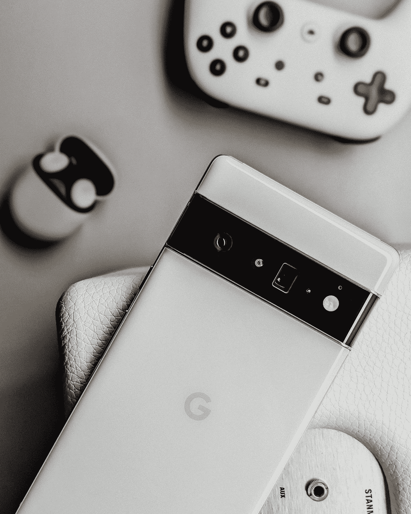

# 915 字的谷歌 Pixel 6 Pro

> 原文：<https://medium.com/codex/the-google-pixel-6-pro-in-915-words-3ed80b4c42bb?source=collection_archive---------6----------------------->

像素排列的正偏差。

照片由 [Unsplash](https://unsplash.com?utm_source=medium&utm_medium=referral) 上的 [Triyansh Gill](https://unsplash.com/@triyansh?utm_source=medium&utm_medium=referral) 拍摄

我的第一部安卓手机是第一部谷歌 Pixel，要追溯到 2016 年 10 月。我喜欢接触最新的技术，所以当需要更换我的华为 P20 时，我几乎可以肯定我会在 Pixel 6 或其 Pro 发布时接触到它。

尽管看了其他选择，如三星的 Galaxy S21 Ultra 和华为的华丽 Mi 11 Ultra，但当 Pixel 6 发布日到来时，我几乎立即预订了我的 Pixel 6 Pro。它不仅比 849 英镑的竞争对手便宜得多，而且它还配备了一个看起来很棒的相机系统，并自带功能丰富的 Android 12。

## 设计

当我看着我的新手机时，我想到的第一个词是“分裂”。就我个人而言，我是谷歌选择的相机护目镜的粉丝。这与标准相去甚远，但它消除了你现在几乎在其他手机上看到的温和的小黑圈。

然而，我明白为什么有些人不是粉丝了。与更传统的摄像头凸起相比，遮阳板在手机背面占据的面积要大得多，而且不一定那么光滑。

也许我很奇怪——毕竟我选择了“有点阳光”的颜色——但我真的很喜欢这款手机的外观。抛光铝在灯光下闪闪发光，手机四周如此光滑，当你拿着它时，几乎感觉它融化在你的手中。

## 显示

所有你需要知道的是，这是一个非常旗舰品质的显示器。它拥有我们所期望的顶级手机的所有功能，并且看起来充满活力和清新。太惊艳了。

6 Pro 配备了 6.7 英寸的“光滑显示屏”，由康宁大猩猩玻璃 Victus 制成。自然，这是一个有机发光二极管屏幕，能够达到 120 赫兹的刷新率，但当不需要节省电池时，可以降至 10 赫兹。

## 照相机

作者照片。

尽管到目前为止我对谷歌 Pixel 6 Pro 的其他方面赞不绝口，但摄像头是这款手机最闪耀的地方。Pixel 手机一直位于智能手机相机排行榜的榜首，但 Pixel 6 和 6 Pro 确实将这一点提升到了一个新的水平。

这款手机配备了一个 50MP 主摄像头，一个 40MP 长焦镜头和一个 114°视野的 12MP 超宽摄像头。当然，镜头和传感器本身是非常强大的硬件，但相机真正的亮点是谷歌张量驱动的后处理。

作者照片。

如果你拍了一张照片，然后立即在图库中查看，大约一秒钟后你会发现照片质量突然大幅提高，这都归功于 Android 12 相机应用程序中的时髦算法。

弱光表现也很好，app 有所有常用的拍照模式。我还没有太多机会尝试新的运动模式，所以也许可以在 Twitter 或 Instagram 上关注我，看看它们何时出现😉

作者照片。

## 性能和电池寿命

Pixel 6 系列中最受关注的功能之一是谷歌开发了自己的内部处理器，名为“张量”。我没有任何旗舰骁龙处理器与之比较，但它肯定感觉足够快，我从来没有注意到任何性能问题。由处理器中的专用芯片支持的谷歌的设备上 AI/ML 也工作得非常好，即使在离线时也可以进行准确的字幕和翻译。

电池可以持续一整天，我不会整夜给手机充电，而是选择在早上醒来时给手机充 70-80%的电。我可以用谷歌的 30W 快速充电器在大约 20 分钟内做到这一点(尽管手机[在任何给定时间](https://www.gsmarena.com/google_clarifies_pixel_6_series_can_charge_at_up_to_23w_speeds-news-51894.php)只使用 23W)。

## 软件

Android 12 很棒。我真的很喜欢它。定制选项太棒了，这是我用过的第一个操作系统，真的感觉…很有趣！这种设计风格让你感觉好像住在充气城堡里，我对它爱不释手。

正如我前面提到的，手机感觉很快，我没有发现任何明显的变慢。然而，我确实对这款手机有一个*的主要*不满——它处理固件更新的方式。我的 Pixel 6 Pro 有时会…重启。公平地说，当我不活跃地使用电话时，它会这样做，并且它会很快重启，但当我错过通知时，它会变得很烦人，因为网络服务在重启后被禁用。这并不经常发生，但仍然足以让我紧张。

## 声音

电话上的扬声器没问题。它们没什么特别的，但是音量越大听起来越好，而且大多数人都会使用蓝牙耳机来观看视频或音频内容。

## 总之…

我很高兴我对 Pixel 6 Pro 做出的选择。与我的其他选择相比，我在手机上节省了一大笔钱，它使用起来很棒，对于任何花费大量时间消费各种形式内容的人来说都是完美的，从阅读新闻到 120fps 的游戏。

我强烈推荐这款手机，如果你已经被这篇文章说服，你可以从这里购买你自己的手机:

 [## Pixel 6 Pro

### 新的像素相机系统利用张量的强大处理和先进的机器学习来应用下一个时代…

store.google.com](https://store.google.com/product/pixel_6_pro?hl=en-GB) 

这就是这篇文章的全部内容，但是如果你喜欢，请随时关注我的 Medium 或我的其他社交网站。我喜欢谈论技术和编程，所以如果你对此感兴趣，我的链接在下面！

 [## 艾萨克·哈里斯-霍尔特培养基

### Quiffen 包的基本概述，以及如果您曾经试图完成一个数据科学项目，它为什么如此有用…

isaacharrisholt.medium.com](https://isaacharrisholt.medium.com/)  [## JavaScript 不可用。

### 编辑描述

twitter.com](https://twitter.com/IsaacVaughan_) 

[https://www.instagram.com/isaac_vaughan_/](https://www.instagram.com/isaac_vaughan_/)

 [## 艾萨克·沃恩

### 嗨，我是艾萨克·沃恩。我是一个英国的书呆子，流和网页设计师，对所有的技术都充满热情。关于这一点…

www.youtube.com](https://www.youtube.com/IsaacVaughan)