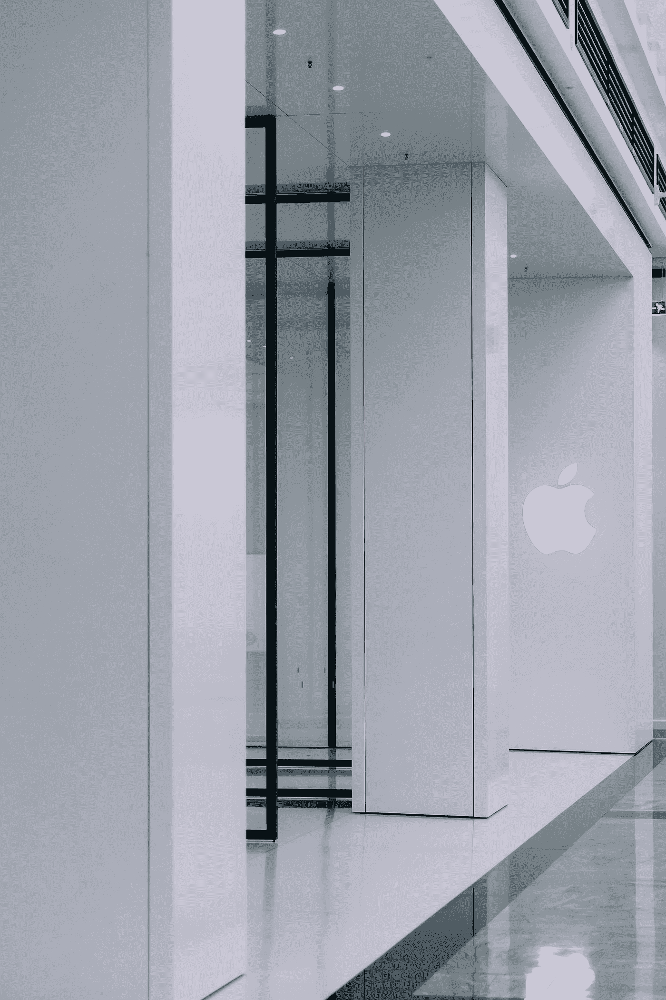

# 政府要控制苹果了！

> 原文：<https://medium.com/codex/the-government-is-trying-to-control-apple-f92f123a6186?source=collection_archive---------4----------------------->

照片由 [Sumudu Mohottige](https://unsplash.com/@stm_2790?utm_source=medium&utm_medium=referral) 在 [Unsplash](https://unsplash.com?utm_source=medium&utm_medium=referral) 上拍摄

# 介绍

**政府**正在对 **iPhone 进行一些控制，他的改变可能会影响你的**安全、**你的**隐私、**这种改变可能会影响你和你的家人和朋友。**

如果你想找到答案，那就留下来继续吧！

# 问题是

“美国参议院司法委员会”(满嘴都是)批准了另一项反垄断法案，“**开放应用市场法案”，TLDR** 侧加载将在 **IOS 上可用。**

虽然还不是官方的，但它确实使这一结果不可避免地被签署为法律，所以当 **iPhone 14** 问世时**苹果**将被迫允许第三方应用商店或第三方应用从**苹果之外安装。**

[张凯夫](https://unsplash.com/@zhangkaiyv?utm_source=medium&utm_medium=referral)在 [Unsplash](https://unsplash.com?utm_source=medium&utm_medium=referral) 上的照片

# 隐私和安全

如果应用程序不需要通过应用程序商店提供的“**停止并搜索**”，这意味着大多数不像你我这样懂技术的人在试图赢得免费刮刮卡时，可能会在他们的手机上发现六七个漏洞和病毒。

这对苹果公司来说是一个巨大的问题，因为这将最终摧毁苹果公司辛辛苦苦建立起来的品牌声誉。

# 重温 iPhone 14

多年来，iPhone 经历了一些独特的设计，从 **Pro** 到 **Max** ，一直到 **mini，**，但看起来苹果将再次净化其阵容。

即将推出的阵容将包括两款**Base**model 和两款**Pro**model，其中**Base**model 将采用 **6.1 英寸和 6.7 英寸**显示屏，而 **Pro 的**也将采用 **6.1 英寸和 6.7 英寸**显示屏。

好吧，如果你还不知道，看起来粉丝们喜欢的 iPhone mini 将被放在砧板上，这是有道理的，因为它只占苹果利润的不到 10%。

# 药丸冲头

为了记录，我们之前说的关于打孔的一切都是正确的， **Face ID** 技术将位于屏幕下方，而面向地面的相机将在屏幕上方出现，但现在来自 **DylanDKT (77.5%准确)**的报道表明，打孔将呈**丸状**形状。

现在，这些渲染与来自**约翰·普罗瑟(73.9%准确)**的渲染相矛盾，但不要惊慌，在来自**的报告中，约翰·普罗瑟**谈到了药丸打孔，似乎相信它，但不会改变他的渲染，但有充分的理由。

# 结束…

虽然我们不会对这件事发表我们的意见，但我们强烈要求大家在下面的评论中给出你们对这件事的**民事**意见，不要**咒骂**或**打架！**

自从第一代 iPhone 诞生以来，苹果一直是全球消费科技行业的主要动力，在这里的**总部，**我们的目标是给你所有的“内幕消息”，涉及到整个社区的所有小 Nic Naks。

如果你想支持我们，那么给我们一个👏🏽如果可以的话。

如果你还想让我介绍其他内容，请在下面评论，如果这篇文章值得你花时间，请关注更多内容。😉

照片由[阿里礼萨·哈达姆](https://unsplash.com/@alixrezax?utm_source=medium&utm_medium=referral)在 [Unsplash](https://unsplash.com?utm_source=medium&utm_medium=referral) 上拍摄