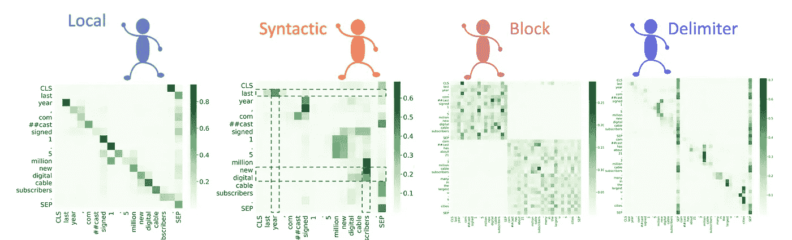
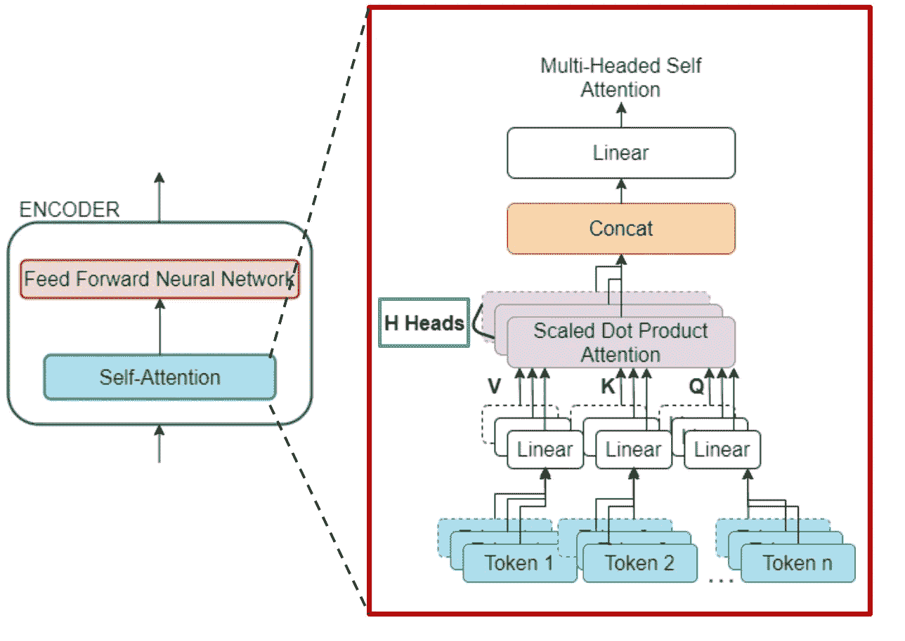
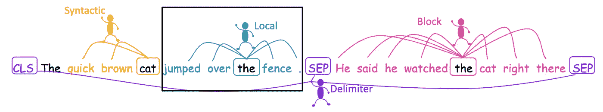
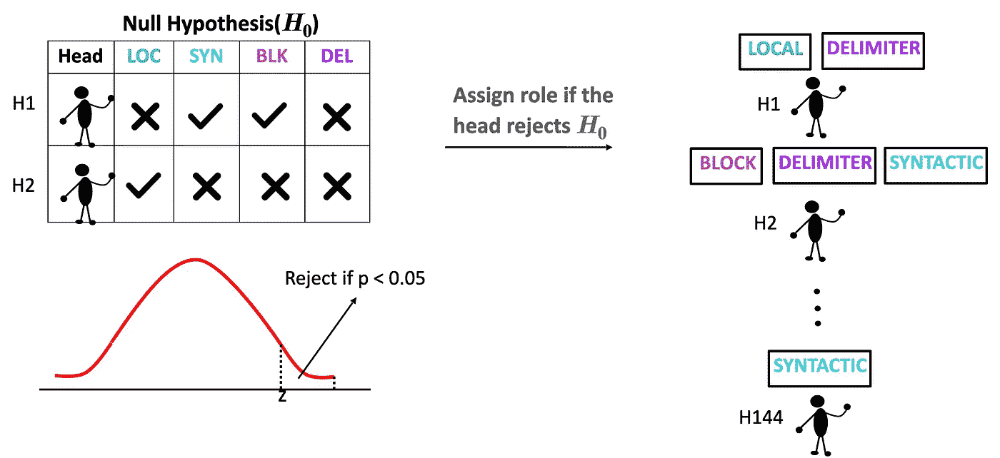
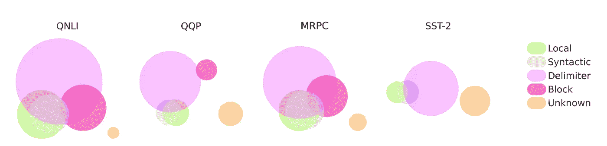
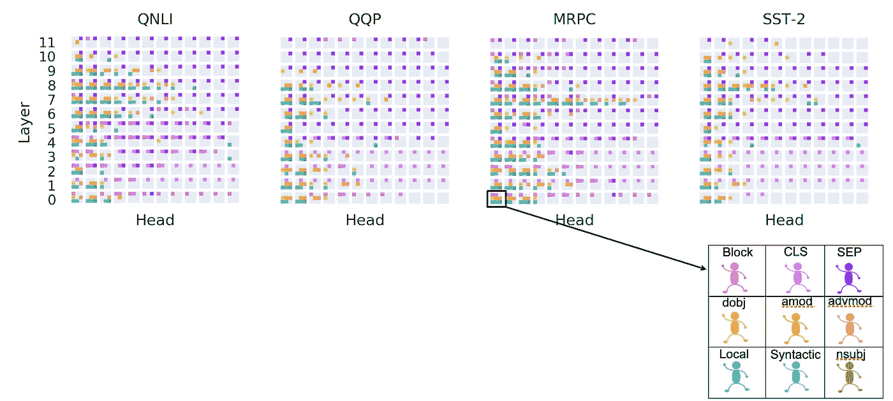
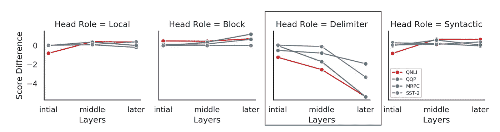

# 头部假设:理解 BERT 中多头注意的统一统计方法

> 原文：<https://medium.com/codex/the-heads-hypothesis-a-unifying-statistical-approach-towards-understanding-multi-headed-attention-15fd8b221637?source=collection_archive---------16----------------------->

## 在 AAAI 21 大会上发表的研究工作的高水平综述

# 目的

BERT 模型已经获得了巨大的欢迎，并且已经成为解决各种自然语言处理问题的默认选择，比如情感分类，问题回答，解释等等。它已经在多个 NLP 任务上展示了显著优于其任何前身模型的示范性性能。然而，它被批评为一个对其工作原理知之甚少的黑箱。BERT 也是一个基于 transformer 的模型，该模型中有多个组件，下面描述了其中的两个主要组件(如果您是 BERT 的新手，可以考虑阅读这篇令人惊叹的[博客](https://jalammar.github.io/illustrated-transformer/)，以了解基于 transformer 的模型的端到端架构)。为了理解这个博客，将理解抽象成这样就足够了:(1)BERT 由多个内部成分组成，其中“自我关注”是非常重要的。(二)自我注意由多个注意头组成。

自我注意成分由多个注意头组成

因为有多个注意力头，所以很少有像“*这样的问题，每个注意力头学习什么？*“起兵。我们的工作正是试图回答这个问题。我们试图确定 BERT 的不同注意头执行的各种功能角色，以及当我们进行微调时行为如何变化。

# 与其他相关作品的区别

使我们的工作不同于其他当代方法的是我们提出的方法所需要的统计的严格性和形式主义。统计测试是许多科学领域研究的一个组成部分。然而，在自然语言处理模型的可解释性领域，大多数作品采用基于平均值的方法或者基于一组精选的句子得出结论。考虑到每个不同的输入句子都有很大的可变性，统计测试不仅仅是一个小时的需要。因此，我们从我们的方法中得出的推论是稳健的，并且是仔细得出的。

# 方法

我们考虑 4 个高级功能角色:*局部、语法、块和分隔符。*我们建议采用三步程序来确定负责人的职能角色:

> (I)我们首先定义一个用于分析注意力模式的模板，我们称之为“注意力筛子”。
> 
> (ii)我们计算所有注意头和所有输入序列的所有功能角色的“筛选偏差分数”的度量。
> 
> (iii)我们应用假设检验，最终将职能角色分配给负责人。

## 注意力筛子

给定功能角色的令牌集被定义为当前令牌的注意力筛子。下面的数字会使它更清楚。

为职能角色定义的各种注意力筛选。这些线指向框中单词的给定注意筛选中的单词。

## 筛偏分数

通过输入序列的样本，我们为所有功能角色和所有注意力头计算这个度量。

这表明在该示例中，给予该局部注意力筛子内的标记 5 倍以上(多于一致)的注意力

此指标量化了注意力筛选中的标记相对于其他标记的相对偏好。因此，在输入序列的大样本中，我们对每个功能角色、每个注意力头都有一个筛选偏差分数。

## 假设检验

我们需要汇总输入序列的筛选偏差分数。我们如何做到这一点？最简单的方法是对输入序列取平均值，这样我们就有一个“单一数字”来代表每个注意力头和每个功能角色。如果“单一数字”足够高，那么我们说这个注意力头可以被分配那个功能角色。然而，这种基于平均值的测量容易出错，因为筛偏分数的分布是不对称的。我们需要更准确的东西:假设检验。

**备选假设:**所有输入序列的筛选偏差得分的平均值*大于或等于*某个阈值τ。

**零假设:**对于某个阈值τ，所有输入序列的筛选偏差得分的平均值小于*。*

为每个注意力头和每个功能角色设置零假设。只有当注意力头**拒绝**为 *f* 设置的无效假设时，我们才会将给定的功能角色 *f* 分配给注意力头。下图形象地描述了职能角色分配策略。

职能角色分配:表中的❌表示拒绝零假设，而✔表示接受零假设。

使用这个过程，我们给 BERT 的所有注意力头分配功能角色。接下来，我们讨论从作业中得出的结果和见解。

# 结果和讨论

我们讨论结果并回答三个主要的研究问题:(一)功能角色是互斥的吗？(ii)职能角色如何跨层分布？㈡微调对职能角色有什么影响？

## 实验装置

我们在来自标准 GLUE 数据集的四个 NLU 任务上测试了我们的方法。任务是*转述(MRPC 和 QQP)* ，*情感分类(SST-2)* ，*自然语言推理(QNLI)* 。

## 1.职能角色是互斥的吗？

不，他们不是。单个注意头可以执行多种功能角色，例如，它可以是局部的也可以是句法的。下图显示了头部的集合(用圆圈表示),重叠部分表示多功能性的程度。

*   有大量的定界符头(73%跨越 4 个粘合任务)
*   局部标题和语法标题之间的重叠非常高，在所有任务中约为 42%到 89%。

## 2.职能角色是如何跨层分布的？

我们将 4 个粗略的功能角色(局部、语法、块和分隔符)分成细粒度的角色。

句法角色进一步研究为 **nsubj，dobj，amod，advmod**

对于 **CLS** 和 **SEP** 令牌，分隔符的作用是分别研究的

分配给所有注意力头的功能角色。颜色表示各自的功能角色。

*   MRPC、QNLI 和 SST-2 的中间层(第 5 层至第 9 层)的多功能磁头数量较多。然而对于 QQP 来说，这些头更多的是在最初的层。
*   定界符头(注意 SEP)在后面的层中。
*   负责 CLS 令牌的头在初始层。
*   块头主要出现在第 0 层。它们在随后的层中的存在随着任务的不同而不同。
*   每层至少有 3 个句法头(除了极少数例外)。
*   最后，在这四项任务中，最后两层的多功能负责人很少。

## 3.微调对职能角色有什么影响？

伯特经历了两个阶段的训练过程；首先是预训练阶段，其次是特定任务的微调。在本节中，我们将研究当我们微调 BERT 模型时，这些功能角色是如何变化的。

我们观察到，在微调过程中，功能角色分布在后面的层中。

作为微调一部分的功能行为变化

*   作为微调的一部分，对 SEP 标记的关注减少，这被分配给输入序列的其他标记。
*   加强了 Clark 等人提出的假设，即[SEP]标记是无操作指示符，因此随着微调特殊化最终层，对这些标记的注意偏差正在减少。

# 摘要

这项工作提出了一种统计技术，以确定所扮演的角色的注意头伯特，其中所有不同的功能角色可以分析同一个统一的方法。这有助于阐明注意力头是如何工作的，并鼓励设计可解释的模型。

更多细节和细微差别，请考虑阅读我们的全文:[这里](https://ojs.aaai.org/index.php/AAAI/article/view/17605)