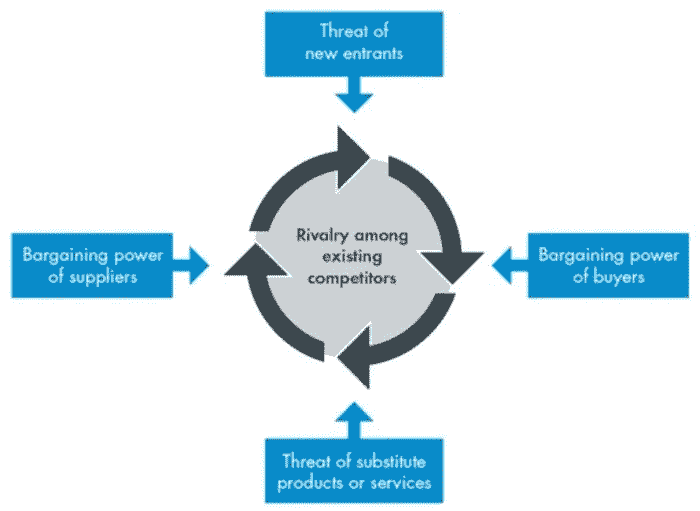
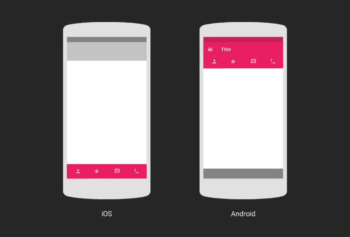
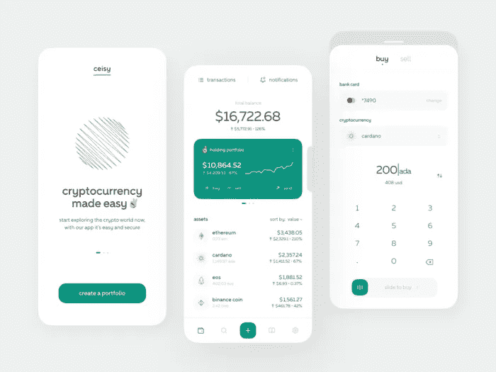
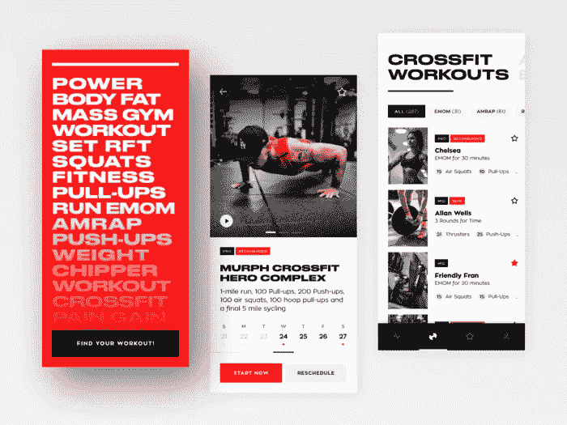

# 移动应用开发生命周期的隐藏面

> 原文：<https://medium.com/codex/the-hidden-side-of-mobile-app-development-lifecycle-a14beccc4405?source=collection_archive---------4----------------------->

## 不想浪费时间解决的问题的解决方案。

玛丽亚·法德耶娃插图

争夺用户注意力的战斗每年都变得更加激烈——公司在产品质量上展开竞争，在用户界面/UX 设计和移动应用程序开发上投入大量资金。

社交网络、即时通讯工具、教育平台等等——每一个应用都有一个清晰的创作算法，不同的软件开发公司会略有不同。这是一个**“移动开发生命周期”**，一个“移动团队”为开发一个新的应用程序而采取行动的场景。生命周期有助于理解:

*   开始一个开发过程需要什么
*   如何运行它
*   最终结果会是什么样子

移动应用市场正在快速增长:去年，用户下载应用[2180 亿次](https://www.statista.com/topics/1002/mobile-app-usage/#dossierKeyfigures)。仅在 2021 年第三季度，普通人在 Google Play 或 App Store 上的支出为 5.31 美元。真令人印象深刻。

每个应用程序开发周期都有其隐藏的问题。在这篇文章中，我们将分享我们解决这些问题的方法。

# 第一步——研究

**问题:** *客户并不真正知道他们是否需要一个应用程序。*

**解决方案:** *我们采访他们，找出他们的价值观，提出下面列出的问题。*

一切都始于一个想法。但是糟糕的决定也是从一个想法开始的。

《弗兰肯斯坦》( 1931) via Giphy

有时候，客户只是确信他们必须拥有一款应用。也许他们受到了我们的一篇关于商业移动应用想法的文章的启发。但是在客户将时间和金钱投入到应用程序开发项目之前，我们让他们回答以下问题:

*   用户从他们的移动设备访问你的网站吗？
*   您是否希望为网站上不可用的移动应用程序实现新功能？
*   你的竞争对手使用移动应用吗？
*   重复销售是你的事吗？
*   你有忠诚度系统吗？

即使客户对大多数问题的回答是“是”，也只有开发机构的专业研究才能确定一个应用程序对企业是否值得。

手机应用不会自动成为新的销售渠道。我们建议从分析**现有客户旅程**开始，分析与客户的所有接触点(通过线下商店、呼叫中心、网站沟通)。了解和分析客户每天面临的内部流程非常有用——考虑一下移动体验如何改善这些交互。

问题: *一个客户一次想要太多的功能。*

**解决方案:**特征选择标准非常简单。*“没有这个功能，用户能解决根本问题吗？”。如果答案是“是”，那么删除该特征。*

剪刀手爱德华(1990 年)

我们沉迷于过度思考。当创建一个应用程序时，最初的功能在一段时间后似乎不再足够。客户经常建议添加一些其他的东西，新的想法经常出现。但是功能越多，开发一个产品的难度就越大。这意味着更多的时间和更大的领先市场的最新趋势。

移动应用程序应该尽快出现在用户的手机上。越早获得客户反馈，成功的机会就越大。如果你能实现这个目标，那么以后改变或者增加功能就不是什么难事了。糟糕的时机是创业公司开发移动应用后失败的原因之一。

**问题:** *客户雇佣的一家外包公司认为“竞争对手分析”字面上只是比较竞争对手的特征。*

**解决方案:** *确保一家开发机构使用波特的五种力量模型进行竞争对手分析。*

[CGMA](https://www.cgma.org/resources/tools/essential-tools/porters-five-forces.html) 波特五力示意图

波特的五种力量是一个分析模型，确定了塑造每个行业的五种竞争力量。它有助于指出潜在应用的弱点和优势。

**这五种力量是:**

*   供应商力量:供应商抬高价格有多容易。
*   买方势力:买方压低价格有多容易。
*   竞争对手:市场中竞争者的数量和能力。
*   替代的威胁:有多少应用可以轻易替代你的。
*   新进入的威胁:你进入市场将如何侵蚀盈利能力。

# 第二步——UX 和用户界面设计

**问题:** *设计师在一个概念中忽略了 iOS 和 Android 的界面差异。*

**解决方案:** *确保设计师从一开始就开发几个概念/选择一个平台。*

通过[谷歌设计](https://design.google/library/design-ios-android-and-back-again/)分析 iOS 和 Android 的用户界面/UX 差异

iOS 和 Android 平台的软件开发生命周期需要不同的方法来设计、导航、移动应用程序开发软件和用户体验的其他方面。如果你正在考虑[创建一个应用](https://shakuro.com/native-mobile-development)，你应该考虑使用哪个平台。

例如，当选择一个概念的颜色时，请记住 iPhone 的调色板通常在屏幕上传达得更好(无意冒犯，Android 粉丝！)比安卓设备的调色盘，所以需要放弃颜色相邻的概念。它们在 Android 上可能看起来“更脏”。

还有一些用户界面/UX 的细微差别:

*   屏幕尺寸:320 pt x 568 pt iPhone vs 360 DP x 640 DP Android。
*   系统字体:旧金山 iOS vs Roboto Android。
*   iOS 拥有与 Android 完全不同的 [UI/UX 指导方针](https://developer.apple.com/design/human-interface-guidelines/)。后者采用材料设计原理。
*   Android 设备有物理导航按钮。iOS 设备没有。

为了避免浪费资金，[联系了一位熟悉操作系统要求和 Android 和 iOS 屏幕构建逻辑的设计师](https://shakuro.com/ui-ux)。

我们展示的大部分作品都是 iOS 概念。但是 [Shakuro](https://dribbble.com/shots/16943680-Easy-Crypto-App-Concept) 可以为 iPhone 和 Android 修改概念

**问题:** *设计师忽略了一个 app 的用途，创造出自己个人喜欢的设计。*

**解决方法:** *永远记住，一个 app 必须回答目标受众的痛点，而不是某个人的审美喜好。将它写在需求文档中。*

记住启动应用程序的目的。是运动会员申请吗？使用动态字体和明亮的颜色:

健身房应用程序概念由 [Shakuro](https://dribbble.com/shots/16922356-HardClub-Crossfit-Mobile-App-Concept)

对于整个应用程序，最好只使用一种字体的 4 种类型(不同的大小、颜色和粗细)和 4-5 种颜色。这足以突出和创建一个整洁的界面。

**问题:** *某客户发送的是现成的概念设计，而不是需求文档。*

**解决方案:** *让一个项目经理事先收集需求。*

有时候，客户会把现成的设计带到应用程序的几个屏幕上，而不是技术任务，并说其余的“已经很清楚了”唉，设计师不是魔术师，没有详细的需求，做不出好的产品。每个缺失的细节都会增加创建应用程序的时间。

# 步骤 3——发展

**问题:** *一个开发团队从一个设计团队那里获得了一个不可能的概念。现在他们必须改变它。*

**解决方案:** *是时候重新估算 3 个手机 app 开发阶段的时间了！*

手机 app 开发辛苦吗？是的，当你有一个现成的概念时，有时更是如此。有时候设计师会想出一些你无法编码的很酷的东西。或者，你可以，但是一年后。客户等不起那么久。那怎么办呢？

**一、开发团队再次分析概念。**

开发人员仔细检查来自设计团队/客户的需求。他们对任务、应用程序功能进行粗略分析，找出差距，并提出问题来填补这些差距。

**二。开发团队发现了这个概念的问题，并经历了 5 个悲伤阶段。**

开发人员从设计概念中指出潜在的问题特性:

*   应用原型的新任务和新技术
*   需要研究和时间的复杂任务
*   无法实现完全自定义的 UI 元素

他们确定了可以使用第三方库/服务的特性(这些库/服务的集成也需要时间)。开发人员重新评估所有的项目时间表。

**三。开发团队与项目经理讨价还价，新的应用程序原型诞生了。**

移动应用开发者:

*   确定可以重用的应用程序组件。
*   确定之前在其他项目的线框中实施的组件/任务。
*   确定有必要进行研究的任务，并与经理协调时间。
*   确定可以在不损失质量和功能的情况下优化的组件(UI 和业务逻辑)。然后，他们与项目经理就优化建议达成一致。

开发人员与项目经理协商每个应用程序功能的变化，并记录下来。如果他们缺乏演讲技巧，无法说服项目经理，他们会以书面形式警告不改变设计的风险。

# 步骤 4 —测试

ABC 网络 Gif

**问题:** *测试人员缺乏特定 app 的必要知识。*

**解决方案:** *确保测试人员阅读用户故事/客户旅程图，或者看看类似的应用程序是如何工作的。*

这是测试人员最常犯的错误之一。他们正在“探索”一个他们从未听说过的应用程序，因此只关注基本的细微差别。但是测试人员必须对应用程序有全面的了解——它的功能需求、特性和逻辑。

问题: *一个客户坚持尝试和探查一切。*

**解决方法:** *放松，呼吸，接受这是不可能的。*

不可能在所有设备和操作系统上测试移动应用程序。谷歌分析让你对用户行为得出某些结论。假设您想要在 5 种不同的网络环境中，在 10 种不同的设备上测试 50 个案例。为了完成这项任务并构建一个应用程序，测试人员需要做出无限多的选择。

# 步骤 5 —部署

**问题:** *应用性能随着用户基数的增长而下降。*

**解决方法:** *提高性能是必须的。*

*   开发人员可以缓存一些数据，而不是每次为每个用户动态发布(例如，评论的数量)。
*   在数据库中存储图像和其他重物会降低应用程序的性能。避免像这样存储大量沉重的图像。再加上，考虑删除长时间没人会问的数据。

**问题:** *用户注意到应用程序中的错误。*

**解决:** *事先想好。*

这是一个好问题。如果应用程序已经有了大量的用户，他们可能会面临各种问题和软件错误。例如，可能是服务器超时、连接重置或更新重置。试着在应用程序的设计阶段考虑这些问题。添加通过第三方服务授权用户的功能。

# 第 6 步—支持

鲨鱼男孩和岩浆女孩的冒险(2005)

**问题:** *一段时间后，一个客户试图“修复”一个应用程序，而不是升级它。*

**解决方案:** *每年都有新版本的 iOS 出来。客户需要立即修复新版本，以便用户可以继续下载应用程序。与此同时，人们必须考虑发展问题。*

当用户下载并使用新服务时，您将收到反馈，并根据这些反馈完善应用程序。过一会儿，你可能会想添加新的功能。

***

手机 app 开发值得吗？到 2023 年，通过付费下载和应用内广告，全球移动应用收入预计将达到 9350 亿美元。这使得移动应用程序开发成为 IT 市场中利润最高、增长最快的领域之一。

然而，这带来了某些限制，如紧迫性。移动市场对设计和性能的趋势极为敏感。手机 app 开发的前景如何？查看我们关于【2022 年顶级移动用户界面/UX 趋势的最新文章了解最新动态！

[*由丽塔·恩慈担任，文案*由三郎担任](https://shakuro.com/blog/author/margarita-nevidnyk)