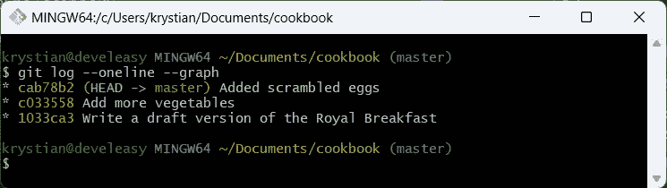
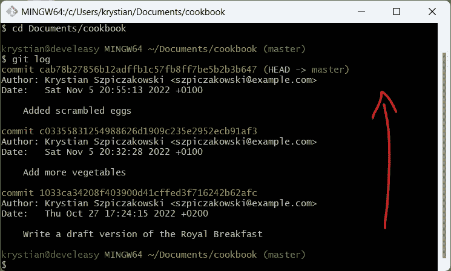
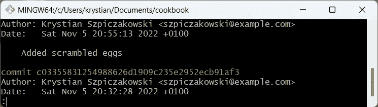
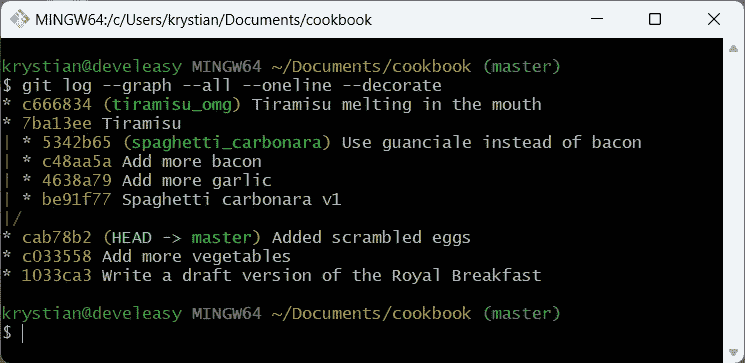
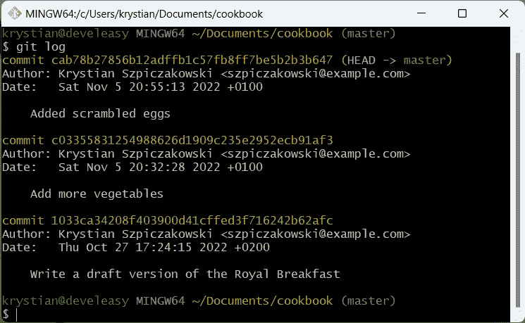

# 皇家早餐的历史(见 Git #6)

> 原文：<https://medium.com/codex/the-history-of-the-royal-breakfast-meet-git-6-b1a8a2b521ba?source=collection_archive---------10----------------------->

## 什么是提交以及如何读取 Git 历史？

乔安娜·科辛斯卡在 [Unsplash](https://unsplash.com?utm_source=medium&utm_medium=referral) 上拍摄的照片

# 介绍

在上一篇文章中，我们正在完成食谱中的第一个食谱。今天，您将学习关于什么是提交、它们如何相互关联以及如何查看存储库历史的基础知识。

我们开始吧！

# 提交已解释

## 什么是提交？

嗯，我们已经在 cookbook 存储库中创建了一些提交，但是它们到底是什么呢？

每次您通过输入`git commit`告诉 Git 保存您的更改，Git 都会创建一个 commit，您可能已经猜到了。

提交是自上次提交以来通过`git add`命令发生的所有暂存更改的快照。每次提交都包含以下信息:

*   对以前快照的新更改
*   作者
*   编成日期
*   消息
*   SHA-1 校验和，例如 cab78b27856…，通常只有前几个字符重要，只要您可以唯一地标识提交

## 提交存储在哪里？

这些对象存储在哪里？提醒一下:在`.git`子目录中，在我们的例子中是`cookbook/.git`。

幸运的是，我们不需要知道 Git 内部的细节。你需要记住的是**你的库是** `**.git**` **目录**。这意味着，即使您不小心修改了皇家早餐的食谱，或者您甚至删除了名为`royal_breakfast.txt`的文件，恢复食谱也是轻而易举的，只要您有`.git`目录。

## 提交是如何相互关联的？

关于提交，*每个*提交都链接到其父提交。在这一点上，我想提一下有两种特殊情况，可能会发生:

*   存储库中的第一个提交没有其父提交
*   合并提交可以有多个父提交(我们还没有谈到合并，但是我将在下一集向您展示这个场景)

为了更好地理解提交之间的关联，让我给你一个基于 cookbook 存储库的例子。

最新的提交`cab78b2`链接到`c033558`，这意味着`cab78b2`的父代是`c033558`。然后，提交`c033558`，链接到存储库中的初始提交，即`1033ca3`。最终，提交`1033ca3`没有父级。

每个提交都链接到其父级

## 不要失去理智

还有一件事需要注意:你看到上面截图上的蓝色标记了吗？这是一个所谓的*指针*，如果你的工作流很简单(就像我们的例子)，它通常被放在分支的顶部。

`HEAD`指针主要有两个职责:

*   它显示了您的工作目录所代表的存储库的状态
*   它指向下一次提交将被添加到的位置

在上面的截图中，`HEAD`指向提交`cab78b2`。**`**HEAD**`**的位置只是告诉你** `**cookbook**` **目录中的文件看起来就像执行这个提交时一样(除非你用皇家早餐食谱修改了文本文件)。****

****同样，如果你要执行另一个提交，它会出现在** `**cab78b2**` **之上，因为这是 HEAD 指向的地方。****

**操作`HEAD`指针非常有用，例如，如果你想让你的项目回到之前的已知状态。**时光旅行，还原 Git 中的变化主要与移动** `**HEAD**` **指针有关，这个话题下一集会讲到。****

## **关于分支**

**在分支方面，我还没有谈到这个主题，但是现在你只需要知道每个存储库至少有一个分支，在我们的存储库中这个分支被称为`master`，或者`main`，这取决于你的 Git 配置。我们*总是*在特定分支的上下文中工作，所以我们可以说我们一直在`master`分支上工作。**

**这是什么意思？像这样组织的提交允许您做有趣的事情，例如:**

*   **比较*和*时有哪些变化**
*   **如果你改变主意，时光旅行/回复变化**

# **查看历史记录**

**在前几集，我们在存储库中创建了三个修改(提交),但是如何检查引入了什么以及何时引入的？**

**像现在这种项目超级简单的时候很容易记住所有这些东西，但是当项目越来越大的时候，记住所有的东西就越来越难了。为了查看和分析历史，Git 附带了几个工具，我将在下面描述。**

## **使用 git 日志**

**使用`git log`是了解存储库情况的最简单的方法。**`**git log**`**命令显示了您当前工作的分支的历史** ( `master`，因为在整个存储库中只有一个分支)。每个条目代表一次提交，它由一组关于特定快照的重要信息组成。****

****重要的是，条目是按从最新到最老的顺序排列的，所以如果你想按时间顺序查看历史，就从下往上读条目。乍一看这似乎很奇怪，但是我们通常对最近的变化感兴趣，所以这就是为什么它们被列在第一位。****

****如果历史记录包含太多的提交，以至于无法在一个页面上显示，请使用键盘上的`B`(后退)、`F`(前进)和`Q`(退出)键进行导航。****

********

****最近的更改列在顶部****

********

****结尾的冒号意味着还有更多页面要显示****

## ****以图表形式查看历史****

****简单的`git log`没问题，但是如果你想真正像专业人士一样使用 Git，我有更好的东西给你。****

****现在，让我们假设我们的食谱将包含比现在更多的食谱。此外，如果您想独立于其他配方开发配方，您可能会喜欢在单独的*分支*上工作，并且存储库的历史可能看起来像下面的截图。****

********

****以图表形式表示的存储库历史****

****每个浅绿色标签，即`master`、`spaghetti_carbonara`、`tiramisu_omg`，代表一个单独的分支。如你所见，**历史不再是线性的，所以这些配方可以独立开发。******

****在这种情况下，简单的`git log`不再有效。我的意思是，它确实工作，并且仍然产生输出，但是**`**git log**`**的输出仅限于来自你当前所在的**分支的提交(`HEAD`指向`master`分支)。******

********

****git 日志只显示来自当前分支(主)的提交****

****更好的做法是对存储库的样子有一个更大的了解，例如存储库中还有哪些分支，如果有的话，它们是如何合并的。****

****为了实现这一点，我鼓励你开始使用 `**git log --graph --all --oneline --decorate**` **。******

****下面是对特定标志作用的简短解释:****

*   ****`--graph`使得每一次提交都是用一行星号连接起来的****
*   ****`--all`显示*存储库中的所有*分支****
*   ****`--oneline`将单个提交的信息压缩到一行中****
*   ****`--decorate`给出了一些额外的格式(取决于 Git 版本，默认情况下可以启用装饰)****

## ****Git 中的别名****

****这个命令很好，但是我们真的需要在每次想要使用它的时候一遍又一遍地重复输入吗？****

****我承认，将历史显示为图形的命令有点长，如果我不得不从头开始输入，这将使我发疯。****

****幸运的是，Git 有一个很酷的特性叫做*别名*。如果您有一个经常使用的命令，可以为这样的命令创建一个别名。例如，这允许您将长命令变得更短。****

****如果我告诉你不用写`git log --graph --all --oneline --decorate`而只用`git lga`会怎么样？****

****为了使`git lga`在 Git 中可用，粘贴端子`git config --global alias.lga log --graph --all --oneline --decorate`。这将在全局范围内添加新的别名，这意味着从现在开始，`git lga`将可用于您的系统帐户。****

# ****下一步是什么？****

****由于我们还没有穷尽检查历史的主题，在下一集我们将了解如何检查具体是什么时候被提交的。****

# ****参考****

****[1]王南钧·什皮查科夫斯基，*让皇家早餐真正皇家化(遇见 Git # 5)*[https://medium . com/codex/Make-the-Royal-Breakfast-true-Royal-Meet-Git-5-b7ba 8 a 36 f 91](/codex/make-the-royal-breakfast-truly-royal-meet-git-5-b7ba8a36f91)****