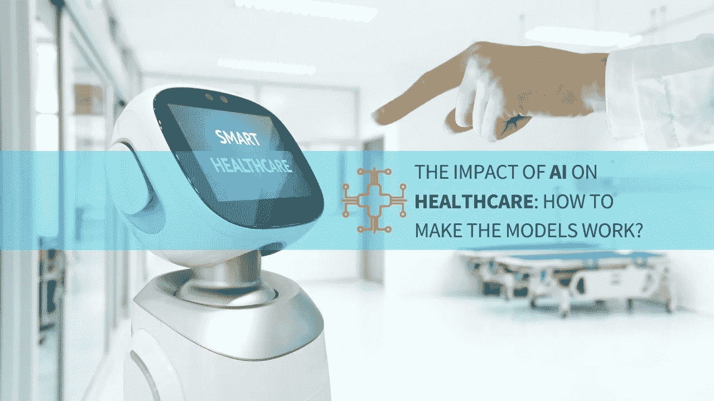
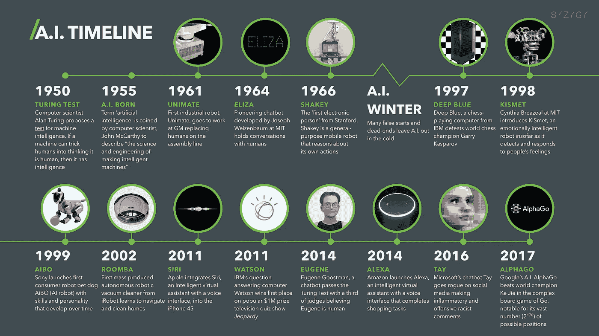
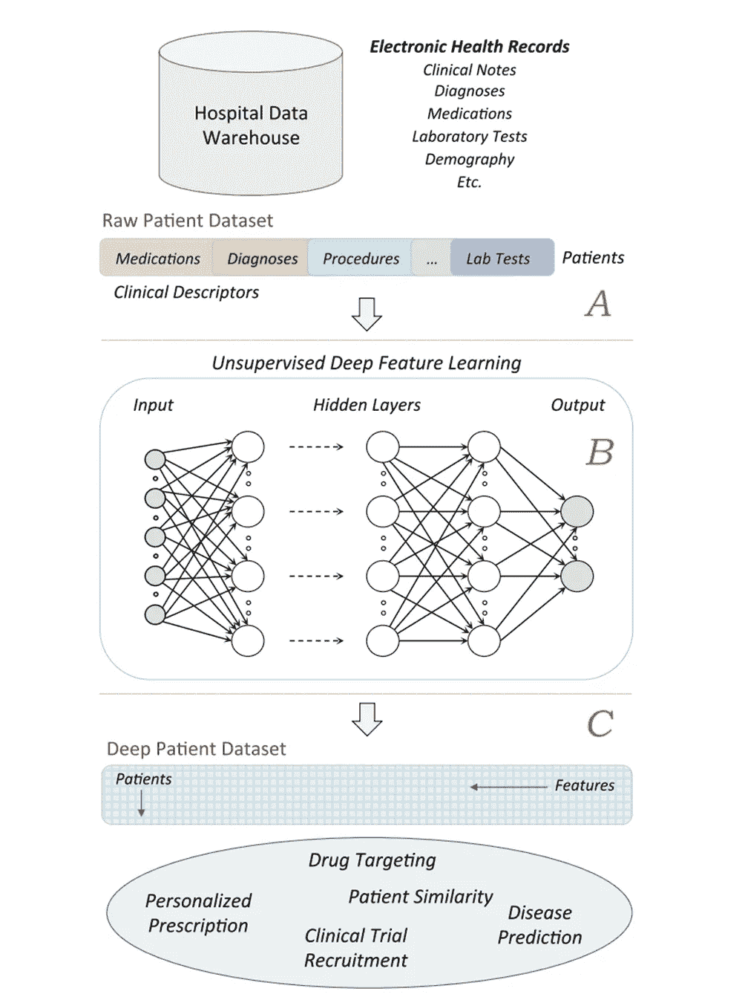
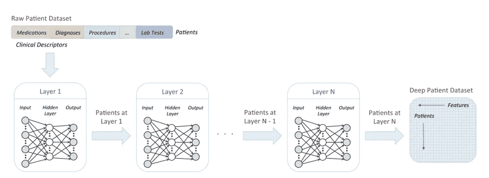
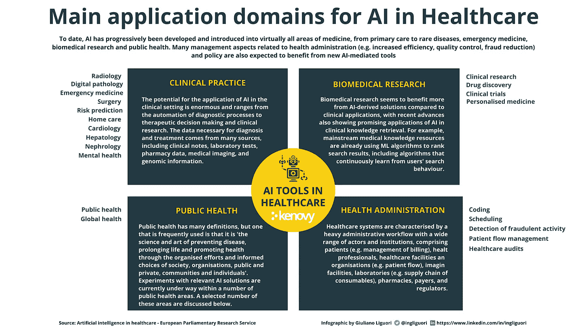
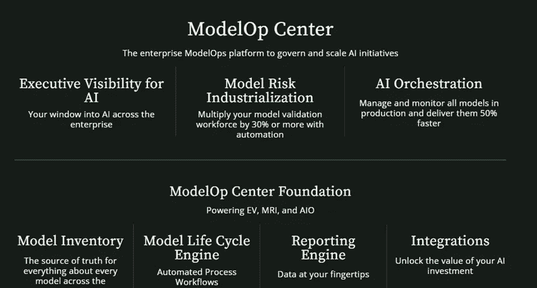

# 人工智能对医疗保健的影响:如何让模型发挥作用？

> 原文：<https://medium.com/codex/the-impact-of-ai-on-healthcare-how-to-make-the-models-work-16ee304b6bc8?source=collection_archive---------9----------------------->

## 人工智能在医疗保健领域的现状及其带来的问题，对医院和医生办公室临床决策的影响，以及为什么企业实施人工智能治理系统非常重要。

# 简介:什么是人工智能？

对人工智能(AI)的研究已经持续了几十年，早期的提议可以追溯到 1950 年。然而，只是在最近几年，由于计算能力的增加以及大数据和机器学习的增长，它才重新受到欢迎。人工智能是机器执行通常需要人类智能的任务的能力，例如理解自然语言和识别物体。随着人工智能的快速发展，企业和个人都有机会利用它的能力。

人工智能是计算机科学和工程的一个领域，专注于智能代理的创造，智能代理是可以推理、学习和自主行动的系统。它被定义为机器执行通常需要人类智能的任务的能力，例如理解自然语言和识别物体。通俗地说，就是可以用 AI 来创造具有自主学习和工作能力的智能机器。

随着这项技术在我们生活中变得越来越普遍，越来越多的公司开始开发基于人工智能的应用程序和产品。迄今为止，已经有几个使用人工智能的商业成功产品，但这仍然是一个不成熟的市场，因此公司和个人都有机会利用人工智能的能力开展业务。

[AI 时间轴](https://digitalwellbeing.org/artificial-intelligence-timeline-infographic-from-eliza-to-tay-and-beyond/)

> 你可能也想阅读安全可靠的人工智能的[模型操作](/codex/model-operations-for-secure-and-reliable-ai-2cf0ced9945b?source=user_profile---------2-------------------------------)

# 为什么人工智能是医学的未来

人工智能经常在技术及其未来在我们生活中的作用的背景下被谈论。然而，许多人没有意识到的是，人工智能有可能彻底改变几乎每个行业，包括医疗保健。从诊断疾病到帮助手术，人工智能可以为改善病人护理做出巨大贡献。医生已经在使用人工智能来改善他们的实践，这项技术的未来看起来非常光明。随着不断推进和实施，AI 将成为医疗保健不可或缺的一部分。

人工智能在医疗保健领域因其在诊断和治疗疾病方面的巨大前景而受到称赞，而其在医疗领域的应用因其改善患者护理的潜力而受到称赞。医生正在使用人工智能工具，这些工具可以自动读取眼睛的扫描或图像，检测异常或癌性肿瘤，甚至以比人类医生自己更快的速度识别皮肤状况。

因此，人工智能在医学和医疗保健领域的应用越来越多。医疗领域正在发生根本性的变化，包括更多人工智能工具，如认知计算系统，这些工具可以帮助医生做出更好的决策，并快速找到复杂问题的答案，如“心脏病发作的症状是什么？”或者“乳腺癌最好的治疗方法是什么？”。

近年来，人工智能在医学上的应用有了许多新的发展。例如，研究人员在 2016 年开发了 Deep Patient，这是一种无监督的表示，可以从电子健康记录中预测患者的未来。

[来源](https://www.nature.com/articles/srep26094)

图中是用于通过大型 EHR 数据仓库的无监督**深度学习来导出深度患者表示的概念框架。** (A)预处理阶段，用于从 EHRs 获取原始患者陈述。(B)通过无监督的深度架构对原始表示进行建模，从而产生一组通用且鲁棒的特征。将深层特征应用于整个医院数据库，以导出可应用于许多临床任务的患者表示。

下面是通过多层神经网络将原始数据集转换为深度患者表示的无监督深度特征学习管道图。神经网络的每一层都被训练为根据前一层的结果产生更高级别的表示。

[来源](https://www.nature.com/articles/srep26094)

人工智能可能会以几乎无限的方式重塑医疗保健领域——帮助改善诊断，实现更加个性化和精确的医疗方法。医学图像量化、自动化基因分析、疾病预测、医疗机器人、远程医疗和虚拟医生是人工智能在医学中的一些主要应用。冠状病毒疫情加速了人工智能应用在医疗和临床领域的开发和部署，因为这些技术是全球应对这场健康危机的核心。

> 你可能也想阅读[用 ModelOps](https://towardsdatascience.com/unlocking-the-value-of-artificial-intelligence-in-business-applications-with-modelops-92379965f87c?source=user_profile---------3-------------------------------) 释放人工智能在商业应用中的价值

# 探索人工智能在医疗保健中的不同应用

毫无疑问，人工智能正在改变医疗保健的格局。医疗保健中一些最常见的人工智能应用包括用于诊断的图像识别、患者监测和药物发现。然而，人工智能在医疗保健领域的潜力远远大于这几个例子。

人工智能在医疗保健领域最令人兴奋的一个方面是它能够为每个人提供个性化的治疗。有了这么多关于患者的数据，人工智能可以分析并从中学习，以更好地了解一个人的健康历史如何影响他们的当前状况。这将使医生能够提供更准确的诊断和量身定制的治疗。

人工智能的另一个应用领域是生物医学研究，其中的好处是多方面的。人工智能可以帮助研究人员在他们的数据中找到他们以前从未见过的模式。它还可以帮助他们更好地理解他们的数据，这意味着他们将能够提出新的假设和实验想法。

人工智能无疑有助于塑造医学研究的进程。

迄今为止，人工智能已经逐渐发展并引入到几乎每个医学领域，从初级保健到罕见疾病，急救医学，生物医学研究和公共卫生。与医疗保健管理相关的许多管理方面(例如，提高效率、质量控制、减少欺诈)和政策也有望受益于新的人工智能工具。

*   **临床实践中的人工智能**:人工智能在临床应用中有着巨大的潜力，从诊断过程的自动化到治疗决策和临床研究。诊断和治疗所需的数据来自各种来源，包括临床记录、实验室测试、药房数据、医学成像和基因组信息。
*   **人工智能在生物医学研究中的应用**:人工智能衍生的解决方案在生物医学研究中的应用似乎比在临床应用中更有前景，最近的进展显示，人工智能衍生的解决方案也证明在检索临床知识方面有用。例如，已建立的医学知识资源已经在使用 ML 算法对搜索结果进行排名，包括不断从用户搜索行为中学习的算法。
*   **公共卫生:**公共卫生的一个常见定义是“通过社会、组织、公共和私人、社区和个人的有组织的努力和明智的选择来预防疾病、延长寿命和促进健康的科学和艺术”(Wanless，2004 年)。相关人工智能解决方案的实验目前正在几个公共卫生领域进行。
*   **医疗保健管理中的人工智能**:医疗保健行业的特点是管理工作流，涉及广泛的参与者和机构，包括患者(如账单管理)、卫生专业人员、医疗保健设施和组织(如患者流)、成像设施、实验室(如耗材供应链)、药房、支付方和监管机构。

作者提供的信息图

> 你可能也想阅读【ModelOps 如何帮助你执行你的人工智能策略

# 如何保持 AI 在使用中的监管合规性？

谈到使用人工智能，许多医疗保健组织都想知道如何确保遵守 HIPAA、GDPR 和 AI Act 等法规。随着人工智能在医疗领域变得越来越普遍，组织了解与其实施相关的风险并采取措施降低风险非常重要。

低估这些方面会导致许多风险，我们可以将这些风险分为七类:

1.  人工智能错误导致的患者伤害。
2.  医疗 AI 工具的误用。
3.  医学人工智能中的偏见和不平等永久化的风险。
4.  缺乏透明度。
5.  隐私和安全问题。
6.  人工智能问责制的差距。
7.  现实世界医疗保健实施的障碍。

这些风险不仅会伤害患者和公民，还会降低临床医生和社会对人工智能算法的信任。因此，风险评估、分类和管理必须是人工智能开发、评估和部署过程中不可或缺的一部分。

> 人工智能在医学上的承诺是提供个人医疗数据的复合全景视图；改善决策；以避免误诊和不必要的程序等错误；帮助安排和解释适当的测试；并推荐治疗方案。
> ― **埃里克·托普，** [**深度医疗:人工智能如何让医疗保健再次人性化**](https://www.goodreads.com/work/quotes/63790687)

# 模型在医疗保健人工智能研究中的重要性

与其他技术进步一样，医疗保健中的人工智能也有特定的好处和风险，需要自己的一套监管框架来解决其使用的社会伦理影响。虽然人工智能在医疗保健领域的实施非常有前景，是一个快速发展的领域，但它也引起了患者，医疗保健组织和社会的关注。正如我们在前面的段落中已经提到的，这些问题包括临床安全、公平获取、隐私和安全、适当使用和使用者，以及责任和监管。

因此，研究人员、公众和政策制定者等利益相关者都强调了重要的生物伦理问题，其中包括如何评估人工智能在医疗保健中的风险和益处，如何在生物医学人工智能领域建立问责制，以及如何在这种特定的高风险背景下监管其使用。讨论的另一个重要核心问题是人工智能是否可以增加传统上代表性不足的社区的包容性和公平性，或者它是否有延续和增加先前存在的健康差异和不平等的风险。

我们已经在之前的文章《人工智能法案:基于风险的人工智能卓越和信任政策方法》中广泛涉及了这些问题，但是，有必要强调实施人工智能治理模型的重要性，这种模型可以降低风险并确保对患者没有偏见。

人工智能的具体特征，如不透明性、复杂性、数据依赖性和自主行为，会对用户的一些基本权利和安全产生负面影响。规范人工智能模型的使用成为全球关注的问题，以解决这些问题。因此，我们相信 **ModelOps** 在降低商业风险和确保提议的模型没有错误和失真方面是有价值的。准备在医疗保健行业开发人工智能应用的公司可以从 **ModelOps** 中受益，因为它提供了技术、业务以及最重要的监管合规性控制，并通过基于规则的引擎管理大规模人工智能计划来标准化模型验证流程。

除了政府法规，利用人工智能的组织应该满足市场设定的要求。在使用这些技术时，消费者希望公司采取道德和公平的商业做法，因此公司被要求遵守。此外，基于人工智能的公司必须确保他们拥有与他们使用的模型相关的治理政策和流程，以至少解决以下问题:

*   **功效**:如果模型构建或维护不当，可能会危及个人或整个公司的生命。为了确保模型稳健并产生良好的结果，必须定期对其进行适当的开发和验证。
*   **透明**:为了保护个人和团体免受不公平待遇，模特做出的决定需要有解释，并被证明是公正的。
*   **道德使用:**人工智能模型，当开发不当或带有偏见时，会造成重大伤害。例如，美国的一个医疗保健应用程序，它使用人工智能根据观察病人如何走路来预测病人是否需要多次测试。

尽管医疗保健部门受到高度监管，但没有法规涵盖人工智能在医疗保健环境中的使用。卫生保健中的人工智能一直是几个国家和组织提出的法规的主题，但迄今为止尚未通过任何法规。因此，监管人工智能模型在医疗保健领域的使用是一个全球关注的问题。通过使用[企业模型操作平台](https://www.modelop.com/product/)来管理和扩展人工智能计划，公司可以:

*   **建立**关于模型在所有环境中必须满足的标准的明确政策，包括业务指标、统计指标、内部生成的合规性指标和外部法规。
*   **广泛地**记录每个模型的目的、指标、开发方式以及部署方式。
*   **确定**模型从概念到开发再到生产的所有必要批准和批准人。
*   **捕获**所有与模型相关的工件和元数据，包括代码、训练数据、测试用例以及结果。
*   **记录**模型从发布到生产再到报废期间发生的所有活动，包括与 KPI 的偏差、代码更改或再培训等补救措施，以及每个步骤中发生的所有批准。

[来源 Modelop.com](http://www.modelop.com)

一个设计良好的[企业模型操作平台](https://www.modelop.com/product/)的功能和特性的例子。

根据大多数监管机构的规定，验证和测试模型的人员必须与开发模型的人员分开。ModelOps 平台应包括持续更新的模型清单，该清单捕获每个模型所需的所有文档和元数据，包括任何变更和批准。

> 你可能也想读读 [Modelops 2022:实践状态](https://ingliguori.medium.com/modelops-2022-the-state-of-practice-966b676e6063?source=user_profile---------1----------------------------)

# 结论和要点总结

我们提供了人工智能健康相关应用的概述，并分析了人工智能改变医疗保健服务的潜力。我们也看到了人工智能在医疗保健领域的当前和潜在应用相关的风险。然而，为了解决这些社会伦理、监管和技术问题，我们解释了基于 ModelOps 的解决方案如何允许引入许多旨在最小化医疗 AI 风险的选项，加强企业的治理，从而加强其负责任的发展。

**关注我的每日技术和创新更新**

【https://bit.ly/m/ingliguori 

# 参考

*   [假人模型操作](https://bit.ly/MdlOpsB)
*   Modelop 的[网站](http://www.modelop.com/)
*   医疗保健中的人工智能:应用、风险、伦理和社会影响——EPRS(欧洲议会研究服务)科学预见组(STOA)
*   [人工智能法案:一种基于风险的政策方法，以实现人工智能的卓越和信任](https://ingliguori.medium.com/ai-act-a-risk-based-policy-approach-for-excellence-and-trust-in-ai-d29ce0d54e2?source=user_profile---------5----------------------------)
*   深度患者:从电子健康记录中预测患者未来的无监督表示