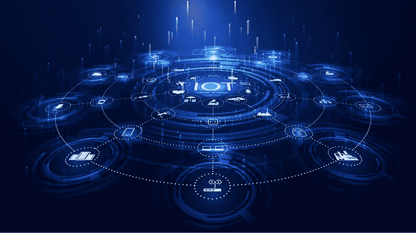

# 物联网对客户服务的影响

> 原文：<https://medium.com/codex/the-impact-of-the-internet-of-things-on-customer-service-2f5f3043b16a?source=collection_archive---------7----------------------->

在过去几年中，组织已经改变了他们的优先事项，今天，他们的一个重点领域是客户服务和满意度，以便在前沿市场中生存。物联网(IoT)是该场景中的一个新成员，它已经在影响组织的客户服务。此外，研究表明，在未来几年，它将对客户服务产生巨大影响。连接性的提高导致消费者的期望增加，这增加了这些组织的压力和需求，以满足这些期望来留住这些客户。

[物联网解决方案](https://www.daffodilsw.com/iot-application-development/)不仅会影响 B2C 市场的客户体验，还会影响 B2B 市场的客户体验，因为物联网设备以及 5G 技术、人工智能、区块链等其他技术先进的解决方案正在兴起。组织现在正试图通过最少的人工干预来解决这些棘手问题。这将导致更快地解决问题，降低成本，并最终导致抢先服务，这将有助于预测客户问题。物联网正被用于连接智能设备和产品，以提供无缝体验、提高忠诚度、留住客户和吸引新客户。

**物联网解决方案对客户服务的影响:**

*   **客户服务变得越来越复杂:**物联网解决方案将使客户服务的整个流程变得更加复杂。客户将在家中或办公室使用其他物联网设备，您组织的产品/服务很有可能会与其他产品重叠和交互。这将导致在处理客户询问时复杂性的增加，因为其他产品在他们的问题和顾虑中也起着重要作用，在解决他们的问题时需要考虑到这一点。[物联网开发公司](https://www.daffodilsw.com/iot-application-development/)需要考虑与行业内其他物联网解决方案的可能整合。
*   **客户服务可能变得更加智能:**为客户服务实施物联网解决方案的优势之一是它产生的大量数据。所有连接的设备以及与其他技术的集成有助于不断收集这些客户的数据。这个庞大的数据库是组织的重要资产。如果分析得当，这些数据可以帮助您更有效地接触客户，让您的组织更好地了解客户的期望以及他们如何使用您的服务。组织可以进一步分析数据，向您的消费者追加销售/交叉销售，并为他们提供增值服务，以提高客户满意度。一旦更多设备与传感器互联，上述数据收集和分析可能会产生巨大影响。
*   **自动化**:物联网有很多优势，自动化是其中之一。自动化可以在客户服务中实施，就像在其他功能中实施一样。正在开发系统来监控和管理物联网系统中不同的连接设备和传感器，并为用户提供仪表板来解决他们的问题。这将有助于消除一层人为干扰，并在需要实际干预的情况下拯救客户服务中心。可能需要主动的客户服务，因为这些服务专业人员可以对这些物联网设备收集的信息做出响应，并在自动化解决方案无法解决消费者的问题时联系他们。
*   **个性化**:基于物联网的设备基于连接，这产生了大量的消费者数据，有助于组织转变与客户互动的方式。通过这些设备收集的实时数据，客户服务专业人员可以访问重点信息，思考驱动支持之外的问题。此外，这将帮助他们更好地解决问题，并向客户推荐新的服务和解决方案。
*   **从多渠道支持转变为全渠道支持**:随着设备变得越来越智能，客户支持专业人员也将变得越来越智能。甚至在开始解决问题之前，他们就可以访问产品信息、安装信息和其他重要的常见问题。但是企业面临的主要挑战之一是从多渠道环境转移到无处不在的环境。全渠道环境将有助于为客户服务专业人员提供有效的分析，让他们了解客户的概况，同时主动参与解决问题，为组织创造额外的收入。

物联网正在帮助组织以更好的方式服务他们的客户，这直接提高了他们对客户服务的期望。物联网解决方案将有助于组织通过更高的自动化、增强的连通性和大量的数据库来提供更好的客户服务。它可能会使流程变得更加复杂，但伴随着这种复杂性，它也将提供增强的解决方案和分析来帮助企业。总而言之，组织应该与[物联网开发服务](https://www.daffodilsw.com/iot-application-development/)提供商合作，以获得更好、更完善的工具版本，从而超越客户的期望。