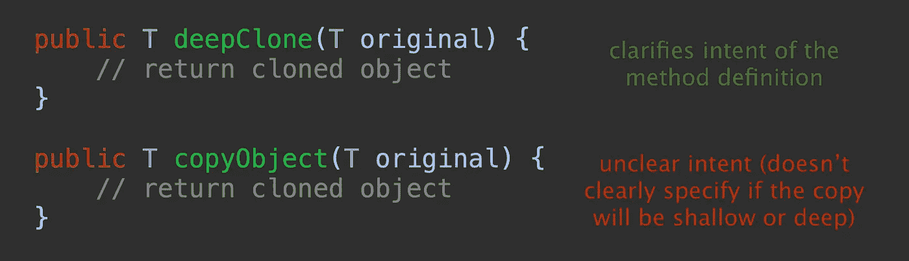
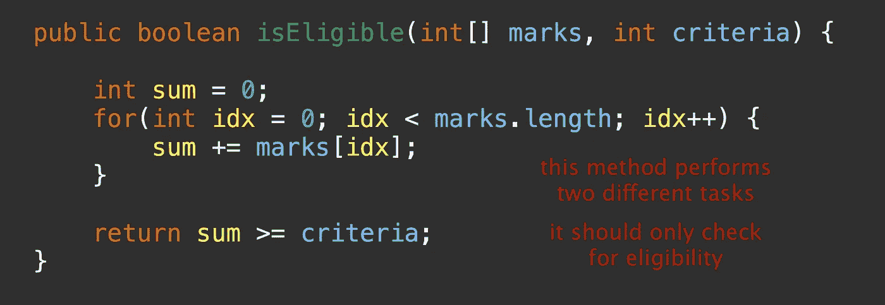
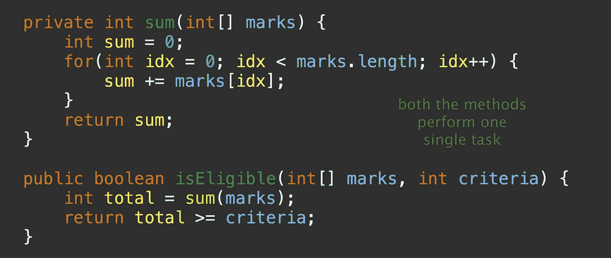
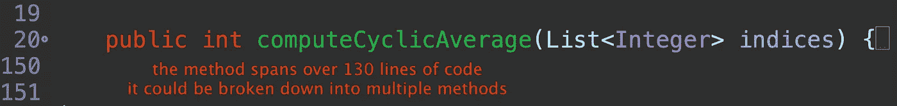
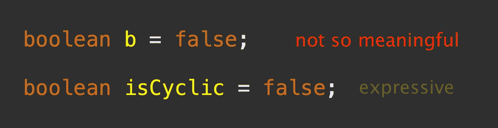
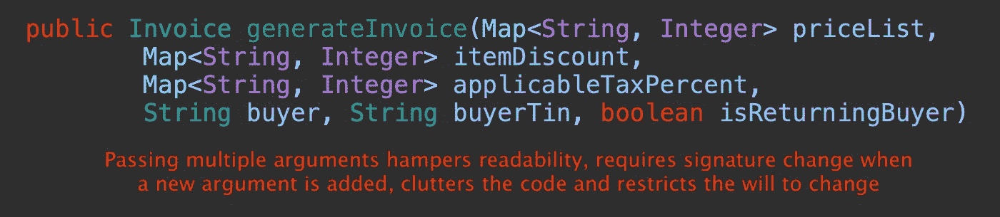
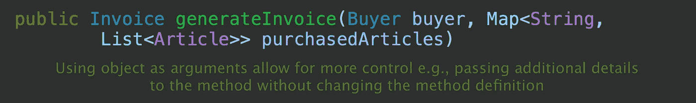
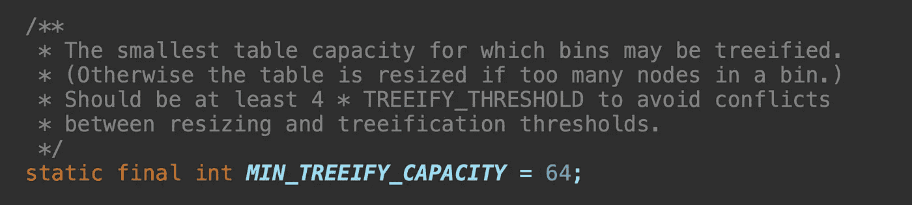
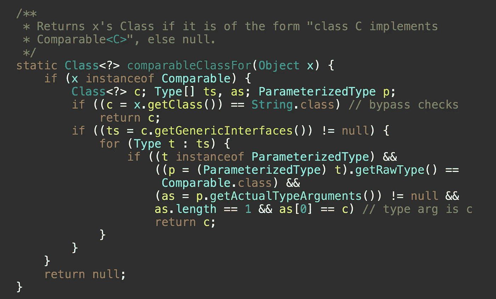
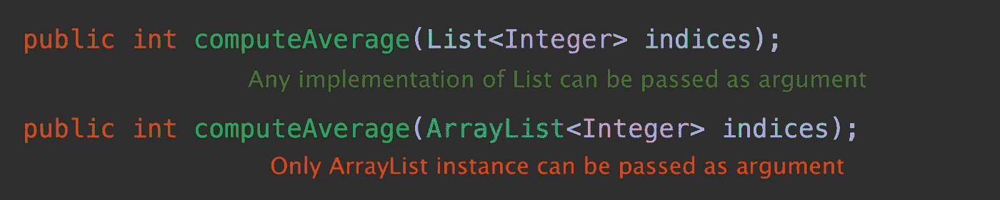

# 干净代码的重要性

> 原文：<https://medium.com/codex/the-importance-of-clean-code-2bb02b36b35c?source=collection_archive---------1----------------------->

我经常审查代码；不仅仅是在我的团队内部，也是跨团队行动的一部分。这项运动既提神又累人。有时我会找到一种全新的创新方法来解决手头的问题，但情况并非总是如此。大多数时候，代码是简单明了的，通常缺乏基本的理性。

开发人员常常忽略了编写干净代码的意义和重要性。代码的编写方式就好像没有人会再去阅读它，就好像它被编写成马上就要过时了。我见过一些非常大的方法定义，一行方法只是调用一个实用程序类并返回，重载方法复制了整个内容，这里要表达的更多。

> 写代码和写干净的代码是两码事。写出来让编译器理解是一回事，让人类理解是完全不同的。

虽然代码正确运行很重要，但可读性也很重要，因为如果不是这样，那就是自找麻烦。一个工作代码并不总是最易读和最容易理解的。平均来说，阅读和理解别人的代码比自己写代码要花更多的时间。

> 我们必须确保我们的代码是以这样一种方式编写的，当我们再次阅读或处理它时，至少我们可以毫无困难地理解它。

不干净的代码是没有效率的，虽然它可能看起来如此。可以引入许多微小但重要的变化来确保代码的整洁和可读性。下面列出了其中的一些。

*1。* ***方法名称应描述其意图***

*2。* ***方法应该总是执行单个任务***

*3。* ***不再有冗长的方法，把许多事情揉成一团***

*4。* ***使用富有表现力的变量名***

*5。* ***传递宾语作为论元，如果可能的话***

*6。* ***写注释表达复杂逻辑***

*7。* ***使用接口避免耦合***

这些只是编写干净有效的代码的几种方法，在这种情况下还有很多要学习的，并作为一般实践引入到代码中。考虑到我们从其中的一些开始，并养成习惯，我们可以很快在很大程度上改造我们的代码。

> 这是我最近写的关于设计模式的书的链接。希望你会觉得有用。

 [## 面向 Java 开发人员的软件设计模式:专家主导的构建可重用软件的方法和…

### 面向 Java 开发人员的软件设计模式:专家主导的构建可重用软件的方法和…

www .亚马逊. in](https://www.amazon.in/Software-Design-Patterns-Java-Developers/dp/9391392474)