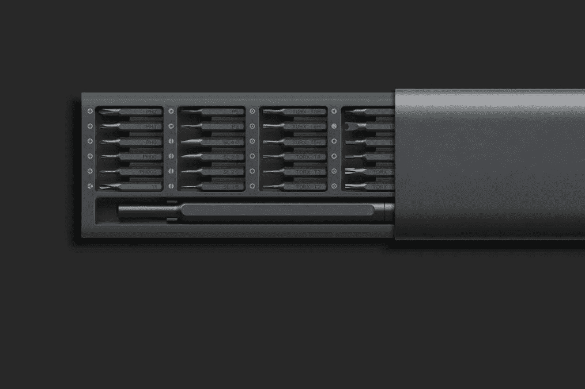

# 依赖注入对良好代码结构的重要性

> 原文：<https://medium.com/codex/the-importance-of-dependency-injection-for-good-code-structure-7d5447f4055a?source=collection_archive---------5----------------------->

…以及何时不使用它！

作为一名大半辈子都在与大型代码库打交道的软件工程师，引入依赖注入彻底改变了我对良好代码结构的看法，并使我更容易将复杂的代码分解为更小且可维护的模块和服务类，而不必太担心分散在代码库中的实例化逻辑，因为它现在封装在 DI 逻辑中。

我是通过一个名为鲍勃·李的谷歌工程师的一系列视频了解到这个概念的，他是 [Guice 框架](https://github.com/google/guice)的作者，随后我阅读了由 [Dhananjay Prasanna](https://www.amazon.com/s/ref=dp_byline_sr_ebooks_1?ie=UTF8&field-author=Dhananjay+Prasanna&text=Dhananjay+Prasanna&sort=relevancerank&search-alias=digital-text) 撰写的[依赖注入书](https://www.amazon.com/Dependency-Injection-Design-patterns-Spring-ebook-dp-B0977ZS7P8/dp/B0977ZS7P8/ref=mt_other?_encoding=UTF8&me=&qid=1634485672)(他也是谷歌 Guice 团队的成员)。

# 什么时候不用？

[依赖注入书](https://www.amazon.com/Dependency-Injection-Design-patterns-Spring-ebook-dp-B0977ZS7P8/dp/B0977ZS7P8/ref=mt_other?_encoding=UTF8&me=&qid=1634485672)将我的注意力吸引到视频系列遗漏或者可能没有明确说明的一个信息提示上；也就是说， **DI 应该只用于您的服务类。**

换句话说， **DI 不是为了实例化你的实体类(例子包括 ORM 类、数据类、数据结构等)。** DI 用于实例化您的应用基础设施服务类。

这些服务类拥有使用**new**Entity 实例化实体和数据类的方法是完全没问题的，但是不应该使用 DI 框架来实例化它们(换句话说，使用 **new Entity()** 完全没问题)。

如果你错过了上面的建议，那么 DI 将开始在你的代码中变得毫无意义，给你增加负担，并且永远不会让你体会到 DI 作为一个概念背后的真正好处。

DI 可能没有用的其他地方是在小型脚本或应用程序中。如果你有一个小的应用程序或者只是写一个小的脚本，DI 可能不是你想要使用的。

**依赖注入-快速解释**

以尽可能简短的解释提供:

> **依赖注入将实例化和连接服务类的责任转移到 DI 逻辑，而不是类实现。**

换句话说，像`CustomerInfoService`这样需要和数据库对话的服务类，不会创建一个`new DatabaseService()`；相反，DI 会将 DatabaseService()的一个实例传递给`CustomerInfoService`的构造函数。这由 DI 逻辑负责(无论是阿迪框架还是应用程序初始化时的简单 DI 代码)。

虽然在细胞微观层面上听起来微不足道，但这个简单的调整在应用程序代码结构的宏观层面上创造了巨大的好处。

原因很简单，您现在可以很容易地用任何服务实现替换任何抽象服务，只需指示 DI 逻辑连接必要的服务实现。

关于如何使用您的代码库，您的代码库可能处于以下三种状态之一:

**代码基础类型 I(从 DI 中受益最大):**您的应用程序中已经有了服务类，您正在其他消费服务类中实例化您需要的服务，或者使用工厂方法实例化您的服务类并将它们连接在一起。在这种情况下，DI 将立即使您受益，因为它将消除创建逻辑和工厂方法，并且所有实例化逻辑将作为 DI 框架(或逻辑)的责任的一部分完全转移。

代码基类型 II(可能会受益):你有服务类，但是由于某种原因，它们在每个类中都使用了`static`方法。这意味着您的服务类是不可实例化的，只是充当静态函数的名称空间。目前，您可以从任何地方调用任何函数(这并不好)。为了使您的代码库适应使用 DI，您的代码库必须进行重组，删除静态函数修饰符，并修改每个类的构造函数，以传递它将消费的所需服务类。在与 DI 进一步合作之前，这是必需的。

**代码库类型 III(几乎没有任何好处)**:在你的代码库中有一个叫做 Utils.java 的巨大类，在静态函数中有成千上万行代码，不断打破单一责任原则。在这种情况下，您可能需要修改代码结构的基础，并开始构建一个为每个服务定义边界的服务层。同样，您的团队可能会认为代码运行良好。在这种情况下，这里所需要的超出了本文所能提供的范围。

# 好处

除了 DI 提供的常见好处(这些好处在网上很多地方都讨论过，包括:更好的可测试性、没有工厂方法层、增强的解耦、更少的锅炉板代码，因为现在所有的实例化代码都由 DI 组件处理)之外，我强烈感觉到以下好处被忽略了，甚至没有被提及:

**好处#1:依赖注入作为一个简单的插件系统**

您可以在应用程序中使用 DI 作为一个简单的插件系统来启用和禁用特定的实现。定义可以做什么的接口可以为不同的行为插入不同的实现。

**好处#2:将 DI 与配置标志结合起来为您的应用程序提供了强大的可扩展性**

从可扩展性的角度来看，您的 DI 组件，结合用于启用不同环境设置的不同配置标志、实验性功能标志或可插拔组件，使阿迪成为非常强大的工具。示例:您可以拥有一个测试或生产的 Enum 环境，它将连接不同的服务实现来模拟测试环境中的真实生产端点。

**好处#3:改变你的思维方式，将你的系统分解成小的服务类，这些服务类相互作用，组成模块，模块相互作用，组成你的应用程序。**

综上所述，需要利用 DI 的优势来感知其背后的力量。另外，虽然你不需要阿迪库框架来启动。我建议使用一个，以便快速引导您了解它如何帮助构建您的服务层。

对于 Java，有 [Guice](https://github.com/google/guice) 和 [Dagger](https://github.com/google/dagger) 。
对于 Python 3， [Opyoid](https://github.com/illuin-tech/opyoid) 看起来很有希望，并且变得更容易，因为 Python 3 现在允许类型声明提示。