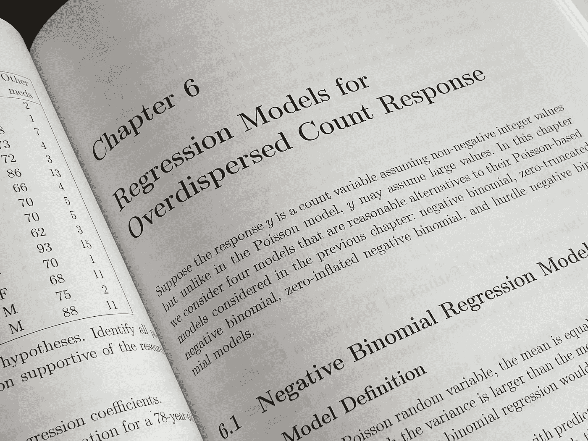

# 比率和 KPI 在数据科学中的重要性

> 原文：<https://medium.com/codex/the-importance-of-ratios-kpis-in-data-science-d9a2623d5cb1?source=collection_archive---------8----------------------->

## 精确 ML 模型的三个步骤

## 如何在机器学习和 co 中创建有用的属性。

在 [Unsplash](https://unsplash.com/s/photos/regression?utm_source=unsplash&utm_medium=referral&utm_content=creditCopyText) 上由 [Enayet Raheem](https://unsplash.com/@raheemsphoto?utm_source=unsplash&utm_medium=referral&utm_content=creditCopyText) 拍摄的照片

在我的职业生涯中，我遇到了为数据科学和统计学建立良好比率的主题。这些对于后来良好的机器学习模型是必不可少的，或者可以显著改善这一点…