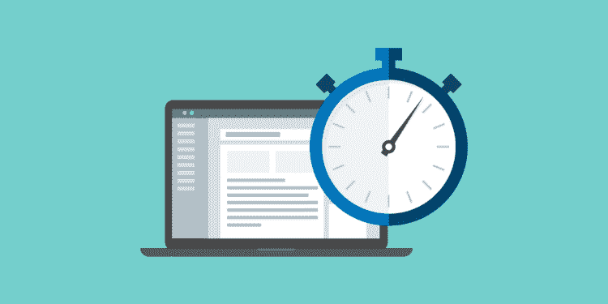

# 时间追踪对设计师和设计团队的重要性

> 原文：<https://medium.com/codex/the-importance-of-time-tracking-for-designers-and-design-teams-ad45a4dfd5ea?source=collection_archive---------14----------------------->

时间追踪对设计师和设计团队的重要性

[来源](https://assets.proof.pub/2056/firstround/3whXDJTDQAaGNXKRHcOa_ThreeDesigners.jpg)

作为一名设计师或企业主，了解你的员工在工作上花了多少时间以及他们在这些时间里做了什么是非常重要的。

你可能没有意识到，但如果你负责整个设计团队或整个设计部门，时间跟踪可能是最重要的方面之一。

如果你不知道你的员工在每个项目上花了多少时间，就几乎不可能知道他们是否有足够的工作要做，或者他们是否需要接受更多的项目来帮助业务进一步发展。

这使得建立一个有效的时间跟踪系统成为改善工作流程、节省时间和降低长期成本的重要一步。

没有人们如何支配时间的清晰记录，就不可能知道员工是否高效地完成了工作，如果你不知道他们在做什么，也很难知道你是否公平地支付了他们的时间。

为了在这篇博客中帮到你，我们将讨论时间追踪如何帮助你管理工作室的五个要点。

但在深入挖掘之前，我们先了解一下

**为什么时间追踪很重要？**

**为什么时间追踪很重要？**

[来源](https://www.clio.com/wp-content/uploads/2020/02/Clio-Blog-10-ways-to-track-hours-using-legal-time-tracking-software-01-750x375.png)

这对设计行业来说是必不可少的，因为这有助于他们决定在任务上花费多少时间。他们可以使用时间跟踪软件轻松跟踪员工的工作时间。

管理设计工作意味着管理设计时间。了解每个设计师花多少时间来恰当地规划未来的项目是很重要的。在处理多个项目时，拥有一支有组织有管理的员工队伍会带来巨大的不同。

时间追踪对于设计师提高工作效率也是必不可少的。时间跟踪软件可以帮助他们跟踪自己的生产力，确定哪些任务比其他任务花费更多的时间，从而使他们更有效率。

现在让我们明白

# 设计师和设计团队如何从时间追踪软件中获益？

设计师和设计团队如何从时间追踪软件中获益？

[来源](https://www.etazweb.it/images/agenziawebpadovaetazwebartsolutions.jpg)

如果你的公司有一个设计团队，你可能很清楚让每个人都按部就班有多难。面对多重任务、客户、截止日期和项目经理，很难专注于真正重要的事情。

如果设计师没有时间完成最后的任务，一切都会落后于计划。时间跟踪软件可以很容易地确保设计师保持在正确的轨道上，并按时交付出色的结果。

他们可以很容易地看到谁在一个项目或项目的一部分上花费了太多的时间。这使他们能够相应地调整工作负载，并确保每个人都高效工作。

借助时间跟踪软件，设计师还可以更好地了解他们每天的时间使用情况，这使他们能够随着时间的推移提高工作效率，并在了解如何最好地工作时变得更有成效。

它还通过跟踪员工的工作时间来减少员工的倦怠，设计师可以准确地知道他们在转移到另一项任务之前必须在一项任务上花费多少时间。

现在让我们来看看‌look 时间追踪对设计师和设计团队的重要性。

# **1)准确的估计**

准确的估计

[来源](https://cdn.civiljungle.com/wp-content/uploads/2021/02/All-About-Estimate.jpg)

通常，客户对项目需要多长时间了解有限。通过提供准确的估计，设计师可以为客户提供更好的服务，并允许他们相应地进行规划。一个时间跟踪软件精确地跟踪雇员在不同任务上花费的时间，包括计费和非计费时间。这将有助于时间估计和监控整个团队的计费时间，从而提高效率。

有了更准确的估算和能够准确跟踪员工工作时间的软件，你的企业可以更好地为客户服务，从而扩大规模。有了时间跟踪软件，你就可以创建报告，详细说明每个团队成员是如何花费时间的，以查看哪些项目需要更多的关注。

总的来说，投资一个易于使用但功能强大的时间跟踪应用程序是值得的，这样可以使您的运营更加顺畅，实现利润最大化。

# **2)降低项目风险**

**降低项目风险**

[来源](https://www.ittoolkit.com/assets/img/articles/600x300/control-project-risk.jpg)

对于设计师来说，跟踪员工工作时间是一个重要的项目管理工具。通过监控他们的工作，您可以更容易地确定谁在做什么，他们何时完成任务，以及他们完成任务需要多长时间。项目风险在任何创意行业都是不可避免的，通过采取措施监控员工的工作时间，你可以从头到尾更好地管理项目风险。

**向设计团队分配任务时，跟踪员工工作时间**。如果你给你的设计师分配了一个八小时的任务，但是只有五个小时是必须的，这是一笔巨大的浪费。

通过密切跟踪他们的工作时间并根据该数据分配任务，您可以节省资金，同时实现高生产率并按时完成任务。

# **3)提高员工参与度**

**提高员工参与度**

[来源](https://assets-global.website-files.com/61766c42e8e50c99a04fbd4b/6179a7473854b15e11196ea6_shutterstock_1389455627.jpeg)

跟踪员工的工作时间是跟踪他们表现的一项重要实践。这种做法可以让员工看到自己的整体进步和可能落后的地方，从而提高员工的参与度。

时间追踪也可以促进更好的时间管理实践，降低压力水平。对于设计师来说，了解他们在一个工作日或一周内在各种项目上花了多少时间是有益的。了解哪些任务需要更多的时间将使设计师和设计团队更有效地计划。

当员工看到自己的进步时，他们的参与度会大大提高，这可以通过时间跟踪来实现。记录工作时间有助于识别持续处于或超过平均工作时间的员工，以及需要额外动力来保持工作的员工。有了时间跟踪，团队领导可以更好地了解他们在一个员工工作日或一周的每项任务上花了多少时间。

# **4)劳动力分析**

**劳动力分析**

[来源](https://bigdata-madesimple.com/wp-content/uploads/2018/06/HR-Analytics-499x368.jpg)

分析对任何商业运作都至关重要，尤其是对设计师而言。它有助于收集反馈，监控输出，并发现有助于提高团队效率的趋势。想象一下，如果你能准确量化你的团队在一个项目上花了多少时间，你会有多大的效率。知道项目何时落后于计划不是很有帮助吗？或者一个给定的项目还剩下多少任务？

如果您回答是，那么时间跟踪是您需要尽快在您的公司实施的事情。这款 [**员工管理软件**](https://www.workstatus.io/) 将为您提供所有的劳动力分析需求，包括工作流程、任务管理、时间跟踪等。拥有团队绩效的实时更新可以让您轻松发现瓶颈或与标准工作流模式的差异。

它还使您能够测量生产率，并确定您的团队在每个项目上花费了多少时间。在当今竞争激烈的经济中，这些宝贵的信息有助于企业的成败。

# **5)主动计费**

**主动计费**

[来源](https://www.wardyit.com/wp-content/uploads/azure-billing-models-blog-post.jpg)

主动计费是任何设计项目不可或缺的一部分。没有它，你将无法确定你的实际利润，或者你是否赚到足够的钱来继续做生意。如果客户在完成一项工作后没有支付设计师，应该有文件证明你满足了工作的所有方面。

你可以使用时间追踪软件来追踪计费时间，这样你就可以证明你在得到报酬之前做了什么。

如果你做很多项目或者在任务之间休息很长时间，记住你所有的时间是很有挑战性的。通过实时跟踪你的时间，你就再也不用问客户欠你多少钱了？更好的是，保持准确的账目将确保你不会多收或少收客户的账单。

# **结论**

如果你是一个独立的设计师或者是团队中的一员，实现时间跟踪软件是至关重要的。你可以看到你的时间都花到哪里去了，评估你在任何‌day 上的工作效率，看看 trends‌.

最终，它可以帮助你更快地完成工作，减少对你的职业发展没有帮助的任务。通过节省你的宝贵时间，它会让你专注于更重要的优先事项。

今天到此为止。我们希望这些提示有助于指出使用[**时间追踪器应用**](https://www.workstatus.io/best-time-tracking-software-online?utm_source=guest-post&utm_medium=codex-rn&utm_campaign=RN) 是多么有益。

不要忘记在下面的评论区分享你的建议、提示和推荐。

祝您愉快！

谢谢大家！！