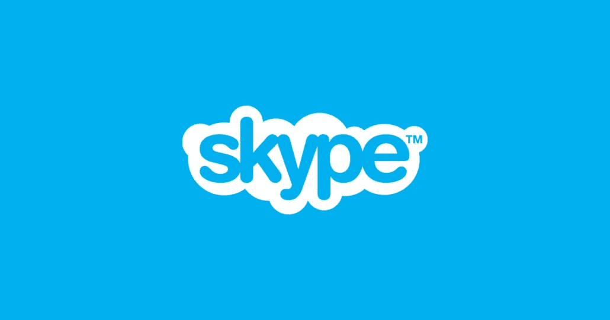
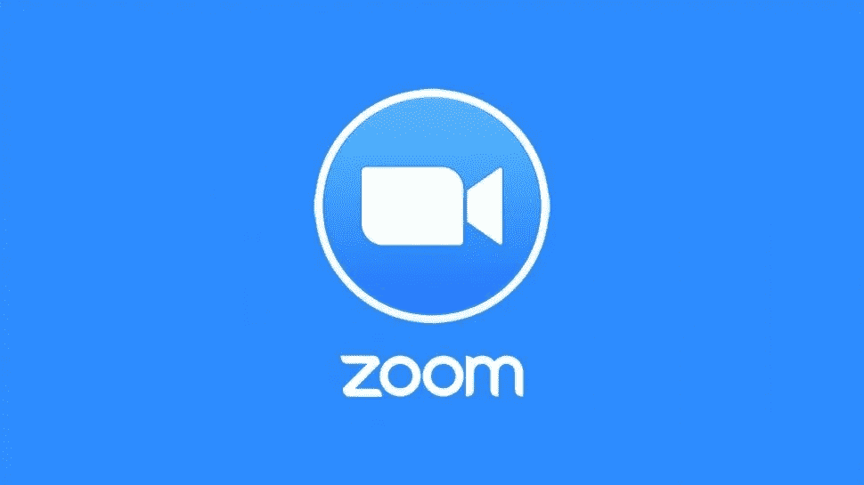

# 疯狂的微软瓶子作业

> 原文：<https://medium.com/codex/the-insane-microsoft-bottlejob-90362e1ea465?source=collection_archive---------5----------------------->

今年是 2012 年。你脑海中最令人恼火的想法不是世界应该在那年的 12 月 12 日结束，不，是你必须在你的 Windows 8 电脑上做点什么。啊，Windows 8，终结一切暴行的暴行。

你打开你的 Windows 8 电脑，如果新的磁贴风格的开始菜单还不足以让你生气，那么这个弹出菜单又如何呢？每次启动时就启动的应用程序，这是你懒得摆脱的挫败感的来源。你告诉自己以后会去做，现在，离开它就足够了。

好吧，很可能你没有经历过这些。但我做到了。在 Windows 8 和 Windows 10 时代的大部分时间里，Skype 都是在启动时启动的，这让我非常恼火。Skype 的声音仍然在我的噩梦中折磨着我。但是因为一些奇怪的原因，他们走了？

我应该高兴他们走了，事实上，我是。但你知道谁不应该吗？微软。

Skype 很受欢迎。非常受欢迎。以至于微软斥资 85 亿美元收购 Skype，击败谷歌和脸书，争夺即时通讯和视频通话应用/平台。当时，这是微软有史以来最昂贵的收购。如果像微软这样的巨头愿意花那么多钱在一项主要用于视频通话的服务上，特别是在组织内部，那么他们肯定有计划，这些计划会让他们赚得远远超过他们投入的。

Skype 成为一个 Windows 软件包，预装在许多 Windows 8 和 10 电脑上。在很长一段时间里，如果你需要通过互联网与朋友、家人或同事进行视频或语音通话，它是首选应用，尽管它有很多缺陷，但它仍占据主导地位。

一晃 10 年过去了，2021 年即将结束，Skype 不过是过去的一个幽灵，一个褪色的记忆，一个逝去的烦恼[可能有点刺耳，但我从来没有真正喜欢过 Skype。]你提出视频通话或语音通话，你的选项是 Google Duo 或 Zoom，后者可能性更大。Skype 比这两种服务都古老得多，然而，当疫情来敲门，扰乱人类生活，迫使我们进入一个通过互联网工作的时代，一个语音和视频通话成为日常必需品的时代，Duo 和 Zoom 崛起，而 Skype 逐渐消失。

这引出了一个问题。微软怎么把这个包装的这么烂？即使是托特纳姆热刺队也没那么差。这是一个突破性的瓶子工作，真的。二十年的领先优势，几个月就消失了。

从预装 Windows 系统的电脑，到仅仅成为那些出于某种奇怪的原因决定购买 Skype 的用户在几乎不用的 Windows store 中的一个选项，微软似乎也已经接受了他们严重错失 Skype 的事实。

但是他们是怎么做到的呢？

首先，微软是推出 Windows ME、Windows XP 和 Windows 8 的同一家公司，所以他们在长长的名单上又增加了一个 L，这真的不应该是一个令人惊讶的事情，但 Skype 的情况并不是服务糟糕，而是它没有最大限度地发挥其潜力，抓住出现的机会。公平地说，微软也确实破坏了这项服务。

大约在 2016 年或 2017 年，微软做了一些令人难以置信的大胆和鲁莽的傻事:他们对 Skype 应用程序进行了非常不必要的重新设计，试图更新它，以类似于世界上的 Snapchats、WhatsApps、电报和 iMessages。他们想变得可爱。他们想变得性感。他们推出了自己的表情符号版本，并试图提供自己版本的 Snapchat 功能，这是一个荒谬的愚蠢举动。界面变得一塌糊涂，性能倒退，视频通话质量变得更差，因为掌舵的白痴们决定，改善视频通话平台的最佳方式是模仿一个在当时因色情短信而全球闻名的平台。

这是一个奇怪的决定。也许他们希望它能吸引更年轻的人群，但事实是，Skype 最受需要该平台与团队互动的员工的青睐。没有多少 15 岁的孩子会接触这个应用程序，不管重新设计了什么。我知道这一点，因为我也曾是一名青少年，在我整个高中经历中，没有一次有一群朋友建议在 Skype 上互动。Skype 不是那种人。永远都不会。

因此，当微软进行自我破坏，该应用的评论直线下降时，许多其他公司正准备夺走桂冠，提供同样的功能，使 Skype 在第一时间流行起来，但更好，更优化。这就是为什么我们都在缩放而不是 Skyping:微软可怕地摸索着袋子。

当 2020 年疫情袭击世界时，作为预防措施，全球各地都实行了封锁，这意味着几乎整个世界都必须数字化工作和学习。这意味着，这是一段时间以来，世界第一次真正需要 Skype。你猜怎么着？

他们也搞砸了。一个相对错误、复杂的程序和糟糕的通话质量，这些问题促使人们寻找替代方案，以便在大流行后的世界中保持联系。变焦是另一种选择。Zoom 响应了这一号召，有效地将 Skype 送进了坟墓。

国王万岁

Zoom 的崛起可能把 Skype 放进了棺材，但是是微软自己把最后的钉子敲进了棺材。怎么会？嗯，随着微软团队的引入。

你知道 Skype 在 2012 年到 2017-19 年间是如何作为膨胀软件预装在 Windows 操作系统中的吗？好吧，微软现在已经将他们的注意力转移到 Teams 上，这是一项服务，它做了 Skype 应该做的事情，并附加到 Windows 11 任务栏上，就在开始和小工具按钮旁边。

Teams 拥有 Skype 的所有功能，此外还有一些令人印象深刻的聊天功能，以及与 my Microsoft 提供的其他服务的集成。所有这些都使得 Teams 成为一种服务，这种服务一定会吸引各种组织，甚至可能挑战 Zoom 的桂冠。当然，除非，微软拉另一个微软，把它全炸了。

也许他们从过去吸取了教训？