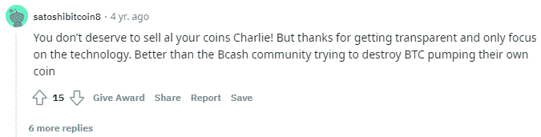

# 机器人网络和反 BCH 宣传

> 原文：<https://medium.com/codex/the-internet-of-bots-and-the-anti-bch-propaganda-35942c4549e8?source=collection_archive---------13----------------------->

*图像:*

*查理·李(莱特币创始人)五年前在接受美国消费者新闻与商业频道采访时声称，比特币(BTC)的目标是取代美元。*

*这是一个空洞的叙述，因为查理·李已经知道 BTC 无法扩大规模。*

*一个月后，李开复卖掉了他所有的长期贷款，换成了美元。从一个真正的信徒瞬间转化为投机者。然而，整个 LTC 社区似乎并没有对此感到不安。*

*Litecoin 社区没有做出反应，也没有像任何一个理智的人所期望的那样，大规模谴责查理·李是一个出卖者。想象一下投资者对贝佐斯出售其所有亚马逊股票的强烈抗议就是一个例子。*

*事实上，似乎没有人关心莱特币的创始人和主要倡导者查理·李实际上卖掉了他所有的长期信用币。Litecoin 的价格持续上涨，数量不断增加，合作和发展的“好消息”持续了大约一个多月。这种对任何理性投资者来说都令人发指的行为在社交媒体上受到了推崇、赞扬甚至称赞:*

**

*[推特](https://twitter.com/callumadamson/status/943404202738503681)*

*很奇怪吧。推特上的这个家伙甚至在祝贺查理·李向他的投资者倾销莱特币。*

*声明是在 Reddit 上发布的，然而评论似乎完全同意接受这是很自然的事情！我们甚至可以找到一些评论，认为这是一个绝佳的机会来表达对比特币现金的一贯仇恨！*

**

*[*reddit*](https://www.reddit.com/r/litecoin/comments/7kzw6q/litecoin_price_tweets_and_conflict_of_interest/)*

*这个账户(和其他多个 Reddit trolls)转移话题诋毁 BCH 是多么的方便啊！！*

*但这是一个真实的账户吗？有一个真实的人写这个评论吗？Litecoin 社区在 2017 年支持它，并在 2018 年 2 月决定完全放弃 LTC 吗？*

**

# *机器人的互联网*

*当一个真实的人决定挑战叙事，站在风的面前而不是随波逐流，提出真正的问题，会发生什么？*

**

*这是 2022 年的互联网。**互联网的审查制度。***

*二十年前，甚至十年前，互联网都不是这样。*

# *反比特币现金宣传*

*“骗局”和“骗子”这两个词很厉害。BTC 的影响者经常滥用这些术语，因为这是一种逃避争论的简单方法。就指责对方是骗子！*

*称某人为骗子，即使没有证据，甚至没有一丝怀疑，直接暗示指控者是诚实的参与者。*

*已经没有理由了吗？称马克·库班为骗子！Tone Vays 也是这样做的，为什么其他人不是呢？*

*随机垃圾邮件机器人，就像邪教成员一样突然出现，用类似的方法刺激比特币现金。总是使用个性化攻击(ad hominem ),因为这是主要方向:*

**

*(我不太确定为什么这两个人(Blockstream founders/[trolls](https://twitter.com/gavinandresen/status/859390357552979968))甚至被主流社会认为是值得尊敬的人，但仍然不是这个问题，所以我暂时不讨论这个问题)。*

*始于 2014 年的宣传已经发展并服务于一小部分人的利益，为有影响力的人提供方向。比特币现金的宣传出现了一个令人不安的挑战。*

*然而，这不仅仅是来自 BTC 支持者的宣传，那只是一小撮个人。互联网算法改变到我们不知道今天什么是真实的，什么不是。*

*Python 和更多的编程语言在自动化过程方面令人惊叹。*

*一个简单用户可以执行的操作是有限的。极限是基于我们只有一个大脑和一个键盘的事实。然而，有了脚本，我们不仅仅是一个人，也许我们可以是成百上千的人。*

*依靠我们的 CPU，或者一个人控制下的 CPU，一个精通技术的个人，可能等于成千上万的真实用户。*

*机器人是根据开发人员的突发奇想或他收到的指令来编程的。*

**

# *死亡互联网理论——大部分互联网都是假的*

*互联网上的操纵范围很广。*

*根据“死亡互联网理论”，绝大多数互联网只是一种营销策略，使用先进的人工智能技术和付费媒体影响者，戏剧性地影响公众舆论并控制我们的态度。*

*虽然这个视频包含了一个强烈的信息，应该让每个人都重新思考他们的在线方法，但我们将在真实的加密中检查这一现象。*

*“互联网感觉空荡荡的，没有人”。*

## *机器人运行着加密互联网，影响者在上面*

*首先，我想提一下，活动地址的数量并不代表一个网络的实际用户数量。可能是数百万个活动地址在一个脚本例程下执行事务，而用户只有一千个，甚至更少。几乎没有办法知道，也没有人会投入精力和资源去发现这一点。*

*这是关于区块链的使用，而不是在中央交易所进行的交易*

*Twitter 账户也不是代表采用的数据。随着谷歌上服务广告的增加，任何东西看起来都很受欢迎。*

**

*[*推特*](https://twitter.com/Panterabch/status/1478395376759709700)*

*很可能，“加密子弹”忘记了他为 Twitter 上的 10 万名粉丝付费。和有人花钱买 1500 个赞和转发没什么区别。*

*非常渴望将比特币现金归类为骗局，因为这是他的邪教洗脑后他声称的。*

*也许购买追随者的价格不同，但是通过暴露这个用户，他也暴露了他自己。非常有趣的是，他甚至没有意识到这条推特看起来有多糟糕。*

*YouTube、抖音和其他网站也是如此。看起来合法的机器人大军可以将一个不会引起任何注意的视频变成病毒。人们有追随他人的倾向。互联网就是这样一个例子，对每个视频或文章的喜欢/不喜欢和看法是其价值的决定性因素。*

*“继续毫无意义地与那些冒犯你的在线机器人争论，以激发无休止的参与。”。*

*网络机器人和网络巨魔的战争已经持续多年。今天，它在 Reddit、Youtube 和 Twitter 上变得很有趣，因为这还处于测试阶段。机器人在学习，开发人员在进步。*

**

*这种胡说八道的一个例子是这个评论。这是一个机器人。使用自比特币诞生以来大量复制的标准论点，它挑选了某些引语释义，并将其重新创建为一个新版本，只是为了保持讨论。*

*当然，它似乎不是一个真实的人，它的目的是不断提出某个观点，但也不断与其他用户(在这种情况下是我)进行无休止的接触。*

*由于没有人关心或有资源进一步调查此事，机器人正在横冲直撞，破坏(一些)用户的互联网体验，这些用户记得它不同。*

*你说错了话，你被审查，你陈述你的观点，算法暂停你的账户。祝你找到真人。*

> *YouTube 上的浏览量，点击量，增长，都是胡说八道。我在 YouTube 上做了七年，才发展到今天的规模，这完全是人为的……都是假的……说正确的话，推送正确的内容，你就会成功，你会随波逐流。但是如果你站在风的前面，你将会独自站在那里看 20 个风景。*
> 
> *[*来源*](https://www.youtube.com/watch?v=DEn758DVF9I) *(07:00)**

*上面链接的视频中另一个重要的引用是:*

> *最保险的假设是，我们今天在主流中看到的技术是在我们看到它之前 10 到 15 年创造的。所以想象一下人工智能现在能做什么。我们多年都无法理解的事情。*
> 
> *[*来源*](https://www.youtube.com/watch?v=DEn758DVF9I)*

**

*[*推特*](https://twitter.com/mackenzieastin/status/941459382864437248?lang=en)*

**

# *互联网有多少是真实的？*

*我们生活在一个不知道什么是真实的什么不是真实的时代。*

*我们只是尽可能多的阅读，把主流叙事当成理所当然。*

*机器人、审查和舆论操纵的互联网也体现在反比特币现金运动中，这场运动持续了数年，预计不会很快结束。*

*有多少是真的？到目前为止，还不知道有多少 Reddit 机器人账户在传播反 BCH 的宣传。*

*一个强大的程序员，可以创建成千上万个帐户，并在任何平台上释放它们，可能会被忽视很长一段时间。*

*“在操纵、金钱和权力的海洋中，我们只是一个小小的声音”*

*有些人正在为此尽自己的一份力量。*

**

*在以下网站写作:●[read cash](https://read.cash/@Pantera)●[noise cash](https://noise.cash/u/Pantera99)●[Medium](/@panterabch)●[Hive](https://hive.blog/@pantera1)●[Steemit](https://steemit.com/@pantera1)●[Vocal](https://vocal.media/authors/pantera)●[Minds](https://www.minds.com/pantera99/)●[Twitter](https://twitter.com/Panterabch)●[LinkedIn](https://www.linkedin.com/in/panterabch/)●[email](https://read.cash/@Pantera/localcryptos-p2p-exchange-is-now-offering-bitcoin-cash-trading-06637230#bad-link)*

> ***免责声明**:本内容发布的所有材料均用于娱乐和教育目的，并符合**公平使用**的准则。无意侵犯版权。如果您是或代表本文所用材料的版权所有者，并且对所述材料的使用有疑问，请发送 [**电子邮件**](https://read.cash/@Pantera/cryptouknowns-battlegrounds-the-crypto-battle-royal-part-i-0ca762da#bad-link) 。*

****支持内容创作者。****

*如果你喜欢这个故事，就订阅吧！*

**原载于*[*https://read . cash*](https://read.cash/@Pantera/the-internet-of-bots-and-the-anti-bch-propaganda-3bed0c6b)*。**

**