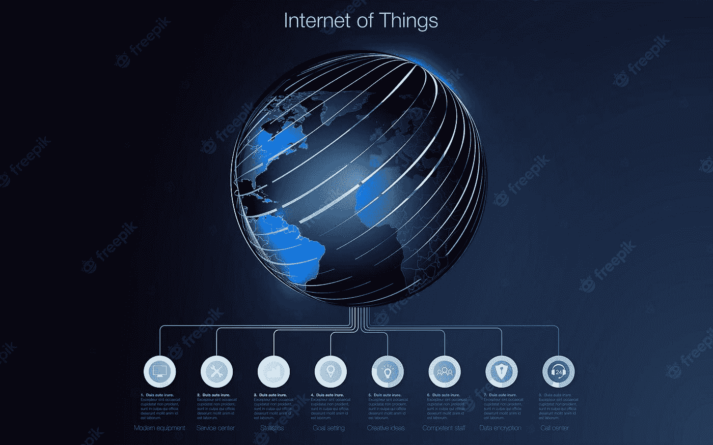

# 物联网解释道

> 原文：<https://medium.com/codex/the-internet-of-things-explained-c418dc07ec47?source=collection_archive---------20----------------------->

## 技术

## 了解互联设备的基础知识

图片来源:Freepik

# 物联网

过去几年，物联网(IoT)已经成为一个热门话题，各种规模的企业都在探索这个互联世界的可能性。物联网是将互联设备、软件…