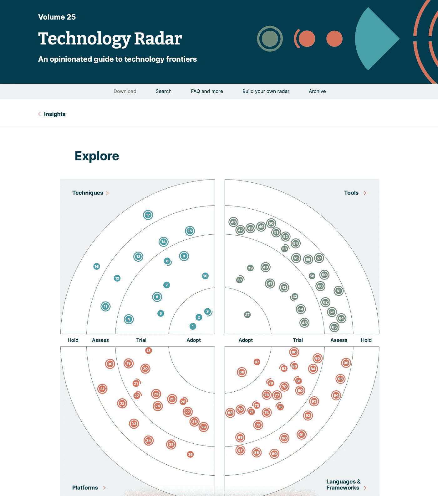

# 面试过程:架构和系统设计

> 原文：<https://medium.com/codex/the-interview-process-architecture-and-system-design-a9cd09b2a72d?source=collection_archive---------4----------------------->

面试过程的这个阶段在不同的公司之间是不一样的。每个人都专注于一些特定的技能，这取决于他们在寻找什么。例如，一些公司非常看重你与公司文化的契合程度，当你在这个舞台上时，这很容易识别。大多数类型的技术面试是:

*   实时编码
*   根据给定的问题提出解决方案
*   为一些业务案例绘制架构模型

每一个都是为了回顾你的经历，展示你能为团队做出多大贡献。例如，实时编码专注于解决一个算法问题，但也显示你的代码本身如何:你如何命名变量，你的代码有多干净，它的可伸缩性如何。在你解决了问题之后，面试官增加了问题用例的可选场景，或者可能只是更多的需求需要实现。这种情况会显示你是如何思考的，也是证明你为什么是那个职位的理想候选人的最佳机会。测试是非常赞赏的。如果你建议从测试本身开始，遵循 TDD 方法，你将比其他候选人领先几步。

# 另一方面…

这种面试不仅仅是考察你能编多少代码。技术面试官关注不同的方面，例如:

*   你如何阐述你的想法。
*   你对建议有什么反应？
*   接收反馈时遵循的方法。

例如，很容易找到具有很强编程技能的候选人，但是对于他们来说，解释他们的解决方案或者证明他们为什么做出一些决定是复杂的。面试官的任务不是评判你，他在那里只是帮助你找到解决方案，探索你能给团队带来多少价值。在这个过程中，很容易发现当解决方案不被接受时感到不舒服的人，那么他需要改变一些东西。其他人只是太紧张，不能清楚地思考。同样，面试官的任务是帮助你找到解决方案，在需要时给出反馈，并探索你的职业经验。

# 建筑评论

与前一个主题相同，架构挑战旨在探究您对工具、实践和模式了解多少。基本上，您需要能够基于给定的用例提出解决方案，例如:“我们需要在一次营销活动中每秒处理超过 1000 个请求”。大多数候选人开始提议负载平衡方法、扩展实例等等。没关系，这解决了问题，但是作为面试官，如果你开始问更多关于需要什么的问题，我们会很感激。如果您熟悉云基础设施，也许您可以建议使用 CloudFront 缓存来避免相同请求的服务，基本上，您很容易就解决了问题。

你获得的背景越多，就越有机会提出一个好的解决方案。你的经历是独一无二的，如果你能用它创造出一个前无古人的解决方案，那么功劳就是你的了。

您还必须准备好扩展您的架构。与您的架构中预期的编码练习相同:

*   可量测性
*   可靠性
*   安全性(访问角色、凭证管理)

当然，为了能够提出符合要求标准的解决方案，您必须熟悉云计算、第三方工具等等。我建议回顾你所有的专业经验，确定你最强的话题，并检查当前的市场状况。在软件开发中，事情变化非常快，您应该与这些变化保持一致。一个非常有用的工具是 ThoughtWorks 技术雷达。这将有助于您与现代堆栈保持一致，并且您将有更多的洞察力来丰富此类练习的提案。

在某些情况下，会建议您遵循特定的技术堆栈来解决架构挑战。这不是一种常见的做法，但一些公司遵循固定的架构，您应该与采访者一起验证它，如果您不熟悉堆栈要求，您可以提出一个替代流程。例如，假设您是一名谷歌云专家，但是您需要使用 AWS 服务来实现解决方案。如果你只是说“对不起，我不熟悉 AWS，无法解决这个挑战”，那你就完了。也许，类似于“我不熟悉 AWS 服务，但我知道云平台是如何工作的。云提供商之间有共同的服务，所以我可以尝试提出一个架构模型。”。听起来好多了，对吧？经验和您的想法比您对特定供应商的了解程度更重要。最后，你可以在几个月内熟悉 AWS，因为你已经熟悉云计算，这是关键。

# 提问

在大多数技术面试中，你会问一些问题。一般在技术面试结束后，你会有一些时间向面试官提问。这段时间非常有用，因为面试官通常是一个团队的高级开发人员，如果你被录用了，你有很多机会和他一起工作。这是一个询问公司日常生活、他们如何解决特定用例、组织和管理情况等的好机会。当候选人询问这些话题时，我们真的很感激，因为这表明了你对成为我们团队一员的真正兴趣，现在我们需要让你相信我们非常适合你的职业生涯。

通常，面试流程中有第三个阶段:行为面试。通常，这是对一些经理的采访，基本上是探索你的职业生涯，并谈论你面临的一些挑战。这将是我们最后一次讨论的话题，敬请关注，别忘了提问。如果您错过了关于代码挑战的第一阶段，您可以在下面找到它:

 [## 面试过程:代码挑战

### 为面试过程中的第一次测试做好准备

medium.com](/codex/the-interview-process-code-challenge-a403b1961506) 

那里见；)