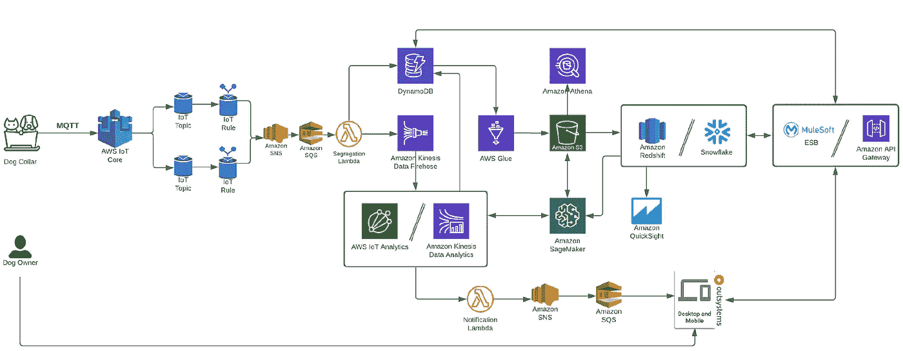
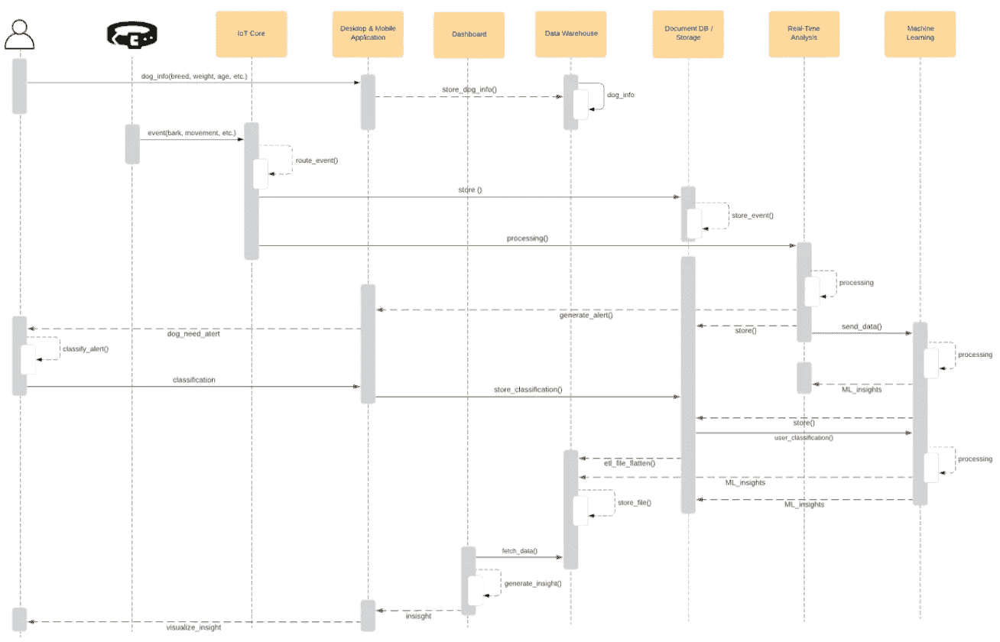
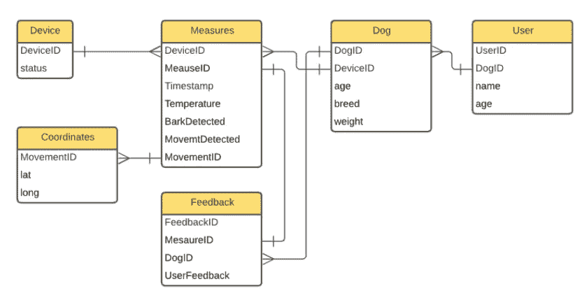
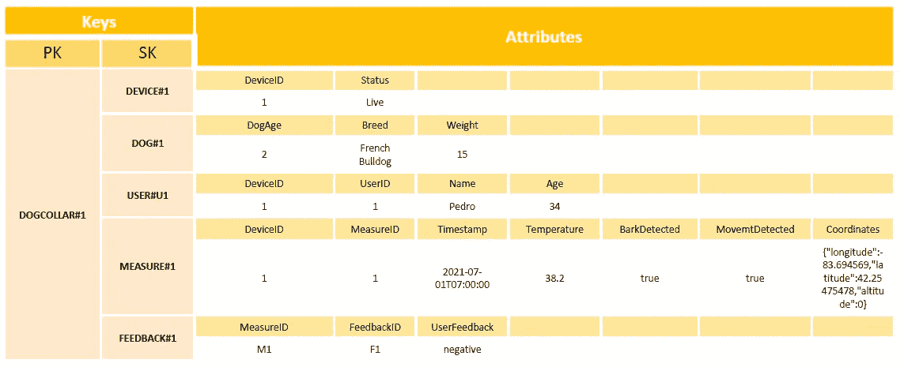
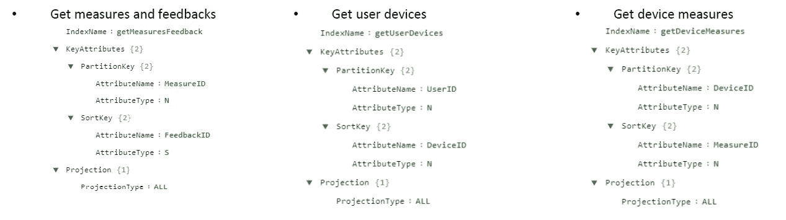

# 物联网狗项圈护身符

> 原文：<https://medium.com/codex/the-iot-dog-collar-charm-8e98a5b4cf2f?source=collection_archive---------10----------------------->

在我过去的一次互动中，我经历了一个物联网用例，当时我觉得非常有趣，我想与世界分享结果。请记住，有些技术可能会被废弃，有些想法可能会改变，但我相信主要思想仍然有效。

# 假设

*   来自 dog collar 的所有信息都以 JSON 文件/有效载荷的形式发送，以提供轻松展平这些文件并使用标准化工具(API、集成等)读取它们的能力。).
*   用户可以使用移动或网络应用程序输入狗的信息。
*   Dog 的信息和基于历史信息计算的见解/KPI 存储在关系数据库中，供 ANSI SQL 功能共同使用。
*   AWS IoT Greengrass 不在此架构上使用，但可用于部署、配置和管理。
*   安全细节，如加密、设备网关、身份服务和注册表，在提出的架构中没有考虑。
*   在这个体系结构中，没有对 API/ESB 技术的完整描述，它旨在提供在移动/web 应用程序之间存储信息和层间通信的能力。

# 高层架构

仅使用 AWS 云原生技术，定义的架构假装实现了一个物联网环境，它不仅包含数据环境和可能的见解推导，还包含在应用程序和物联网部分之间传递信息的集成层。

基于高级 AWS 的物联网架构

当时的目的是存储由 dog collar 输出的所有事件，并将它们保持在其原始格式下，允许快速实时分析，然后将这些事件处理成关系格式，以存档在数据仓库中，用于 KPI 分析。

# 端到端序列图

下面的端到端图表旨在解释各种应用程序之间的数据流。狗主人、项圈、web 应用和后端、存储之间的信息流，如何处理见解并将信息输入机器学习算法。

狗项圈的端到端序列图

# 集成规范

集成规范为物联网解决方案的成功实施提供了协议的高级视图。提供关于设备网关的消息协议和交换消息的有效负载示例的视图

## 设备网关

MQTT:使用发布/订阅方法。基本上包括在向 MQTT 代理发布数据时包含一个主题名。然后，这些主题负责为代理路由信息，需要来自每个想要接收该主题消息的客户端的订阅。代理保证将具有匹配主题的所有消息传递给客户端。
HTTP:允许设备通过 POST 向网关推送消息。

## 证明

因为我们计划使用 MQTT，所以我应该用 X.509 证书来认证消息。此外，使用相互 TLS 身份验证来验证客户端证书。因此，当使用 X.509 证书时，设备网关需要使用 TLS。

## HTTP POST 的示例

## 衣领信息示例:

> { " timestamp ":" 2021 07 01 T07:00:00 "，
> "device_id": "dogcollar123 "，
> "temperature": 38.2，"
> bark _ detected ":true "
> movement _ detected ":true "
> location ":lat ":33.406601，long ": 111.9075196}}

## 所有者消息示例:

> { " timestamp ":" 2021 07 01 T08:00:00 "，
> "dog_id ": 32，
> "notification_id ": 2134，
> "user_feedback ":"正"，}

# 数据模型

为了以正确的方式存储信息，使用非关系数据库将符合目的，这意味着所有事件将以原始格式存储，并可以使用这种结构进行查询。

代表性 ERD 模型

ERD 数据模型是事件的关系模型的表示，它有助于促进关系模型到非关系数据模型的转换。这样，它只是表和信息之间关系的图形表示。

## DynamoDB 数据模型

为此架构选择的存储是 DynamoDB。这个数据库具有处理文档的优势，并且非常适合以原始格式存储 JSON 文件。该数据库将充当物联网领域事件的运营数据湖。

为了合理地存储信息，上图显示了一个表模式，该模式将存储狗项圈的所有事件，并提供狗主人、狗和狗项圈之间的联系。这个数据库将以一种更加高效和实时的方式为 web 应用程序提供信息。

DynamoDB 模型—单表表示

## 访问模式和全局二级索引

使用 Dynamo 时，通常会定义最常见的访问模式。这些定义有助于创建全局二级索引，从而以更高效的方式读取 Dynamo 中的数据。尽管实施 GSI 的数量有限。

全局二级索引的示例

重要的是，所有的技术、方法、途径和想法都是观点，不应该被认为是绝对正确的。我完全接受讨论、意见甚至头脑风暴！