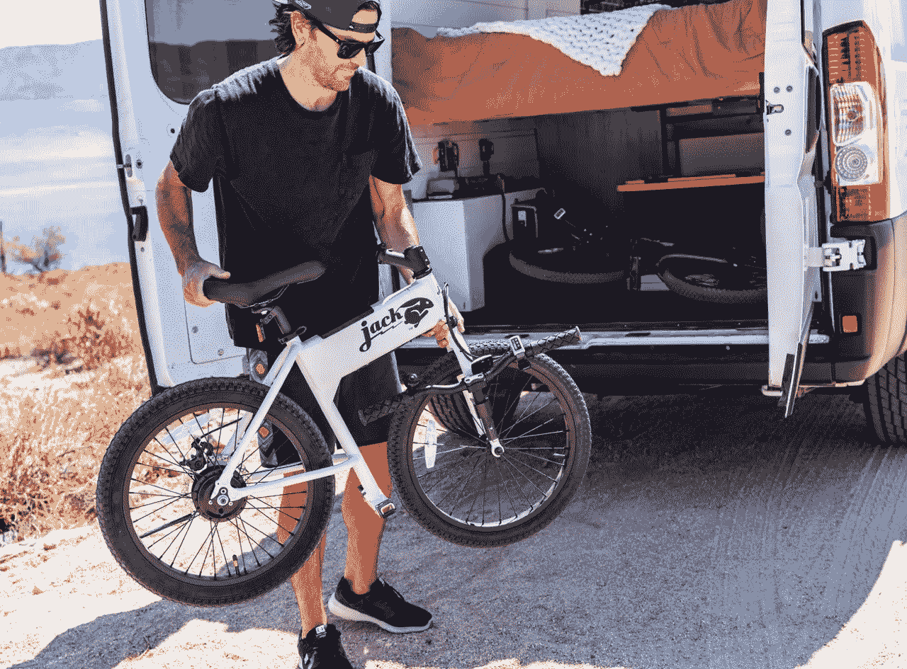

# 长耳大野兔微型自行车——一种新的出行方式

> 原文：<https://medium.com/codex/the-jackrabbit-micro-bike-a-new-way-to-get-around-4dd0c7641b9f?source=collection_archive---------2----------------------->

## 踏板车上面的“台阶”

[卸载长颈兔(长颈兔的介质)](https://cdn.shopify.com/s/files/1/0591/7406/0200/products/Camper_1000x1000_crop_center.png.jpg?v=1662061348)

乍一看，[长耳大野兔微型自行车](https://jackrabbit.bike/products/jackrabbit?variant=41475026583720)是一个值得一看的景象。称之为小型电动自行车和坐式滑板车的结合。首先，你会找到平台来休息你的脚，而不是踏板。仅依靠电池电力将你从 A 点带到 B 点，这看起来像一个伪装成自行车的有趣的小骑行。什么是…