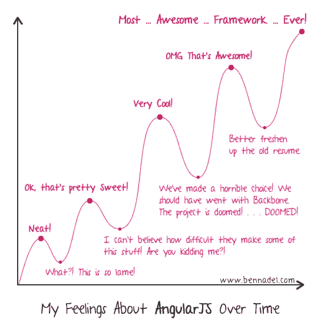
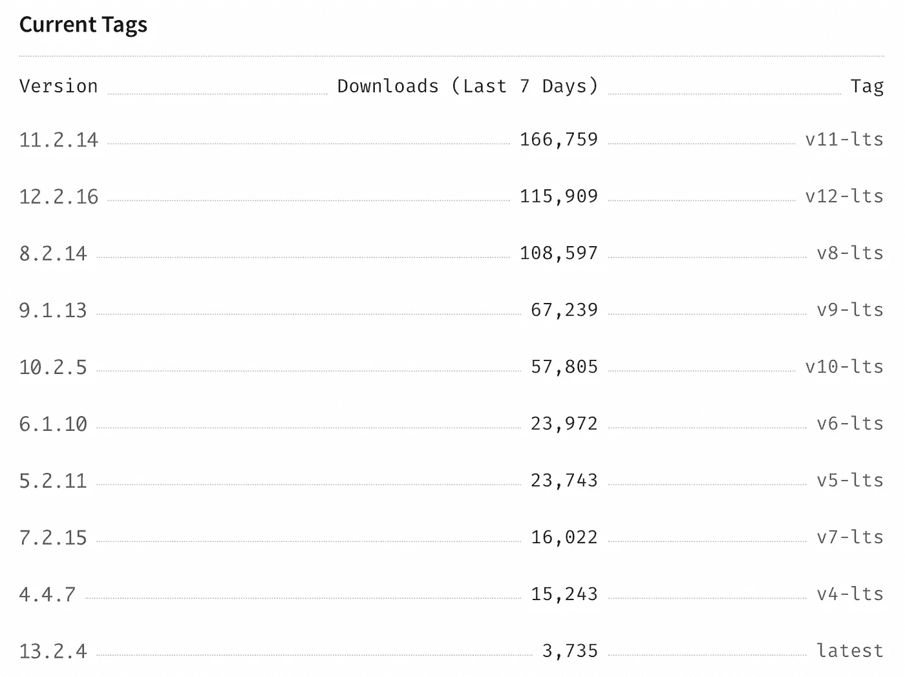
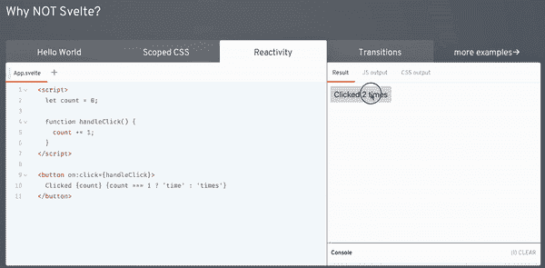

# JavaScript 框架之战已经结束

> 原文：<https://medium.com/codex/the-javascript-framework-war-is-over-bd110ddab732?source=collection_archive---------0----------------------->

## 赢家只有一个。

马库斯·斯皮斯克在 [Unsplash](https://unsplash.com?utm_source=medium&utm_medium=referral) 上的照片

# 竞争者

框架之间的战争是 JavaScript 社区的热门话题，也是该行业众多[圣战](https://en.wikipedia.org/wiki/Editor_war)之一。从一开始，从 jQuery，到 AngularJS，再到现代框架，战争一直很激烈。

许多人在这条道路上倒下了，像 Backbone 或 Sencha，留下了尸体:成吨的遗留代码需要维护。其他存活下来的，比如 jQuery，令人惊讶的是仍然有一个很大的社区。其他的，像 Angular，似乎并没有像预期或承诺的那样升空。

## [jQuery](https://jquery.com)

这可能是在世的最老的参赛者。它非常受欢迎，因为它解决了浏览器之间的互操作性，但是应用程序很难扩展。

现在的 jQuery 并不是主流之一，对于大部分项目来说也不是最佳选择。

## 

**它已经处于 LTS 模式，并且已经被它的老大哥所取代。毫无疑问，这是框架生态系统中的一次大跃进，我们中的一些人仍然怀念它。**

**但是，因为它不再积极维护，它不再是一个竞争者。**

## **[**棱角分明**](https://angular.io)**

**它来到这个世界与 React 竞争。AngularJS 变老了，它有性能问题，健壮性问题，随着 React 变得更好，许多程序员用羡慕的眼光看着 React。Angular 对 AngularJS 进行了现代化改造，以利用 ECMAScript 6 的最新改进，并试图履行与 React 有效竞争的承诺。**

**Angular 最突出的难点就是沉重的学习曲线。它需要很多概念，不是所有的东西都是直截了当的，而且它有很多死胡同。学好 Angular 很难:它继承了 AngularJS 的学习曲线，但有新的困难，比如 RxJS 或分层依赖注入。**

****

**[本·纳达尔](https://www.bennadel.com)的原[图](https://www.bennadel.com/resources/uploads/2013/feelings_about_angularjs_over_time.png)。**

**Angular 的另一个担忧是，它打破了很多承诺。例如，自 V2 以来，每个人都期望有一种简单的方法来创建服务器端呈现的页面，但现在，2022 年 2 月 24 日， [Angular.io](http://Angular.io) 网站本身没有 JavaScript 就无法工作。**

**但 Angular 最大的问题是碎片化和版本升级。升级版本很辛苦；这太难了，以至于用户不敢冒险升级它的应用程序。可以在 [npm 网站](https://www.npmjs.com/package/@angular/core)看到。**

****

**有很多老版本的用户。**

## **[VueJS](https://vuejs.org)**

**Vue 是许多开发人员的答案，他们需要比 AngularJS 更高性能，但比 Angular 更稳定和易于使用的东西。Vue 在其模板系统中非常接近原始 Angular，保持了 AngularJS 的简单性，但同时，它从 React 中获得了一些功能。**

**但是 VueJS 在版本 1 和 2 中有一个严重的问题:它不能很好地处理数组，作者[指责 JavaScript](https://v2.vuejs.org/v2/guide/reactivity.html#Change-Detection-Caveats) 选择了错误的更新算法。如果你不使用像 Vuex 或 Redux 这样的库，可能会导致严重的问题。你可以在这里看到一个可以在 [AngularJS](https://jsfiddle.net/drpicox/90awezk8/) 中运行的应用，但是不能在 [VueJS](https://jsfiddle.net/drpicox/vLr0vhvf/29/) 中运行。**

****

**摘自 [Vue 文档](https://v2.vuejs.org/v2/guide/reactivity.html#Change-Detection-Caveats)指责 JavaScript 的变化检测算法的局限性。**

**理论上，这个问题在版本 3 中解决了。但是把自己的错误归咎于他人并不能让社区接受。**

## **[苗条身材](http://svelte.dev)**

**在这场战争中，它是一个日益壮大的竞争者，而且它做出了重大承诺。它声称它的主要优势是将组件翻译成命令式语言，根据他们的说法，这比 React 采用的声明式语言要好。**

**毫无疑问，它使用起来更简单，但翻译成命令式，以及由此产生的组件，并不像看起来那么容易预测。在某些情况下，SvelteJS 不能正确检测变化。发生这种情况时，状态可能会被破坏，视图无法正确更新。这个问题引起了如此多的关注，以至于很难证明任何 SvelteJS 项目的合理性，就像过去的 VueJS 一样。**

****

**[https://twitter.com/drpicox/status/1496461071334490112](https://twitter.com/drpicox/status/1496461071334490112?cxt=HHwWgIC-kc7av8QpAAAA)**

## **[StencilJS](https://stenciljs.com)**

**嗯，从技术上讲，它不是一个框架，尽管它是。StencilJS 允许编写一个组件，并把它翻译成其他框架。如今，它将组件翻译为 Angular、React、Vue 和 WebComponents 组件。**

**但是，这个类有些奇怪。它和另一个东西很相似，对吗？**

## **[有丝分裂](http://mitosis.builder.io)**

**你可能没有听说过它，但正是它让我创建了这个帖子。有丝分裂是 Angular 的创造者 Misko Hevery 创造的最新框架。没错，米斯科创造了 Angular 之后的另一个框架。**

**有丝分裂的目的和 StencilJS 一样，它将其组件翻译成众多的框架。顺便问一下，这些代码和其他框架相似吗？但是当然，Misko Hevery 的有丝分裂的首选目标不是角，而是 Qwik。**

# **[做出反应](https://reactjs.org)**

**它是最古老的现代框架之一，在 npm 库中已经存在了 10 多年。虽然改动很大，但仍然对之前的大部分版本有兼容性。所有的变化都变得更好了。有人说 React with hooks 创造了一个更好的框架。**

**但是 React 最好的品质不是它有钩子，或者任何可见的功能，而是相反。React 推动了 JavaScript 的最新标准，并推动了 JSX。React 不再是一个框架，也许从来都不是，它只是一个库。它如此努力地推动标准，以至于最终将自己从用户代码中移除。**

# **获胜者是…**

**[JSX](https://babeljs.io) 。好吧，反应，但不是反应本身，而是背后的哲学。React 本身是一个库，但它可以被许多其他库所取代，如 Preact 或 React Native。但如果你仔细观察，StencilJS 或 Qwik 的反应非常相似，这不是巧合，这是因为:**

> **最好的框架是将自己从用户代码中移除的框架。— [为改变而开放，是更明智的决定](https://drpicox.medium.com/the-smartest-code-architecture-84b8277d4763)**

**React 在很大程度上利用了 JavaScript 和 JSX——嵌入 XML 的 JavaScript——并且用户代码对 React 是如此不可知，以至于只要稍加调整，完全相同的代码就可以在其他框架中工作。**

**因此，毫无疑问，反应哲学是框架战争的赢家。因为它不是用户代码内部的框架。**

***感谢阅读。如果你喜欢这篇文章，* [*查看我在媒体上最成功的故事*](https://drpicox.medium.com/my-most-viewed-stories-95b5d96ade0e) *阅读更多。访问本推荐链接* *也可以* [*成为中等会员。*](https://drpicox.medium.com/membership)**

**注:最近发现这个视频:“ [Sebastian Markbage:最小 API 表面积| JSConf EU 2014](https://youtu.be/4anAwXYqLG8) ”。他将 React 呈现为一个试图影响最小可能的库，这就是本文的原因。我感到灰头土脸，因为我花了 8 年时间去理解它。这就是为什么有这么多框架看起来像 React，它不是 React，它是 JavaScript。**

**今天(2022 年 10 月)我被要求去一所大学学习 Redux。前段时间，我写了一篇学习 Redux 的文章，但是用了一种不同的方式:循序渐进。不要从一个完整的样板文件开始，只需用几个小的简单重构来构建应用程序，从 useState，直到 redux。如果你正在努力，或者只是想学习一种不同的方式来学习 Redux，请看看:**

** [## 学习 Redux 的最快方法

### 知道 React 就可以跟着快速学习 Redux 的形位。

drpicox.medium.com](https://drpicox.medium.com/the-fastest-way-to-learn-redux-8de350da6d2a)**