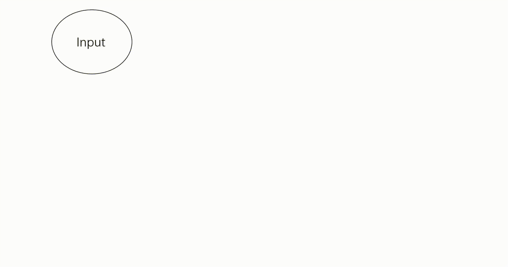
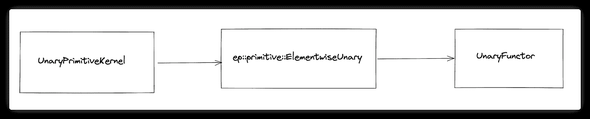

# 深度学习框架中的运营者之旅

> 原文：<https://medium.com/codex/the-journey-of-an-operator-in-a-deep-learning-framework-60d404750cb1?source=collection_archive---------10----------------------->

***赵鲁阳写的；译自董、胡***

> 上一篇文章[深度学习框架中一个张量的执行过程](/codex/the-execution-process-of-a-tensor-in-a-deep-learning-framework-a4d853645d5b)已经介绍了 [OneFlow](https://github.com/Oneflow-Inc/oneflow) 中一个张量的执行机制。在本文中，我们将以`output = flow.relu(input)`为例来说明一个 op 是如何在 OneFlow 中从 Python 执行到 C++的。希望本文对深度学习框架的系统设计有所启发。

Op 是 operator 的缩写。Ops 是深度学习中的基本操作。用于各种类型的数值和张量运算的数百个 op 构成了深度学习框架。nn。Module 是构建神经网络的模块，op 是制作模块的原材料。

以演示网络为例:

从结构上看，这个网络是由各种神经网络构成的。线性、ReLU 和 Softmax 等模块。而这些 nn。模块由 matmul、relu 和 softmax 等基本运算组成。

在 OneFlow 中，现有的 op 如何完成从 Python 层到 C++层的调用、流程和执行过程？

本文将以`output = flow.relu(input)`为例，说明一个 op 从 Python 到 C++的完整执行过程。分析将基于源代码进行。

下面的流程图说明了本文的结构:

# 1.有约束力的

通常，我们使用 Python 来构建网络、训练模型和调用函数。但是，这些函数通常只是 Python 层的一层包装器，底层实现由 C++完成。Python 绑定允许您从 Python 调用 C++，并利用这两种语言的优势。

在深度学习框架的实现中，Python/C api 和 pybind11 是实现绑定的两种实用方式。这两种方法都在 OneFlow 中使用。

*   `oneflow/api/python/framework/tensor.cpp`
*   `oneflow/api/python/framework/tensor_functions.cpp`

上面代码中 tensor.xxx 的绑定方法有 Python/C API；

*   `oneflow/core/functional/functional_api.yaml`

上面代码中 flow.xxx 的绑定方法有 pybind11 有关 Python/C api 和 pybind11 的更多详细信息，请参考以下文档:

*   [https://docs.python.org/zh-cn/3.8/c-api/index.html](https://docs.python.org/zh-cn/3.8/c-api/index.html)
*   [https://pybind11.readthedocs.io/en/stable/index.html](https://pybind11.readthedocs.io/en/stable/index.html)

回到 flow.relu，Python 层中调用的 flow.relu 的底层就是`python/oneflow/__init__.py`中定义的`oneflow._C.relu`，这里的`_C`表示它现在在底层 C++层。和 PyTorch 类似，我们也定义了一套基于. yaml 的接口导出和代码生成的规则，比如在`functional_api.yaml`中，我们可以看到 relu 的导出接口的函数签名:

如上面的代码所示，流。_C.relu 接收两个参数，一个张量和一个布尔值。它和 C++ Relu 绑定在一起，函数返回值也是张量。编译 OneFlow 的时候，C++。h 和。cpp 文件将通过运行`tools/functional/generate_functional_api.py`的文件并解析`functional_api.yaml`动态生成:

*   build/one flow/core/functional/functional _ API . YAML . h
*   build/one flow/core/functional/functional _ API . YAML . CPP

此外，对应的函子在。将调用 cpp 文件来完成 C++级别的函数调用。

走心流。_C.relu 为例，其对应的函子定义位于`oneflow/core/functional/impl/activation_functor.cpp`:

ReluFunctor 通过下面的代码完成了函子的注册。注册为功能接口后，流。_C.relu 被绑定到 python 层的“relu”。同时，这个函数也可以在 C++中通过 functional::Relu 直接调用。

# 2.函子

函子是将 Python 扩展到 C++的核心，也是调用 ops 和对输入参数进行推导和检查的第一步。通常，ops 不仅需要在函子层检查输入张量的形状、数据类型、维数和元素个数，还需要解析和处理 ops 的特定逻辑。

Relu 函子的代码如下:

ReluFunctor 定义了一个由 OpBuilder 构造的私有变量`std::shared_ptr<OpExpr> op_;`，这个 op_ 就是需要执行的 relu op。根据 inplace=True 还是 False，仿函数运算符()的内部进入两个不同的分支。而 op、输入张量和参数是通过 OpInterpUtil::Dispatch()分派给解释器的。

# 3.派遣

在函子中完成检查和逻辑处理后，大部分 op 都需要通过 OpInterpUtil::Dispatch()进行调度，目的地是解释器，op 将在这里进行进一步的处理。

`oneflow/core/framework/op_interpreter/op_interpreter_util.h`中有各种超载的调度模板:

这些重载函数的参数包括 input、output、OpExprInterpContext 等。OpExprInterpContext 是解释器中 op 所需的上下文，它应该携带 op 所需的属性(如 conv2d op 所需的 *kernel_size* 和 *padding* )、device、sbp 和 parallel 等描述信息。

这些过载的调度函数最终将运行到:

下一站是口译员。

# 4.解释者

## 获取解释器

从字面上看，GetInterpreter 的意思是获取后续执行 op 所需的解释器，下面是代码的精简版本(省略了与“check”相关的逻辑)`oneflow/core/framework/op_interpreter/op_interpreter_util.cpp`:

从上面可以看出，口译员大致可以分为两种:渴望型口译员和懒惰型口译员。此外，还可以根据是快速镜像的还是快速一致的来细分快速解释器。

总而言之，我们有以下三种类型的子类实现:

*   EagerMirroredInterpreter
*   EagerConsistentInterpreter
*   激光判读仪

在常规的 eager 模式下(无论是单 GPU 训练还是 DDP 训练)，您都需要遵循 EagerMirroredInterpreter 逻辑；否则，如果您已经为输入张量设置了 SBP 和位置，您将需要遵循 EagerConsistentInterpreter 逻辑；在懒惰模式下(使用 nn。Graph)，您将需要遵循 LazyInterpreter 逻辑。

现在让我们看看这三种类型的解释器是如何构建的:

如你所见，这三种类型的解释器将被用作“内部”变量(私有变量)来构建一个 AutogradInterpreter，并最终返回一个 AutogradInterpreter。

## 应用()

如上面的代码所示，EagerMirroredInterpreter、EagerConsistentInterpreter、LazyInterpreter 将被打包成一个 AutogradInterpreter，以触发“Apply”的调用。顾名思义，一个亲笔签名的解释者所扮演的角色与亲笔签名密切相关。它主要是为前向传播中的 op 节点增加相应的通过反向传播计算梯度的节点。

代码如下(提供了关键部分的注释):

唷，这对你来说太多了，对吗？但是不用担心。简单来说，你只需要关注这一部分:

现在让我们回到前面提到的 flow.relu 的例子。由于它处于一种渴望模式，我们将需要使用 EagerInterpreter 的 Apply()方法。

通过为 APPLY_IF 定义一个宏，我们为不同类型的 ops 添加了分支处理。其中，UserOp 是我们的用户最常用的类型，这意味着他们最有可能进入这个分支:

现在我们来看看 EagerMirroredInterpreter::ApplyImpl。就是这里:`oneflow/core/framework/op_interpreter/eager_mirrored_op_interpreter.cpp`；

最终实现是 NaiveInterpret。

## 天真地解释

简单地说，NaiveInterpret 用于以下目的:

*   检查输入张量的设备是否与默认设备相同
*   创建输出张量
*   推导并检查输出张量的形状/步幅/数据类型
*   构建 op 执行指令，并将它们分派给虚拟机(VM)

下面是代码的简化版本:

如您所见，VM 是解释器的目的地。OneFlow 有其独特的 VM 设计，这也值得一提。但是为了便于理解，我就这么说吧:

在 VM 接收到分派的指令后，op 将在任务队列中等待调度和执行。

# 5.计算

由解释器分派给 VM 的 op 执行指令将由 VM 中的调度逻辑处理。然后指令将在`oneflow/core/eager/opkernel_instruction_type.cpp`中被触发并执行。

核心代码如下:

上面这行代码会触发 op 内核的执行:`operand->user_opkernel()->Compute(compute_ctx, state, cache);`

通常，基于不同的设备，操作内核将被分配到不同的实现，通常是`oneflow/user/kernels/xxx_kernel.cpp`或`oneflow/user/kernels/xxx_kernel.cu`。

然而，ReLU op 是一个例外，因为它是由原语实现的。(OneFlow 也有其独特的原语，具有良好的抽象性和可组合性。)例如，下面的一元基元是 elementwise 一元模板和一元函数的组合。一元本原的痕迹如下:

## 一元原始核

## 原始的

## 一元函数

一元函数为每个一元运算类型呈现一个特定的函数实现。例如，ReLU op 的仿函数实现如下:

`oneflow/core/ep/common/primitive/unary_functor.h`:

现在，我们已经走过了一个 op 的 Python -> C++之旅。

你可能会发现细节复杂得吓人，但如果你把它放大，看到大图，你会意识到这只是一个简单的四步过程:

**函子- >分派- >解释器- >内核计算**

通常，实现/添加一个 op，不需要太注意中间步骤，即“分派”和“解释器”。您可以只关注与 op 密切相关的内容，即仿函数步骤中的参数和 op 逻辑检查，以及内核计算步骤中的 op 计算。

# 参考

OneFlow 源代码:

[https://github.com/Oneflow-Inc/oneflow](https://github.com/Oneflow-Inc/oneflow/commit/1dbdf8faed988fa7fd1a9034a4d79d5caf18512d)

**相关文章:**

1.  [***如何逐步推导环全归约的数学性质***](https://oneflow2020.medium.com/how-to-derive-ring-all-reduces-mathematical-property-step-by-step-9951500db96)
2.  [***如何提高 CUDA 中 PReLU 的计算效率— OneFlow 性能优化***](https://oneflow2020.medium.com/how-to-increase-computational-efficiency-for-prelu-in-cuda-oneflow-performance-optimization-20e6e336b8b8)

*欢迎访问 OneFlow on**[***GitHub***](https://github.com/Oneflow-Inc/oneflow)**并关注我们 on**[***Twitter***](https://twitter.com/home)**和* **【T5******

**还有，欢迎加入我们的 [***不和谐群***](https://discord.gg/4kpjGA5bZY)*讨论和提问 OneFlow 相关问题，与 OneFlow 贡献者和全球用户联系。***