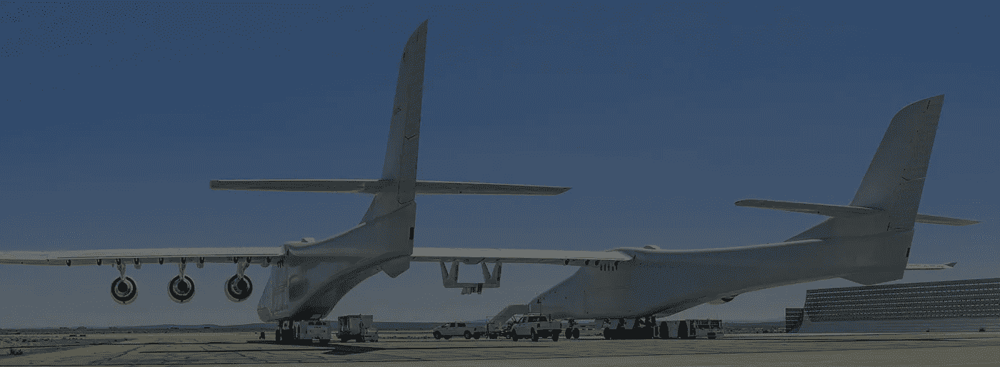

# 世界上最大的飞机！

> 原文：<https://medium.com/codex/the-largest-plane-in-the-world-7b724fac1479?source=collection_archive---------11----------------------->

## Stratolaunch 是“Roc”背后的公司

[Roc(媒体通过 Stratolaunch)](https://www.stratolaunch.com/)

当我第一次知道世界上最大的飞机是由 [Stratolaunch](https://www.stratolaunch.com/vehicles/carrier) 制造的 Roc 时，我的下一个问题是，“为什么？”一家公司会造这么大的东西肯定有原因。想象一下让这个巨大的装置升空所需的跑道的大小。你在哪里存放这么大的东西？