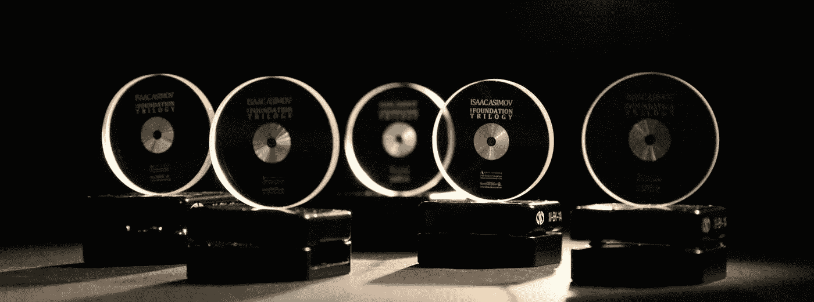

# 激光和数据存储的未来——一堂简短的历史课

> 原文：<https://medium.com/codex/the-laser-and-the-future-of-data-storage-ab5a44109c6?source=collection_archive---------5----------------------->

来源: [Arch Mission 基金会](https://www.archmission.org/5d-optical-memory)

当今世界以其快节奏的环境和日益增长的信息使用而闻名。每年都有新技术出现，需要比以前更多的数据存储。从长远来看，第一个硬盘驱动器(HDD)，*IBM 350 磁盘文件*，只能容纳 5MB(兆字节)的数据，而现在，大多数商用硬盘驱动器可以容纳…