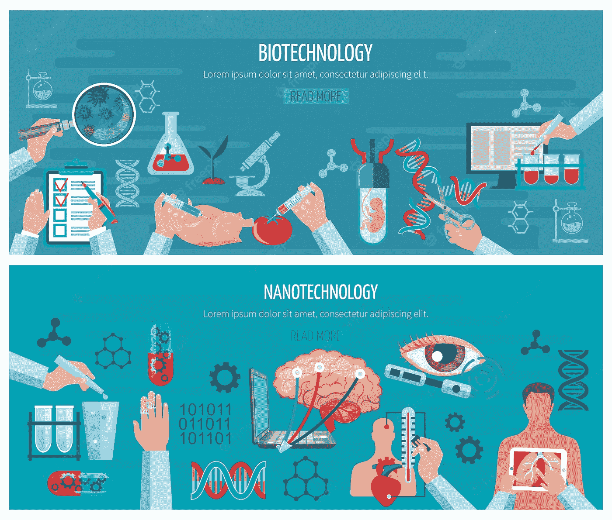

# 生物技术的最新进展——5G、纳米技术和 mRNA

> 原文：<https://medium.com/codex/the-latest-in-biotechnology-5g-nanotech-and-mrna-f3c6833eee7d?source=collection_archive---------7----------------------->

## 科学与功能

## 了解现代技术

图片来源:Freepik

# 现代生物技术

科学家们使用前生物介质来模拟早期地球上发现的条件，以测试不同化合物的影响，并确定哪些最有可能引发生命的起源。