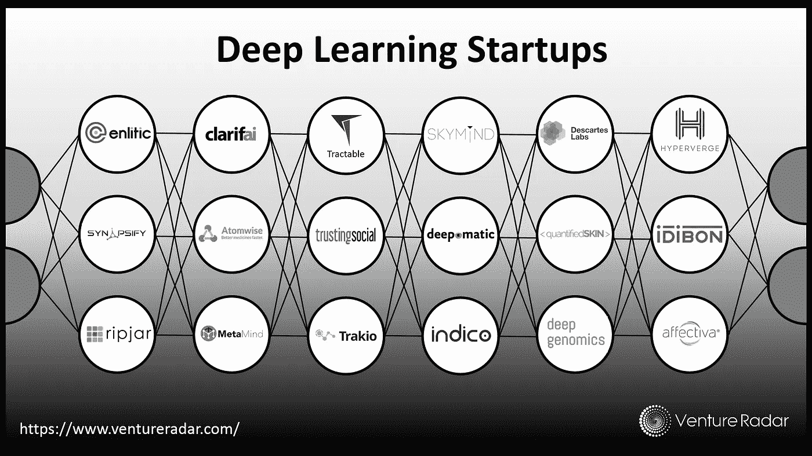
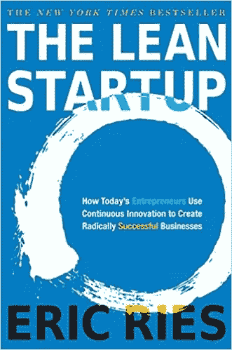
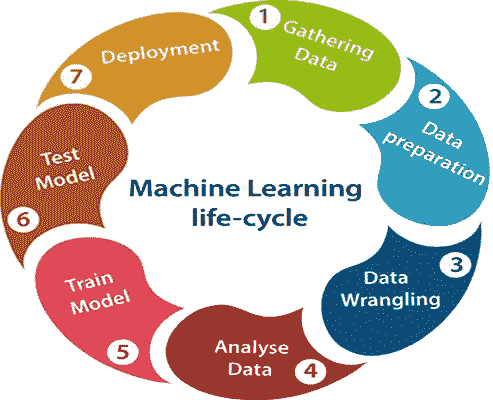

# 精益机器学习

> 原文：<https://medium.com/codex/the-lean-machine-learning-86a7f5414f8b?source=collection_archive---------16----------------------->

我们生活在一个惊人的科技时代。在这个时代，科技公司(谷歌、亚马逊、苹果等)统治着市场和世界。谈到技术，我必须提到机器学习和深度学习的贡献。这两个学术领域引领技术世界创新新的创业公司和新产品，解决我们的问题，改善我们的生活，使他们更有效率。

深度学习领域的一些创业公司([https://tinyurl.com/ms8abyds](https://tinyurl.com/ms8abyds))

创新创业非常困难，可能需要很长时间才能盈利。虽然创业公司很多，但事实是大部分创业公司都失败了。创业公司失败的一个主要原因是，没有足够多的客户愿意支付足够的钱，以便创业公司能够盈利。

因此，在这个漫长的旅程中，企业家首先应该专注于一件事——证明有一个客户愿意使用该产品并愿意为该产品付费。企业家希望尽快证明这一点，否则，他将浪费宝贵的时间和金钱。那么，当一个企业家的初创公司需要在 ML/DL 领域进行研究时，他会怎么做呢？这些研究可能不清楚、很复杂，而且会耗费大量的时间和金钱。在接下来的部分中，我将提供快速迭代和长期研究之间的最佳点。

# 精益创业

谈到创业，我不能不提到由*埃里克·里斯*写的*《精益创业》*这本书。在他的书中， *Ries* 展示了创业公司的基本概念:

## MVP——最小可行产品

MVP 是公司的第一个产品。MVP 有 3 个主要特征:

1.  MVP 的创建应该很快
2.  MVP 应该尝试解决企业家定义的问题，并为客户提供价值
3.  MVP 可能效率不高，不可扩展，甚至无法盈利

## “构建-测量-学习”反馈循环

*   建立——企业家有了一个想法，并从**建立它**开始
*   衡量——定义评估企业家所建立的成功的商业指标，并**衡量它们**
*   学习——检查度量的结果，然后**学习**并得出下一步要做什么的结论

> Ries 解释了这些概念的重要性:“最小可行产品(MVP)帮助企业家尽快开始学习的过程。不过，它不一定是能想象到的最小的产品；这是用最少的努力完成构建-测量-学习反馈循环的最快方法。与传统的产品开发相反，传统的产品开发通常包括一个漫长的、深思熟虑的潜伏期，并努力使产品尽善尽美，MVP 的目标是开始学习的过程，而不是结束它。与原型或概念测试不同，MVP 的设计不仅仅是为了回答产品设计或技术问题。它的目标是测试基本的商业假设。

埃里克·里斯的《精益创业》

# 早期创业公司中的机器学习

机器学习如何与所有这些联系起来？

人工智能研究可能需要一段时间，而且它不符合初创公司的工作方式。我推荐一种“类似 MVP”的研究方法。我们不应该设计一个充满定义、问题、模型、数据争论和探索的完整研究程序，而应该尝试用最少的努力、时间和金钱来解决基本的研究问题。最有可能的是，我们将可能建立的 ML 模型将不会是具有最佳性能度量的最佳模型，**但是它就是好的！**

这种方法的主要优点是我们可以非常快地到达 BML 环路。在我们完成最基本的研究并部署模型后，有 3 种可能的场景:

1.  **的表演太棒了！** —客户对产品(以及型号的性能)相当满意
2.  表现**良好**——客户使用了产品，并部分满意，尽管我们得到了一些反馈和额外的工作要做
3.  性能**差**——我们没有解决问题。在这种情况下，我们也得到了一些反馈，现在我们知道客户更喜欢什么

场景 2 和 3 最有可能发生，尽管最重要的是我们得到了客户的反馈！

酷，我们在 BML 环路上。

## 适应创业思维方式

好吧，让我们来谈生意，研究将会是什么样的？

在下图中，我们可以看到经典的*“机器学习生命周期*:

[https://www.javatpoint.com/machine-learning-life-cycle](https://www.javatpoint.com/machine-learning-life-cycle)

我们在图中看到的这个过程可能需要很长时间。现在我不是说这是错的，我只是说，在你**还没有产品**的时候，这个时间太长了。

当我们还没有产品的时候，我的指导方针是***KiS——保持简单*** 。在创业之初，我们希望事情简单，假设放纵的假设，只是为了让事情继续下去(相信我，这真的很难)。一些关键因素会耽误我们:

1.  **复杂问题定义**——我们倾向于完美地解决问题，定义一切，了解每一个细节。对于完美的产品来说，这可能是真的，但目前我们离完美还很远。尽量不要把事情复杂化。
2.  **复杂数据** —数据并不完美，而且永远都是完美的，主要是在第一个“数据收集”步骤之后。它可能会有噪音，结构怪异，不准确。不是很棒，但也不是灾难。为了改善数据，我们可能需要努力工作，但这可能不值得。此外，我们确定这有帮助吗？如果有，多少，真的值得吗？
3.  **复杂模型** —机器/深度学习的世界是惊人的，在如此多的领域中总是有更好的模型。自然，我们总是想使用 SOTA(最先进的)模型。我们应该记住，它可能不那么容易使用。SOTA 模型可能很重，很慢，而且要花很多时间学习。此外，为了很好地使用它，我们可能需要阅读论文和文档，这可能需要一段时间。我们可以很容易地使用现成的浅层模型，而不是使用 SOTA 模型。性能不会像 SOTA 模型一样好，但它可能是足够好的开始。

# 结论

总而言之，每个创业公司都有自己的困难，数据，客户。在这篇文章中，我试图提供“T*he Lean ML Startup”*的方法。这种方法可能不适合每一家初创公司，但我建议每位创业者都应该考虑一下。请记住，这种方法主要是为初创公司的第一步设计的，那时它还没有客户，还没有建立 MVP。

根据我的经验，使用这种方法，使用基本的浅层模型进行研究需要 2 天，模型在第三天部署，企业家在工作的第四天从客户那里得到反馈(他们非常惊讶)。企业家们知道他们成功地完成了第一个任务，证明他们的产品是有价值的，并且有潜在的客户。