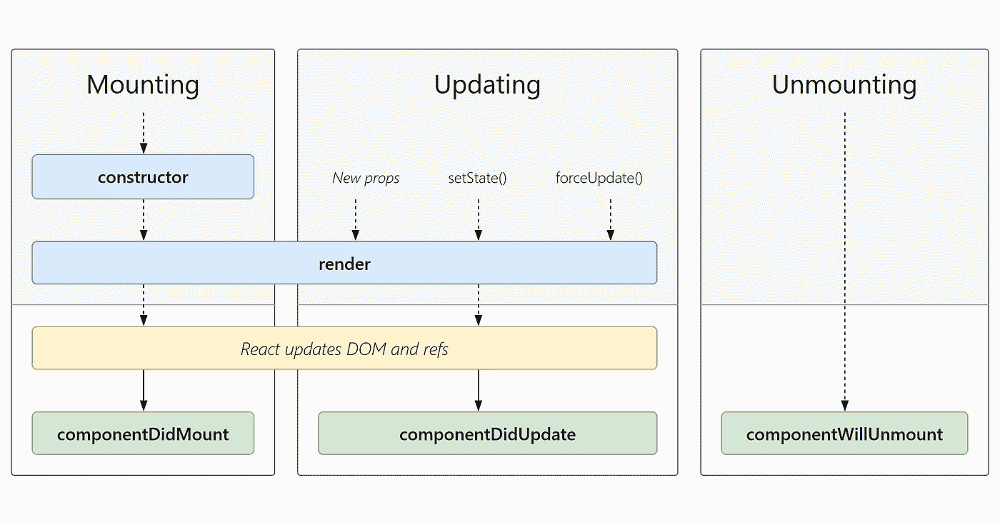
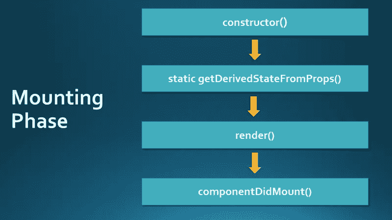
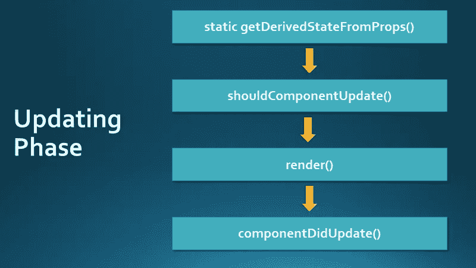
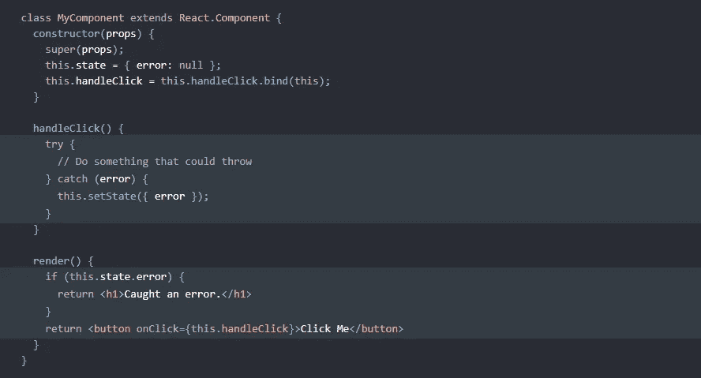

# React 组件的生命周期

> 原文：<https://medium.com/codex/the-lifecycle-of-a-react-component-8e01332a068d?source=collection_archive---------1----------------------->

再来说说生活的 React 组件圈！

在 React 应用程序中，我们使用组件将 web 用户界面的不同部分分割和隔离成单独的部分。这些部分独立工作，并使用渲染函数返回 JSX 中的 React 元素。这些元素描述了应该如何向用户显示该部分。

每个组件都经过**三个**阶段:**安装**、**更新**和**卸载**。你也可以把它想象成我们的自然生命周期:我们出生，我们成长(青春期和成年期)，最终，我们死亡。React 组件是通过挂载到 DOM 上来创建的，它们通过更新来改变或增长，最后，它们可以从 DOM 中移除或卸载。这三个里程碑被称为 React **组件生命周期**。

(**注** : *一个反应元件* ***可能会也可能不会*** *经历所有阶段。有时它们永远不会更新。其他时候，它们从不被卸载。一个组件甚至可以在没有更新的情况下连续经历安装和卸载阶段。)*

React 组件生命周期的现代图表。

上图显示了 React 组件的整个现代生命周期及其相应的生命周期方法。React 提供了特定的生命周期方法，可用于在不同阶段执行特定的操作。这些被称为 React **组件生命周期方法。**让我们仔细看看！

# **安装阶段**

这个阶段指的是组件的创建。这是组件被添加到 DOM 的地方。

以下是可用于此阶段的生命周期方法:

## **构造函数()**

在安装阶段开始之前，我们可能需要使用`constructor()`方法初始化我们的组件。当我们需要初始化状态并将方法绑定到组件时，就会用到它。这是唯一明确指定`this.state`的地方。(*这里不要用* `*setState*` *。*)

同样，在这一步中会发生两件重要的事情:

1.  一个对象被分配给`this.state`
2.  方法通过 props 传递/绑定到类的实例

## 静态 getDerivedStateFromProps()

初始化后，下一个被调用的函数是`static getDerivedStateFromProps()`。这个方法在组件的 render 函数之前(以及初始挂载之前)被调用。

该方法允许组件根据其属性的变化来更新其状态。它很少使用，应该谨慎使用，因为它可能会导致错误。一般规则作为初学者，你可能不需要它，应该避免使用它。

## 渲染()

`render()`方法是组件 ***需要*** 拥有的唯一方法。它总是被调用，它的工作是将组件挂载到 DOM。`render()`方法可以返回以下任何内容:

*   React Elements :用 JSX 写的，这些简单的对象描述了我们希望用户看到的东西
*   **数组或片段**:这些允许你返回多个 React 元素。使用`[]`声明数组，使用空标签`<> </>`声明片段
*   **门户**:这些允许你将孩子渲染到不同的 DOM 子树中(在 DOM 层次结构之外)
*   **布尔值或空值**:本质上，这不会呈现任何内容，但可用于条件情况
*   **普通数字和字符串**

React 文档将渲染函数描述为“纯粹的”。这意味着函数 ***返回的任何东西都不应该*** 改变组件的状态。*(千万不要在这里使用* `setState` *或者发出网络请求。)*

## componentDidMount()

这个阶段的最后一个功能是`componentDidMount()`。在执行 render 函数后，将立即调用该方法。如果我们需要直接与浏览器交互，这就是我们要做的。我们可以进行 API 调用，并根据它的响应更新组件状态。我们可以从另一个端点加载数据来填充内容。这里应该使用调用`setState()`,因为它将再次调用 render 函数并处理像 fetch 请求这样的异步进程。

概述安装阶段生命周期方法。

# 更新

这个第二阶段表示组件由于其属性或状态的改变而需要更新的时间。这些变化可以在组件内部发生，也可以通过后端发生。这些变化将再次触发渲染功能。

以下是生命周期方法:

## 静态 getDeprivedStateFromProps()(再次)

这是此阶段调用的第一个方法。该方法与安装阶段使用的方法相同。

## shouldComponentUpdate()

下一个要调用的方法是`shouldComponentUpdate()`方法。顾名思义，这个方法使您能够控制组件是否应该根据其属性或状态的变化而更新。默认情况下，组件在更新时总是会重新呈现。这个方法可以返回一个`true` 或者`false`。此外，该方法接收`nextProps`和`nextState`作为参数，因此您可以随时将其与组件的当前属性和状态值进行比较。这种方法有助于性能优化，但也很少使用。

## 渲染()

如果`shouldComponentUpdate()`返回`true`，渲染函数立即被调用。

## getSnapshotBeforeUpdate()

在这个方法中，在更新提交到 DOM 之前，我们可以访问 props 和 state 值。即使已经调用了 render 函数，我们仍然能够看到以前的值。这种情况并不常见，但可以用来获取我们可能需要的任何信息。值得注意的是，该方法与`componentDidUpdate()`协同工作，这是我们将讨论的下一个生命周期方法。

## componentDidUpdate()

此方法是此阶段调用的最后一个方法。像前面的方法一样，它也接收前面的属性和状态值作为参数，但是它也接收返回值`getSnapshotBeforeUpdate()`作为第三个参数(如果存在)。

它通常用于在比较当前和先前的属性和状态值的情况下进行更多的获取请求。因此，您可以调用`setState`，但是在条件语句中。

概述更新阶段生命周期方法。

# 卸载

最后，卸载阶段是从 DOM 中删除组件的阶段。这标志着组件生命周期的结束。在这个阶段，我们有一个可用的生命周期方法:

## componentWillUnmount()

这个方法在组件从 DOM 中卸载之前执行。您可以将此方法视为在销毁组件之前清理任何需要移除的内容的一种方式。

# 额外收获:错误处理

除了这些生命周期方法之外，当渲染过程中出现错误时，还会调用一些方法。React 16 引入了“错误边界”的概念，它只是捕捉 JS 错误的 React 组件。他们将捕捉这些错误，记录它们，然后显示一个“回退”UI。这很有用，因为一个 JS 错误不会破坏用户的整个应用程序。

我们实现这个概念的方法是创建一个新的类组件(通常称为`ErrorBoundary`)。我们将组件包装在子组件周围。您应该只创建这个类一次，并在 React 应用程序的不同部分重用它。

有两种相关的方法:

## 静态 getDerivedStateFromError()

如果子组件中出现错误，将调用此方法。错误将作为参数传递，该方法将返回一个值，该值将更新类组件的状态。此方法对于呈现自定义回退用户界面(而不是呈现损坏的组件)非常有用。

## componentDidCatch()

此方法接收作为参数的错误以及包含错误信息的对象。这种方法非常适合记录错误！

直接来自 React 文档的示例。

## 结论

就是这样！react 组件生命周期一开始可能会令人生畏，可能会有点混乱，但是希望这已经让您对这个概念有了更好的理解。

## 参考资料:

 [## 做出反应。成分-反应

### 该页面包含 React 组件类定义的详细 API 参考。它假设您熟悉…

reactjs.org](https://reactjs.org/docs/react-component.html)  [## 反应生命周期

### React 中的每个组件都有一个生命周期，您可以在它的三个主要阶段对其进行监控和操作。三个…

www.w3schools.com](https://www.w3schools.com/react/react_lifecycle.asp)  [## 错误边界-反应

### 过去，组件内部的 JavaScript 错误会破坏 React 的内部状态，导致它发出神秘的…

reactjs.org](https://reactjs.org/docs/error-boundaries.html)  [## 反应生命周期方法图

### 完全交互式和可访问的 React 生命周期方法图。

projects.wojtekmaj.pl](https://projects.wojtekmaj.pl/react-lifecycle-methods-diagram/)