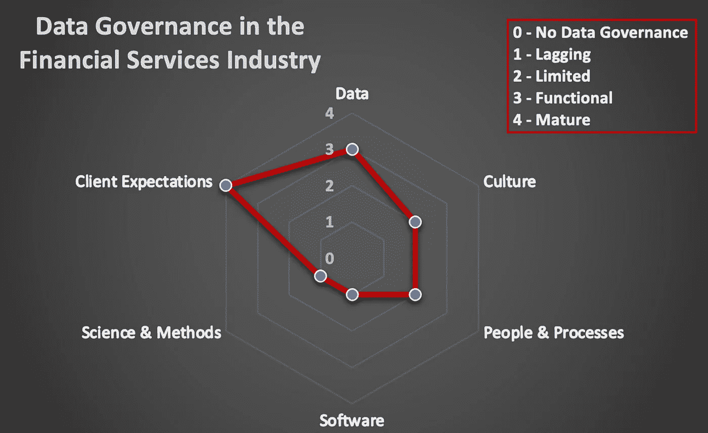

# 机器学习在美国股票交易中的局限性

> 原文：<https://medium.com/codex/the-limitations-of-machine-learning-in-us-stock-trading-10c2f2d23971?source=collection_archive---------4----------------------->

图片来自 freepik 的@javvani

机器学习机构为什么不称霸美股？如果数据科学如此受欢迎，并交付了令人印象深刻的成果和产品，为什么股票交易会有缺点？很少有公司完全专注于美国股票交易中的机器学习技术，但他们拥有巨大的资源和世界上最聪明的人。尽管如此，无论是从市场份额来看，还是从五年或更长时间内持续的令人印象深刻的回报率来看，他们的机构都没有在行业中占据主导地位。基金经理可能会达到[的高水位](https://www.thebalancemoney.com/what-is-a-high-water-mark-5205643)，但金融服务是压倒性的*非*——机器学习利润，更不用说利用营销科学了。下面，我概述了数据问题的环境，金融市场参与者的扭曲，以及美国股市规模的萎缩。

图片作者:约翰·福克斯沃西

如果你的数据不完整或不准确，无论你是否知道，你的机器学习模型都没有问题。作为一个整体，金融服务行业在忽视数据治理几十年后，最近开始涉足数据治理，并且迫切需要满足客户的期望。在这个行业中多年没有科学调查之后，这个行业需要在软件、科学和方法以及有限的文化、人员和流程方面迎头赶上，即使数据是功能性的。没有*或*经典的插补、重采样或假设检验统计技术来对看起来正确但可能不合适的数据值进行置信评分。甚至没有寻找更好的数据供应商，因为没有人好奇。更不用说像隔离森林视觉这样发现实时异常的当代数据科学技术了。

即使上面的一切都改善了，那么有几个可以理解美国股票市场的供求力量。大型商业银行作为经纪交易商，在其交易者承诺(COT)报告中，表达了他们每周购买或出售大量股票的计划，这些股票会影响整个市场的寡头供应。我不是这些报告的专家，但隐藏交易的具体日期或频率是很常见的。换句话说，美国股票市场不存在叙事科学，因为我不知道任何科学发表的文章有一个 COT 报告的历史数据系列，它们对美国股票市场的价格和评估产生了可衡量的影响。这就是为什么在*非*——投资者和媒体的科学叙述的美国股票市场上有这么多买入谣言和卖出事实，因为它填补了一个空白。我们留给我们的是几十年来由大型经纪自营商制造的无脑机器，它们不顾基本金融特征进行买卖。

更有甚者，金融产品创新会产生**人为需求**，不管有没有理由，都会推高股价，比如交易所交易基金(ETF)和衍生合约产品。

散户和机构投资者都喜欢通过分散投资于多只股票来降低市场风险，而不是只投资于 ETF 产品中的一只股票。然而，其目的是**分层聚类**，因为大多数投资者并不将 ETF 中的每只股票与其他股票产品同等看待。在交易的另一方，**ETF 的发行人必须购买某些股票，而不管投资者的价值如何，包括 *zero、*在日常交易中使其产品在市场上得到适当定价**。这里还有更多，但产品管理是以基本面财务估值为代价的。

“给我讲个故事”图片由 hüseyin ahin 拍摄。

期货、掉期和期权等衍生合约不太常见，但可能更有影响力。(衍生合约是从另一个产品中获得其价值的产品，与微积分中的一个衍生函数无关。).经纪交易商偶尔会解除或终止其衍生合约头寸，如一年期期权合约，该合约在当时不同的经济情绪下开始，导致购买基础股票的人为需求，因为经济情绪在合约结束时发生了变化。我可能不知道正确的影响百分比，因为我不知道有哪一项科学研究在我进行探索性数据分析时拒绝，更不用说从统计学上反驳我的观察结果。其他人分享了我在业内多年的观察。这是一个真实的数据之谜。**衍生合约的进场和出场会扭曲自然和人为的需求数量，难以衡量其对美国股市的影响**。

总之，**人为需求**导致太多人陷入叙事中，无法找到逻辑，比如坏消息就是好消息，或者当它试图操纵市场时，少量数据叙事可以解释一切。这不是大脑驱动的新闻，而是数据驱动的股票供应商，这些数据需要实时提供给所有投资者，以产生更好的机器学习模型。我们拥有这样做的数据和技术，但大型商业银行在美国国会的游说力量太强大了。

拉法·奥宾斯基的熊和公牛形象

最后，股票回购通过公司自己重新获得公司的股票来减少供应，但也会提高公司的股票价格。这种情况比比皆是，但股票发行者和供应商都试图操纵供求数量，以投资者的利益为代价来影响价格。历史时间序列和使用特征工程寻找正确的输入必须对状态转换数据序列的非线性确定性的困难进行建模，而不是随机性、平稳性或线性。

斯托姆·索格森的“缪斯——黑洞与启示”图片

即使上面提到的数据治理和供求操纵问题得到了解决，外来性和抽样误差又如何呢？由于股票发行者也是其他金融市场的发行者，美国股市协同运作，而且规模越来越小。

您可以对您的本地输入进行特征设计，但同一发行人的另一个金融市场可能会影响您的股票价格，因为事件可以从相同的数据源(即原始公司)延续过来。单个公司的稳健数据科学模型代表单个发行人，但同一发行人可能有一种债券产品类型，可以表明影响股票产品的信用事件。预测外部冲击何时会冲击公司股票并不容易。该公司的子公司难以偿还债务，或者供应商因货币危机或地缘政治事件而减缓生产，等等。主要的问题是探索性的数据分析，首先要找到数据，更不用说用它来预测有影响的事件了。

自 20 世纪 70 年代以来，就有了一个品牌名称，即美国股票指数产品，由 5000 只股票组成，在 1998 年达到 7500 多点的峰值，但现在在 2022 年低于 3700。除了绝对数量，如果你调整到人口数量，自 20 世纪 90 年代以来的下降趋势是显而易见的。

 [## 美国上市公司数量

### 发布:全球金融发展单位:频率:注释:在…上市的国内注册公司数量

fred.stlouisfed.org](https://fred.stlouisfed.org/series/DDOM01USA644NWDB) 

由于大多数公司都没有在美国公开上市，它们在什么数据集中表现在哪里？私有公司对美国公开上市的股票有多大影响？在同一个行业中，上市公司与非上市公司竞争的例子比比皆是，它们可能是一家公司的供应商，也可能是另一家公司的供应商。这里还有很多，但最主要的是影响公开上市股票的工业部门缺乏可见性。私有和公有公司的混合是一个透明和不透明的数据湖，从哪里开始和结束？

埃里克·约翰松的“信仰的飞跃”意象

总之，机器学习仍然可以用于股票交易，如 OLS 回归的经典线性决定论及其岭、弹性网和套索的正则化替代方法。SVM 的极性的当代模型、决策树的流程图以及随机森林和 Boosting 的集合更准确。深度学习和单独强化学习的神经网络也是可能的，是股票交易机器学习的未来。我们仍需解决数据治理问题、实时透明的供需数量，以及来自其他金融市场(尤其是债券市场)的交叉效应。最重要的是，我们需要更多在美国公开上市的股票。

想了解更多，试试下面我的外汇观点。

 [## 人工智能算法交易

### 捍卫美元

medium.com](/codex/algorithmic-trading-with-artificial-intelligence-5e82e5b2c1a3)