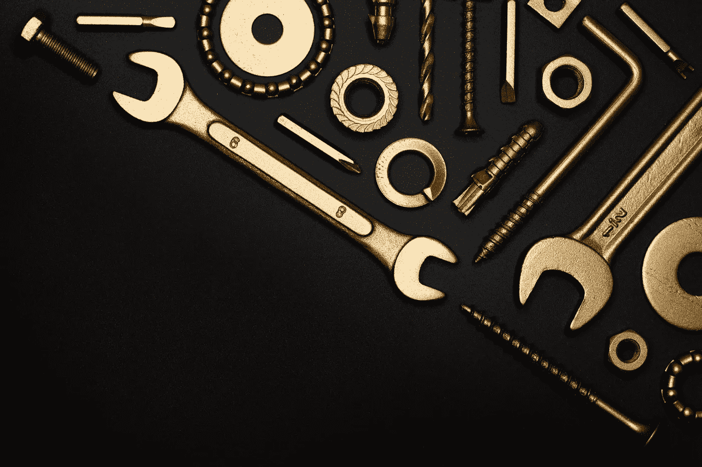

# Linux 瑞士军刀

> 原文：<https://medium.com/codex/the-linux-swiss-army-knife-dd9d27668c0e?source=collection_archive---------0----------------------->

## 让你忘记图形用户界面的命令

米盖尔·Á的照片。帕德里纳:[https://www . pexels . com/photo/flat-lay-shot-of-tools-3930091/](https://www.pexels.com/photo/flat-lay-shot-of-tools-3930091/)

不久前，我写了一篇有 25 个命令行的文章，这些命令行允许你在不使用图形界面的情况下只用一行就能完成复杂的事情。现在，我将向您展示一系列命令，让您成为完美的 Linux 机械师。

注意:所有命令都已经在 ubuntu 20.04 上测试过了。要执行一些命令，您将…