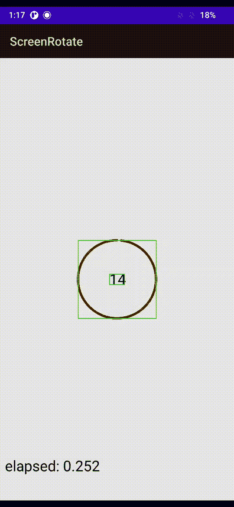
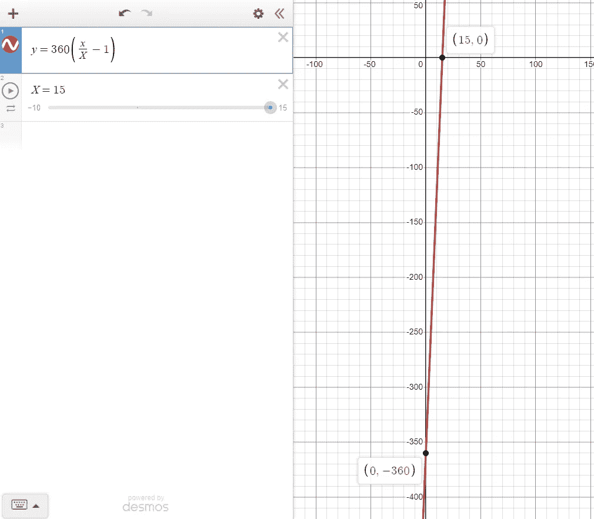

# Android 开发所需的数学知识

> 原文：<https://medium.com/codex/the-math-required-for-android-development-558c706aa97?source=collection_archive---------2----------------------->

## 轻松掌握 Android 中复杂的用户界面


[斯科特·格雷厄姆](https://unsplash.com/@homajob?utm_source=medium&utm_medium=referral)在 [Unsplash](https://unsplash.com?utm_source=medium&utm_medium=referral) 上拍照

如果你去问某人数学对于 android 开发有多重要，他们很可能会告诉你没有*那么*重要。这个回答多少有些道理，因为并不是 android 开发的所有部分都需要复杂的数学。但是我不敢苟同。

# 介绍

**我开始用 Java 开发 Android 应用的时候才 14 岁。**我对 Android 非常陌生，刚刚开始学习 Java 代码和 XML 布局的基础知识。我做得很好。随着我的进步，我想学习如何创建自己的`View`而不是使用谷歌提供给我们的。我被卡住了。我不知道该怎么做。我没有接触过笛卡尔平面，x 轴和 y 轴。我别无选择，只能放弃这个。

快进 3 年——我学会了 Kotlin，并用 Firebase 构建了一些令人惊叹的应用程序。我喜欢数学，微积分之类的题目都得了 a。现在，我计划在 Android 中重新创建自定义视图，猜猜会发生什么？我做到了。我知道如何为吸引人的 UI 和令人惊叹的 UX 创建复杂的视图。

> 的确，有些概念只有通过年龄和经历才能学会。如果你现在不能做某事，你可以在适当的时候再试一次。

# 我需要什么数学？

大多数自定义视图由矩形、圆形和曲线(如路径和 Beizer)组成。它们在视图中的位置也很重要。让我们从创建一个循环计时器开始。对于这种应用，不需要非常苛刻的数学知识。



绿色轮廓**仅**用于视觉

[**这里的**](https://gist.github.com/cybercoder-naj/9cd0ad288745555ca96f3f4c7be36de9) 是我创建的定时器视图的链接。我将分解已完成的工作。

## #1 —我们需要找到屏幕的中心。

我们将视图的宽度和高度设置为`match_parent`。我们可以通过将*宽度*和*高度*除以 2 来找到中心坐标。

我们还需要一个盒子，在这里我们需要**来绑定**定时器的弧线。

64.dp 取一个 64dp，转换成像素。

## #2 —声明了一些重要的变量

这个视图需要 3 个变量:

1.  `seconds` —这个计时器应该持续的秒数。
2.  `elapsed` —计时器启动后经过的秒数。
3.  `isRunning` —保存定时器状态的布尔值

## #3 —为计时器绘制弧线。

`drawArc`函数接受 5 个参数来画出我们喜欢的弧线。

1.  `RectF oval`-指定圆弧的*边界*。
2.  `float startAngle` —在边界内，圆弧的起始位置。
3.  `float sweepAngle` —从起始位置开始的圆弧角度。
4.  `boolean useCenter` —真，如果你想将弧的两端连接到中心。
5.  `Paint paint` —指定弧线的外观(颜色、宽度、样式等)

我们需要圆弧从我们定义的正方形的顶部开始；所以我们选择了`-90f`。现在，当没有时间流逝时，`sweepAngle`应该是 *-360* 。而当`elapsed == seconds`时，那么`sweepAngle`必须是 *0* 。

推导一个满足给定约束的线性方程，我们最终得到这个方程。



使用 X=15 秒的示例

这就是为什么用`(elapsed / seconds -1) * 360f`作为`sweepAngle`的原因。随着经过时间从 0°增加到 15°，扫描角将线性减小。

## #4 —动画显示经过的时间值

在自定义视图中，这是一件相当简单的事情。关于功能和属性的一点知识将帮助你相当容易地掌握 Android 中的动画。

## #5 —添加文本

我们已经完成了绘制圆弧的代码。这篇课文相对容易些。

当`canvas`对象在 *(x，y)* 绘制文本时，该点将是整个文本的左下角。换句话说，如果发送到`drawText`的位置是 *(center.x，center.y)* ，那么文本将向右上方移动。为了进行修正，我们添加了一些额外的代码。

1.  首先，我们得到文本的尺寸，即它的宽度和高度。
2.  其次，用**位置校正**将文本置于屏幕中央。

**位置校正** —这里，我们需要将文本向左移动，移动的幅度是文本宽度的一半。类似地，我们把它向下移动，移动的幅度是高度的一半。

## 瞧啊。

您已经成功地创建了一个循环计时器的复杂 UI。请尝试将此视图添加到 XML 文件中。在您的`MainActivity.kt`中，获取视图的实例，并将其`isRunning`更改为`true`。启动定时器前，不要忘记设置`seconds`的值。

# 结论

> 安卓需要大量的数学吗？不完全是。
> 
> 拥有令人惊叹的 UI 的安卓**需要大量的数学吗？是啊！**

谷歌图书馆并不总是足够的。你的想象力和创造力是你个人的，只属于你自己。就此而言，谷歌或任何其他第三方图书馆都不会总是满足你的需求。有时候，你需要迈出第一步，从零开始建立自己的生活。这样做，你将需要数学和知识。

这篇文章花了我大约 3 天的时间，在家里经历了很多压力之后，才仔细地完成的。我希望你喜欢读我的文章，并学到了一些东西。非常感谢！✌️

```
**Want to conncet?**My [GitHub](https://github.com/cybercoder-naj) profile.
My [Portfolio](https://cybercoder-naj.github.io) website.
```