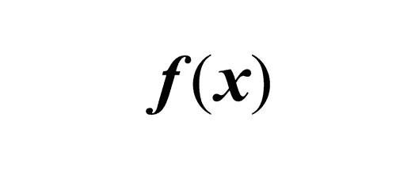

# 程序设计中函数的数学联系

> 原文：<https://medium.com/codex/the-mathematical-connection-of-functions-in-programming-cba7b6a707a7?source=collection_archive---------2----------------------->

> 这是我在大学主修数学期间写的一小段摘录，当时我正在上编程语言课。

在程序设计中，函数可以被定义为“自包含”的代码序列，这些代码被编程来执行特定的任务；它是一种将多个动作组合成一个单一过程的方法(Germain)。编程中的函数以类似的方式工作…