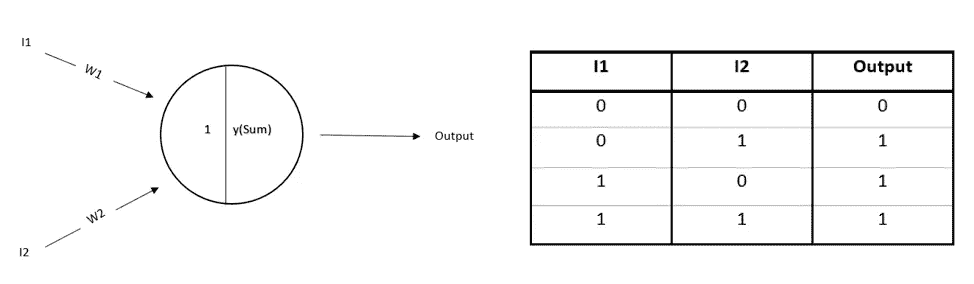

# 麦卡洛克-皮茨安

> 原文：<https://medium.com/codex/the-mcculloch-pitts-ann-ba8c887769fc?source=collection_archive---------12----------------------->

## “基于微积分的生物计算模型，为今天的深度学习奠定了基础”

数学家艾伦·图灵在 1937 年提出的“图灵模型”改变了研究人员通过计算解决日常问题的思维模式。

图灵机的计算模型

图灵模型是什么，它是如何工作的？等等。对我们研究麦卡洛克-皮茨模型没有多大帮助。我们需要知道的是，图灵受到了 1926 年 Entscheidungs 问题(当时一个著名的数学问题)的启发，并试图通过计算解决同样的问题。虽然他找不到解决这个问题的方法，但是几乎所有其他的可计算程序都可以用他的机器来解决。这个可以用计算能力解决问题的小想法激发了其他人想出他们自己解决问题的方法。其中有*美国神经生理学家和控制论专家* **沃伦·斯特吉斯·麦卡洛克**和**沃尔特·哈里·皮茨**，*一位在计算神经科学领域工作的美国逻辑学家。*麦卡洛克和皮茨在期刊*中提出了他们自己的人工神经元模型，这是神经活动中内在思想的逻辑演算，成为了我们今天都为之疯狂的深度学习的基础。*

**

*信息从一个神经元传递到另一个神经元*

*可能因为两人都涉足神经科学相关领域，他们想通过计算来模拟一个生物学问题。最终在 1943 年，他们提出生物神经元可以被描述为计算装置。他们模型的核心和灵魂是这条线:*

> *由于神经活动的“全有或全无”特性，神经事件和它们之间的关系可以用命题逻辑来处理*

*在进入这种说法的含义之前，让我们看看麦卡洛克和皮茨是如何弥合生物神经元和人工神经元之间的差距的。*

# *生物神经元*

*单个神经元看起来像这样:*

**

*神经元的组成部分*

*在 1943 年，关于神经元如何工作的信息非常少。与现在相比，你肯定会发现几十年前作者提出的理论有局限性。我仍然会解释麦卡洛克和皮茨是如何解释生物神经元的功能的。*

*   *当电化学信号从一个神经元传递到另一个神经元时，交流就发生了。传递信息的神经元称为“突触前神经元”，接受信息的神经元称为“突触后神经元”。*
*   *信号通过树突进入神经元。所有的过程都发生在细胞体中。处理后的信息通过轴突到达突触末端。正是这个特殊的终端决定了信息是否应该传递给下一个神经元。此外，作者表示，突触过程将需要四分之一毫秒来决定结果。这一额外的时间被称为“突触延迟”。*
*   *信息不仅仅传递给一个突触后神经元，同样的信息会传递给成百上千万个神经元。*

**

*图解表示信号通信如何通过人脑中的神经元发生*

*   *现在到了关键的部分，麦卡洛克和皮茨提出——**“一个神经元要*激发*，必须通过一定的电压阈值。”**即，终端从突触前神经元接收的兴奋性和抑制性输入的组合决定了神经元是否通过阈值并放电。兴奋性输入支持突触后神经元激活，抑制性输入不支持。*
*   *正是在这种情况下，神经元是否会放电或产生尖峰信号，使得他们提出了这个模型。*
*   ***“神经元可以被视为生物计算设备，也就是说，它们可以接收输入，通过算法对这些输入进行计算，然后产生输出。”这是他们通过写作传达的信息。***
*   *此外，他们还能够使用麦卡洛克-皮茨模型可视化一些布尔代数门(例如，与、或、或非等)。*

# *假设*

1.  ***神经元的活动是一个“全有或全无”的过程:**输入、权重和输出都是二进制的。整个过程只是取决于神经元是否会放电。没有与发布的模型相关联的部分传输。*
2.  ***为了在任何时候兴奋一个神经元，必须在潜伏期内兴奋某个固定数量的突触，并且该数量与神经元上的先前活动和位置无关:**对于要触发的神经元，输入的加权和必须等于或大于预定义的阈值。*
3.  ***任何抑制性突触的活动都绝对阻止了当时神经元的兴奋:**如果一个或多个输入是抑制性的，神经元就不会放电。最终结果神经元是否应该激活取决于总和。如果任何不想让信息通过的输入出现在 sum 中，信息将不会传输到下一个。*
4.  ***神经系统内唯一显著的延迟是突触延迟:**信号通过链路需要一个固定的时间步长。*
5.  ***网络的结构不随时间变化:**结构和权重都不随时间变化，除非手动改变。*

# ***型号描述***

## *数学定义*

*麦卡洛克和皮茨开发了一个被称为**线性阈值门**的数学模型，其定义为:*

**

*计算总和的等式*

**

*激活功能*

*   ***‘I1，I2，I3，…IN’**均为二进制输入值∈ 0，1。*
*   ***‘W1，W2，W3，…WN’**是与具有正/负幅度的每个输入相关联的权重，即∈ -1，1。*
*   ***‘Sum’**是输入的加权和。*
*   ***‘T’**是神经元激活(即触发)的预定义阈值。*

## *建筑图*

**

*麦卡洛克-皮茨模型*

*   *计算**兴奋性输入** (Ii*Wi 为正值)和**抑制性输入** (Ii*Wi 为负值)的加权平均值。该值被分配给**‘Sum’**。“总和”通过麦卡洛克-皮茨**激活函数**传递，输出值告诉神经元是否应该触发或形成尖峰。*
*   *激活功能如下图所示:*

**

*麦卡洛克-皮茨激活函数*

# *应用程序*

*自从这个领域创立以来，理解逻辑思维是如何工作的一直是科学家的主要目标之一。实现这一点的一种方法是建立一个可以执行逻辑运算的人工系统。这是麦卡洛克-皮茨模型的最大应用之一，即，利用这个模型我们可以模拟一些布尔函数的行为。这里让我们讨论几个逻辑门！*

## *与门*

*我们知道，当且仅当所有输出都为真时，与门的输出才会为真。即，当所有输入为 1 时，输出将为 1。换句话说，只有所有的输入都是兴奋性的，神经元才会放电。在这种情况下，激活阈值必须为 2。为了获得 2 的输出，权重必须为正(即 1)。*

**

*与门*

*从逻辑上讲，这个模型适用于我们希望两个输入都为真的情况。例如，我希望我的模型决定我是否应该访问一个城市。我也有一些条件，即当且仅当那个城市有山和湖时，我才会去那里。在这种情况下，麦卡洛克-皮茨模型将是最佳选择。*想不到这么简单的问题曾经是一个大任务而这个简单的实现竟然被一个* ***打了*** *几十年的退！**

## *或门*

*如果任何一个输入为真，或门的输出将为真。也就是说，如果输出为 1，我们只需要一个输入为 1。在神经学家的语言中，如果任何一个输入希望信息被传递，神经元就会激活。对于这种情况，激活阈值必须为 1。权重可以是任意的，只要至少有一个输入是兴奋性的。*

**

*或门*

*例如，现在我希望我的模型来决定我是否应该访问一个城市。条件是，那个城市至少应该有山**或**湖。这个模型太适合这里了。*

## *非门*

*对于非神经元，1 输出 0，0 输出 1。因此，如果输入是抑制性的，神经元就会放电。为了满足这个条件，我们希望输入是抑制性的。在这种情况下，权重应确保输入具有负值。阈值 0 对于非门是理想。*

**

*非门*

*举个例子，现在如果我决定去一个没有山的城市，我肯定会选择 M.P 模型来替我决定！*

## *或非门*

*我们知道或非门与或非门相反。即，对于输出为 1，输入不应为 1。在这种情况下，即使只有一个输入是兴奋性的，神经元也不会触发，因此这种情况下的阈值也将是 0。这里的权重应该和我们在非门情况下讨论的一样。*

**

*或非门*

*例如，我想去一个没有山和湖的城市，毫无疑问，麦卡洛克-皮茨在这里也展示了他们的才华:)*

# *限制*

*我刚刚意识到我对麦卡洛克和皮茨的赞美有点过头了，我的意思是我应该这样做，因为是他们激励我发布了这些内容！XD。玩笑归玩笑，这个模型并不完美，它有很多局限性。我们将在下面讨论它们:*

*   ***只允许二进制输入、输出和权重:**模型假设神经元要么触发，要么不触发，不存在部分触发。我们提供的砝码只有一个作用；决定输入是兴奋的还是抑制的。由于这个原因，所有与神经元相关的问题都不能通过计算来解决，也就是说，大多数是/否问题只能通过计算来解决。*
*   ***没有学习是可能的:**例如，就像我们讨论的与门的情况一样，我们必须手动找到阈值和权重。此外，我们必须手动修改参数。在这里，我们没有学到任何新东西。我们只是看看我们已经知道要解决的这些问题，是否可以通过计算来实现。*
*   *假设“如果一个或多个输入是抑制性的，神经元将不会触发。”可能不对:我们从作者那里了解到，OR、not 和 NOR 门可以用麦卡洛克-皮茨模型来实现，即论文提出即使一个输入是抑制性的，神经元也会放电。这不是同义反复吗？*

# *结论*

*让我们暂时忽略这些限制，因为如果麦卡洛克和皮茨没有提出这样的模型，我甚至怀疑我们是否会有一个名为“深度学习”的领域。这个模型解决的问题可能有预先确定的结果，但可以肯定的是，提出的模型背后的想法是如此之美，以至于它仍然被这个领域的科学家所认可！*

# *参考*

## *文本参考*

*   *西麦卡洛克和西皮茨(1943 年)。神经活动中固有观念的逻辑演算。数学生物物理学通报，5(4)，115–133。*
*   *福塞特(1994 年)。当神经网络出现时:麦卡洛克-皮茨神经元。神经网络基础:架构、算法和应用(第 26-37 页)。普伦蒂斯-霍尔公司。*

## *图像参考*

*   *[神经网络 4:麦卡洛克&皮茨神经元——YouTube](https://www.youtube.com/watch?v=osa3zIEJjgw)*
*   *【我们的电子大脑:神经元主义(thegreatcoursesdaily.com)*
*   *[神经元是神经系统的积木](https://saylordotorg.github.io/text_introduction-to-psychology/s07-01-the-neuron-is-the-building-blo.html)*