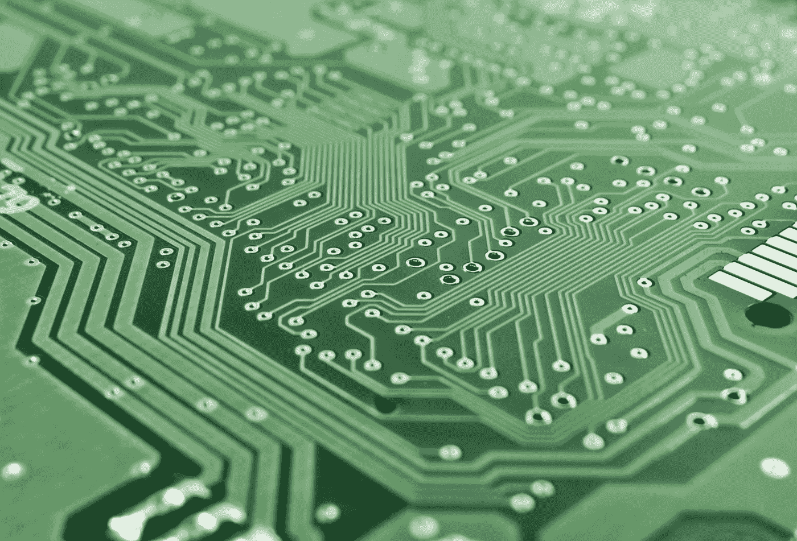

# 人类思维与技术的融合

> 原文：<https://medium.com/codex/the-merging-of-the-human-mind-with-technology-a47d662a0c1f?source=collection_archive---------10----------------------->

世界各地的开拓者和研究人员已经在开发脑机接口技术。科学家们正忙于改进可以植入人脑的计算机芯片。现在还为时尚早，今天的技术在这方面还相当初级，但这是一个快速发展的领域，一些人认为它的发展速度将比普遍预期的更快。技术进步的一个更迷人也更可怕的成果是将我们的思想与机器融合的潜力。许多技术专家预测，有一天，我们会合并，甚至更大胆地将我们的思想上传到机器中。未来研究的一系列场景整合了这两种可能性的元素，表明人类可能会与计算机交互或将思想上传到计算机，从而允许智能的显著增强。这样的发展可能会重新定义人机关系，结合起来产生一种增强形式的人工智能增强智能。

单个人工智能，以其生物电子混合体的形式，将享有超越生物大脑和任何计算系统的重要优势。从功能上来说，一个单独的人工智能可以比作一组深度学习程序，我们的大脑将自己构建和进化，而无需第三方程序员。当人工智能加入其中时，事情变得更加有趣，因为人工智能试图复制机器内部的大脑过程。

毫无疑问，由于人工智能的发展，计算机和机器在很多方面都比人强。很明显，在许多事情上，智能机器正变得比人更有能力，正如谚语所说，如果你不能打败它们，就加入它们。

在本世纪的某个时候，机器智能将超过人类智能。这是对流程能力的预测，是机器达到人类水平智能的必要但非充分条件。摩尔定律表明，到 2020 年，1000 美元的个人电脑将拥有人脑级别的计算能力——每秒 2000 亿次计算。到 2055 年，一台 1000 美元的个人电脑将相当于地球上所有人脑的计算能力(当然，如果摩尔定律成立的话)。

当然，即使技术上的可能性已经存在，也必须考虑其他的事情，比如这些扩展的能力对人类来说意味着什么。我们甚至无法预测这些技术对社会的影响，更不用说推测他们的主观感受了。例如，很难想象当我们能够以 1000 倍的速度处理思想和感情时，我们的意识流会是什么感觉，或者人工智能大脑植入会如何影响我们的爱与恨的能力。

如果仔细观察人性，我们生物物种之间的主要区别是我们改变物理对象和周围环境的能力。我们创造的技术是人类进化的自然生物驱动力，是仅受我们想象力限制的变化的主要原因。事实是，尽管人类已经开发出更复杂的工具，但我们仍然只是一种动物。到本世纪的第三十个十年，我们可能能够制作完整、详细的人脑计算相关特征的地图，并在最先进的神经计算机上重建完整的堆栈。

# 结论

一些人认为，人工智能的进步可能会导致通用的推理系统，这些系统缺乏人类认知的局限性。一些批评者，如哲学家休伯特·德雷福斯(Hubert Dreyfus)，声称计算机或机器无法达到人类水平的智能，而其他人，如物理学家斯蒂芬·霍金(Stephen Hawking)，则声称只要最终结果相似，智能的定义就无关紧要。其他人认为人类将会进化，或者直接改变他们的生物学，以获得更高的智力。最终，我们无法预测它会如何发展——唯一知道的方法就是等待。