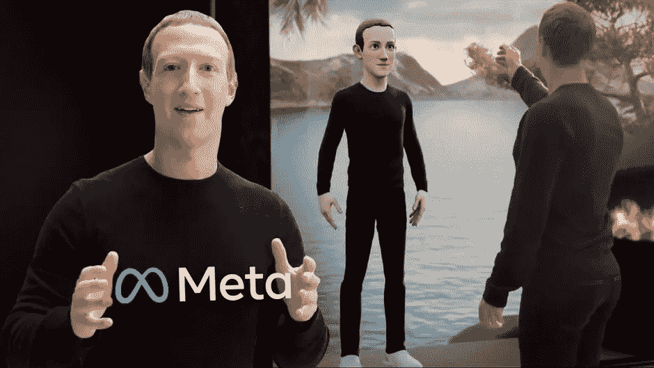
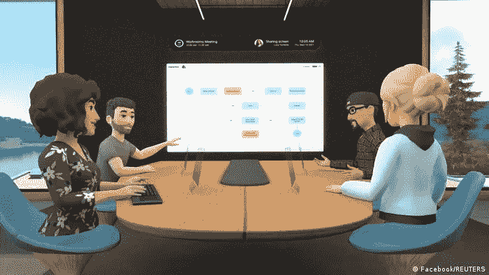
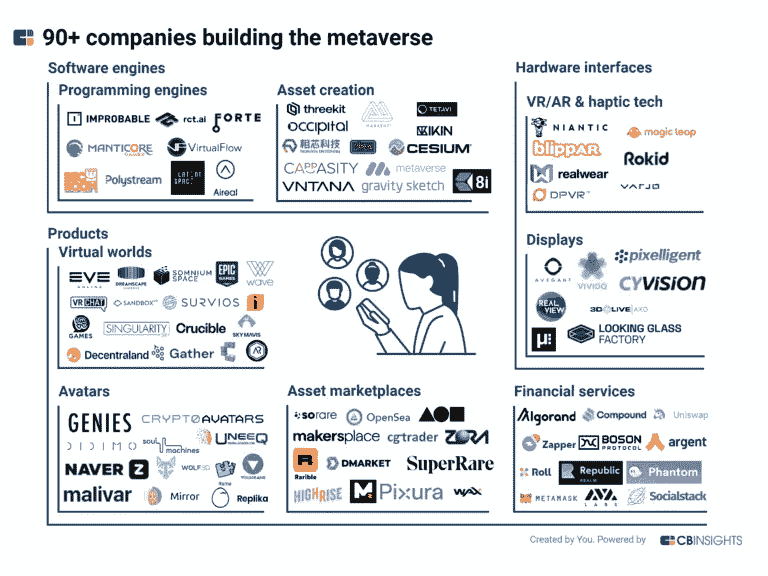

# 元宇宙:我们需要一个由科技巨头控制的虚拟世界吗？

> 原文：<https://medium.com/codex/the-metaverse-bf709398733b?source=collection_archive---------16----------------------->

脸书更名为 META，术语“元宇宙”正迅速成为科技和商业领域的流行语。美国小说家尼尔·斯蒂芬森早在 1992 年就提到了虚拟现实。一个人们将使用数字化身在线生活、工作和娱乐的世界，他称之为元宇宙，融合了 META 的意思是超越，以及来自宇宙的诗句，他的愿景是这个元宇宙将成为互联网的继承者。苹果、微软、谷歌和脸书等科技巨头都在竞相争夺元宇宙。虚拟世界将与现实世界共存，保持领先地位，facebook 将自己重新命名为 Meta。

把它想象成一个互联网，你不仅在看，而且还生活在其中，你的数字化身将居住在元宇宙，而不是观看或阅读某个主题，你将体验它，与其他想成为你体验一部分的人一起数字化地做那些动作。在线空间让你以一种比传统网站更身临其境的方式进行互动。让我们举一个场景来进一步简化，你在远离家人和朋友的禁闭室内，你如何与他们保持联系？视频通话将是当今技术能提供给你的最接近的方式，但它仍然不够接近。你可能会觉得被忽略了，但在这里，元宇宙保证你会改变这一点，在这里，你可以在虚拟空间与他们见面，可以进行实际的移动和对话。这正是元宇宙提供的经验。不仅仅是视觉和听觉。

扎克伯格把元宇宙想象成一个虚拟空间，利用数字工具给人们一种真实存在的感觉|图片来源:脸书

这将是现实与想象相遇的网络空间。这些角色将是真实的人类，但他们的世界将完全是虚构的，由虚拟元素组成，这些虚拟元素象征着真实的生活。元宇宙就像一个传送装置，你可以在家里探索虚拟世界。

## 将会有多少个虚拟世界？

展望不同公司正在进行的投资，可以肯定地说，最终用户将有很多选择。有不同的虚拟世界正在形成，脸书似乎是最大的一个，但它不是唯一的追求。

图片来源:cbinsights.com

例如，苹果公司正在开发一种先进的虚拟现实耳机，报道称这可能会彻底改变整个元宇宙体验。谷歌还在研究一种创新的增强现实设备，这将创造一个独立而独特的元宇宙平台。微软也在创造一个数字世界，称之为 Mesh，这将直接在微软团队中整合虚拟体验。各国政府也在元宇宙上下赌注，巴巴多斯正计划在元宇宙设立大使馆。几乎所有地方的一切都加入了元宇宙。这不再是少数科技极客的实验，而是成为现实的替代方案。

## 最大的问题是:元宇宙能确保隐私吗？它会有多开源？我们需要画什么线？元宇宙会安全吗？

已经有关于元宇宙犯罪的报道，去年 12 月，一名来自旧金山的女子使用 Meta 的 Oculus 耳机玩游戏，当她进入游戏时，她的数字头像被一名陌生人靠近，该陌生人以数字方式摸索和骚扰她的头像。当被要求停止时，据说肇事者告诉受害者，“这是元宇宙，我会做我想做的。”

图片来源:theswaddle.com

这很可怕，而且不仅仅是一起事件，据报道，在一个流行的虚拟现实世界 VRchat 中，每七分钟就发生一起暴力事件。这使得这个概念有问题，最轻微的触摸或感官体验被放大，给你一种身临其境的体验，所以每一次犯罪都感觉更真实，更强烈。随着元宇宙的扩张，这些问题预计将会增加。

## 科技公司计划如何确保数字化身的隐私和安全？

简单的回答是，他们不能。即将成为 Meta 首席技术官的 Andrew Bosworth 说，“在元宇宙，以任何有意义的规模限制人们的言论和行为实际上是不可能的。”元宇宙会有多安全？尤其是对孩子？对于大多数科技公司来说，目标受众是儿童。经常上网的青少年。研究证明，元宇宙对儿童不安全。据报道，发生了几起犯罪事件，如儿童接触色情图片、儿童接受陌生人的极端观点以及儿童遭受性骚扰。所有这一切都在发生，而且很明显，要阻止它几乎是不可能的。元宇宙可以让世界变得更好，但它也可以超越自己的目的，它可以成为网络掠夺者在网上犯罪并逍遥法外的工具。这可能成为对现实的危险和不道德的逃避。全息图不能取代人类关系。这一切都不是真的。这一切都是为了让你忘记现实，逃避生活中无法在网上复制的独特的人类元素。感官体验不能代替情感。沉迷于虚拟世界会导致人们从现实世界的经历中退缩。归根结底，决定权总是在人的手中，而不是技术。如果你没有发现元宇宙的价值，就不要使用它。它不可能成为第二次生命，充其量只是一个被囚禁的现实。

图片来源:them.us