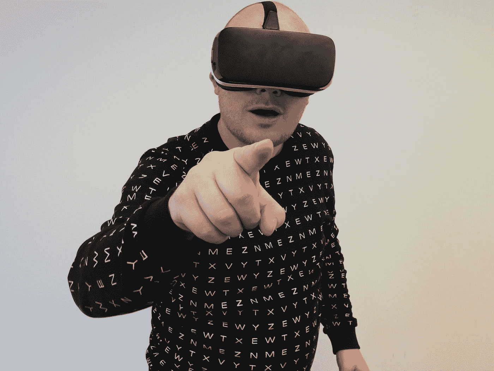

# 元宇宙变得越来越愚蠢

> 原文：<https://medium.com/codex/the-metaverse-just-keeps-on-getting-stupider-e331865dfa9d?source=collection_archive---------8----------------------->

照片由[锤子&獠牙](https://unsplash.com/@hammerandtusk?utm_source=medium&utm_medium=referral)敲在[的挡泥板上](https://unsplash.com?utm_source=medium&utm_medium=referral)

因此，脸书，或称“Meta”，决定从他们的元宇宙平台上的创作者收入中抽取 [50%](https://tech.slashdot.org/story/22/04/13/0137208/meta-plans-to-take-nearly-50-of-creators-earnings-in-horizon-worlds) 。

作为回应，苹果回应说 Meta 的计划是“虚伪的”。比如，如果你让苹果投诉你，那你就没有犯错。

## 元宇宙并不愚蠢