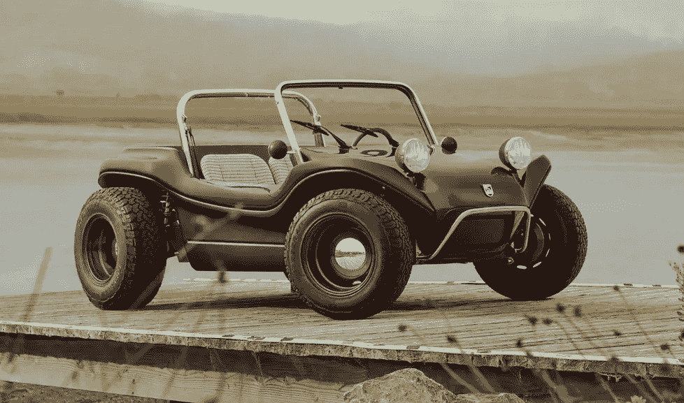

# 迈耶斯曼克斯 2.0 电动车带回了“速度车”的记忆！

> 原文：<https://medium.com/codex/the-meyers-manx-2-0-ev-brings-back-speedbuggy-memories-b39ddad5be9f?source=collection_archive---------3----------------------->

## 这是我的第一个观察

[迈耶斯·马恩岛 2.0(迈耶斯·马恩岛媒体)](https://cdn.shopify.com/s/files/1/0530/4932/7796/t/12/assets/36cbdd708b0648b5969892b44186f6c02s6a9215lrpostoriginal-1660171993480.jpg?v=1660171996)和“[飞车”(汉娜·巴贝拉媒体)](https://hanna-barberawiki.com/wiki/File:SDGW_Speed_Buggs.png)

前几天，我醒来时听到了一个消息，上图中的[迈耶斯曼克斯 2.0](https://meyersmanx.com/pages/manx-2-0-ev) 被重新引入。我几乎立刻被一种怀旧感和对汉娜·巴贝拉的动画秀《飞车》的回忆所征服。片头的演职员表显示了一个工具制造商在制造他的飞车。在动画表演中，它是…