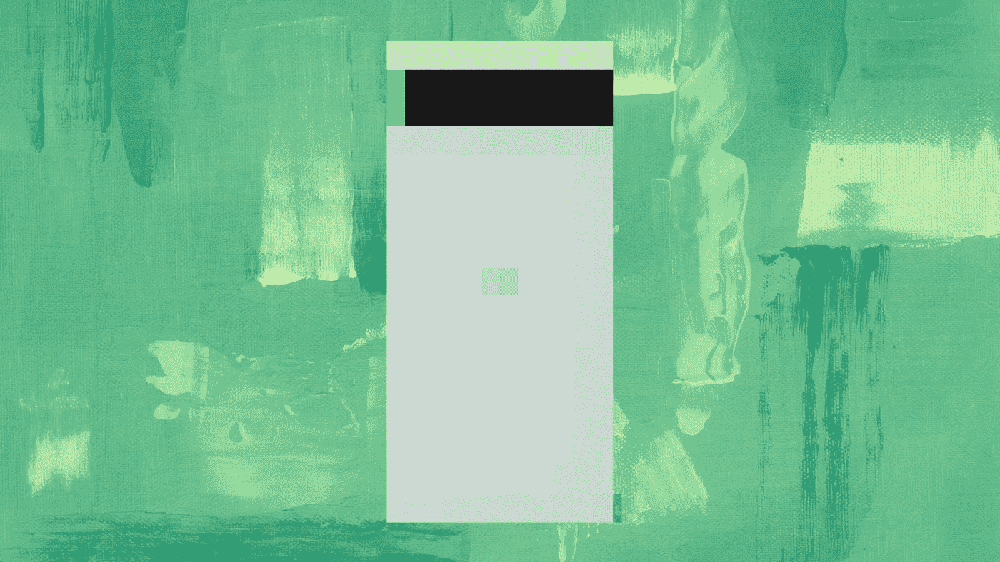

# 对谷歌像素的误解

> 原文：<https://medium.com/codex/the-misunderstanding-of-the-google-pixel-d61899453bfd?source=collection_archive---------5----------------------->

期望、品牌声望和设备用途已经伤害了谷歌的手机雄心

感知和定位是很搞笑的事情。人和事物呈现给我们的方式会严重影响我们看待它们的方式。如果你被告知某人有某种意识形态，无论你被告知的是真是假，你都会立刻对他们形成一种看法。那个人必须工作…