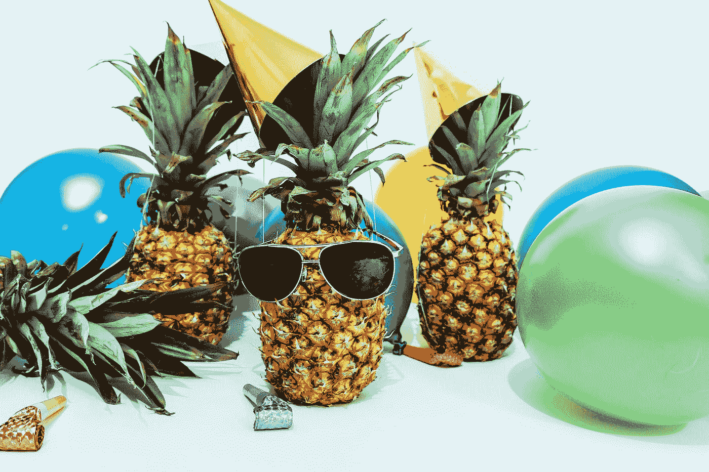

# 你越开心，你就越有效率

> 原文：<https://medium.com/codex/the-more-fun-you-have-the-more-productive-youll-be-3de85152f4ea?source=collection_archive---------6----------------------->

## 只工作不玩耍，聪明的孩子也变傻

[菠萝供应公司](https://unsplash.com/@pineapple?utm_source=medium&utm_medium=referral)在 [Unsplash](https://unsplash.com?utm_source=medium&utm_medium=referral) 上的照片

从长远来看，如果没有乐趣，你就无法完成任务。我花了很长时间试图说服自己相反。

我在想“休假是浪费时间和精力。”我认为试图把工作和娱乐放在同一个包里也是浪费时间。

我应该承认，我仍然认为理论上的**是一样的，但“倦怠”也是真实的。我可以从软件工程、编码、从零开始创造产品以及维护和管理业务的经验中看出，当你没有乐趣时，你不可能在不损失生产力的情况下继续下去。**

**渴望工作、挤出时间和从所有事情中抽离出来并不能保证你的进步和生产力。当你关掉手机，关掉通知，不看电影，不见朋友，不锻炼，不洗澡，不吃饭，或者早上醒来太早，事情不会自动完成。**

**我记得在 DHH 的一次谈话中，有人问他如何一天工作 10-16 个小时，并抱怨说会分心。DHH 的回答很明确:“也许你需要瞄准 5 个小时。你可以在 5 个小时内完成很多事情。”**

**听到这个我真的很惊讶！5 个小时的工作可能比 16 个小时的工作更有效率！这完全违背了埃隆·马斯克的方法，他建议一直工作，全力以赴。这听起来对我来说更符合逻辑(因为构建东西需要时间，甚至你可以花几天，几个月来配置你构建的东西)，但实际上，如果你坚持足够长的时间，你会筋疲力尽！烧坏有很长的反弹！**

**虽然我没有看那部经常使用这句谚语的电影，但这句话是对的:**

> **"只工作不玩耍，聪明的孩子也变傻."**

# **我们不是电脑**

****

**[天翼马](https://unsplash.com/@tma?utm_source=medium&utm_medium=referral)在 [Unsplash](https://unsplash.com?utm_source=medium&utm_medium=referral) 上拍照**

**我们不是电脑。我们的大脑不是 CPU/GPU，它们被设计来加载一批工作，并一直等待正确的结果。我们的身体不是机器，你可以给它提供燃料或电池和油，然后等着它一直活跃。**

**所以“停止玩乐，从所有让你快乐的事情中抽离出来，进入多巴胺排毒”这样的建议是不起作用的。我们的大脑不会进入多巴胺排毒，因为它有能力释放多巴胺。不管怎样，多巴胺不是一种毒素。(当它被你的大脑自然释放时)**

**我记得当我第一次在网上看到多巴胺的时候，我曾试图去戒毒。我不断回忆有趣的事情，独自大笑，结果比使用电脑或智能手机释放出更多的多巴胺。**

**故意剥夺自己的乐趣，让自己难过或者低落，是你能做的最愚蠢的事情。你需要起床来提高工作效率。令人振奋的音乐、故事、电影、令人振奋的人或令人振奋的独处是你所需要的。**

**最重要的事情来了:对你不想要的说不。对让你沮丧或分心或让你失去时间和机会成本的事情说不。或者你就是不想要！**

# **猫的方法**

****

**保罗·花冈在 [Unsplash](https://unsplash.com?utm_source=medium&utm_medium=referral) 上的照片**

**我喜欢猫在这方面的做法。他们在必要的时候工作。必要时把事情做好。他们经常休息，之后变得精力充沛。你可以通过频繁而短暂的休息来达到最佳表现。这些休息可以是身体上的，也可以是精神上的，或者两者都有！**

**这种方法让你储存能量。因为生活不是一条笔直的道路，而是一个有起有落的有趣地带，所以通过不在乎无关的事情来储存额外的能量是很方便的。实际上那不是额外的能量！没有花的离谱的是自己的精力。为什么不用呢？**