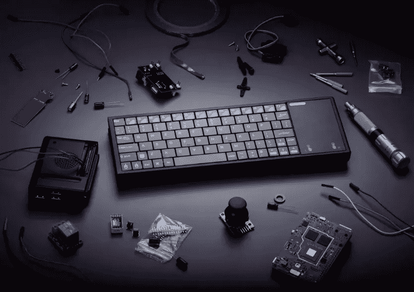

# 世界上最便宜的电脑

> 原文：<https://medium.com/codex/the-most-affordable-computer-in-the-world-8b06c47f9a13?source=collection_archive---------20----------------------->

## Pentaform 推出 AbacusBasic，这是“世界上最便宜的个人电脑”

来源:Pentaform

Pentaform 推出了 AbacusBasic，一种嵌入键盘的计算机。

整个电脑大概就是一个电脑键盘大小，包括键盘本身。