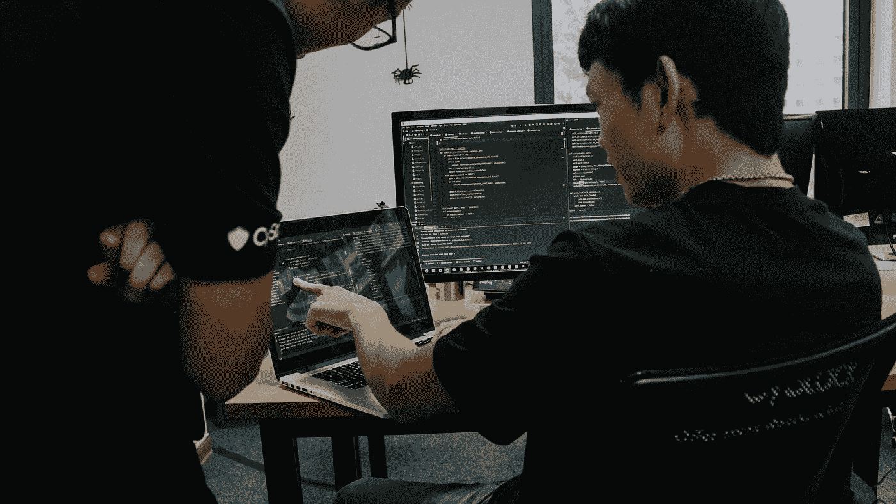

# 2022 年最受欢迎的编程语言

> 原文：<https://medium.com/codex/the-most-in-demand-programming-languages-of-2022-7aa011fdf2b9?source=collection_archive---------8----------------------->

## 学习这些语言给自己一个巨大的开端

沙敏·哈基在 [Unsplash](https://unsplash.com/s/photos/programming?utm_source=unsplash&utm_medium=referral&utm_content=creditCopyText) 上拍摄的照片

即使在 2022 年，科技行业仍在蓬勃发展。因此，公司现在比以往任何时候都更需要程序员。然而，作为一个初学者，知道应该开始学习哪种语言可能会令人生畏。

为了让这个决定更容易一点，我收集了目前需求最大的语言。我还将列出每种语言的一些最常见的应用。从最受欢迎的语言开始。

## 计算机编程语言

我们知道它，我们爱它。正如前一段时间的情况一样，现在 python 继续飙升，占据了这个列表的第一名。Python 是我一直推荐给大多数初学者的语言。没有一种编程语言是容易的，但是 Python 是最容易开始的。尤其是在没有编程经验的情况下。

Python 最常与数据科学世界联系在一起，它在该领域占据主导地位。易于阅读和相对较好的速度使它成为大多数数据科学家的首选。

你可能接触到 Python 的其他领域包括 web 开发和软件工程。由于 Python 大受欢迎，它有库来支持你想做的任何事情。

为了开始学习 Python，我推荐查看[Python 文档](https://docs.python.org/3/)

## Java 语言(一种计算机语言，尤用于创建网站)

有些人认为 Java 已经成为过去，但是报告仍然把它列为最受欢迎的语言之一。Java 也是一种非常适合初学者的语言。你也可以在网上找到成千上万的高质量教程。

Java 最常用于 web 应用程序和嵌入式系统。除此之外，你很可能在移动应用程序开发或游戏开发中遇到它。我们大多数人每天都会使用许多需要安装 Java 才能使用的应用程序。难怪它还有如此巨大的需求。

目前对 Java 最大的需求之一在于电子商务，也就是在线购买和销售产品。电子商务市场在过去的几年里飞速发展，所以现在是学习 Java 的最佳时机。

如果你想学习 Java，我建议你参加一个课程。codeacademy 上的[课程是最好的课程之一。](https://www.codecademy.com/learn/learn-java)

## java 描述语言

尽管名字不同，但 Java 和 Javascript 并不是同一种语言。任何从事 web 开发的人都应该了解 Javascript。幸运的是 Javascript 很容易学，所以你可以很快上手并运行。

Javascript 在 web 开发中最常用于客户端和服务器端编程。现在你访问的几乎所有网站都以这样或那样的方式使用 Javascript。从创建计时器、播放视频或使用简单的下拉菜单，Javascript 有能力创建任何东西。

由于疫情对高质量网站的需求比以往任何时候都高。老实说，我很惊讶 Javascript 在这个列表中没有排在前面。一个原因可能是对 Javascript 的大量需求存在于自由职业市场。

如果你对 Javascript 特别是 web 开发感兴趣，那么我强烈推荐[这门课程](https://www.coursera.org/learn/html-css-javascript-for-web-developers)。

## C

有人可能会说，C 仍然主宰着技术世界。世界范围内使用的许多程序和系统都是用 c 语言编写的。其中最著名的包括 UNIX 操作系统和 MAC OS X。像汽车的自动稳定控制、巡航控制、显示器甚至自动变速器也是用 c 语言编写的。

很明显，为什么 C 语言很受欢迎，如果你学会了它，你会有无限的可能性。它被使用了这么长时间，并且仍然继续具有相关性，这是有原因的。

我学习 C 语言最常用的资源之一是[官方开发文档](https://devdocs.io/c/)。

## 结论

所以这些是最受欢迎的语言。还有其他需求高的很棒的语言，比如 SQL 或者 C#。还要考虑 HTML 或 CSS 之类的东西，它们并不是真正的编程语言，但对于 web 开发来说仍然是必不可少的。

如果你是初学者，我也建议你看看一些你喜欢的产品，并找出它们是用什么语言写的。从你最喜欢的事物中寻找灵感是确保你致力于学习的最好方法之一。