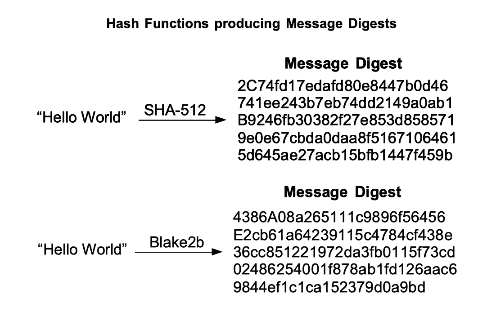

# 数十亿美元的问题？你能破解吗？

> 原文：<https://medium.com/codex/the-multi-billion-dollar-question-can-you-crack-it-53c5e899efcf?source=collection_archive---------9----------------------->

是啊！！你听到了，我将在这篇文章中谈论的问题价值超过一万亿美元，任何能破解它的人都能在几秒钟内得到这笔钱。你没有兴趣知道这个问题是关于什么的，并试图解决它，那么让我们开始吧。

# 问题的先决条件

现在是 21 世纪，当今世界最有价值的东西是什么？是钱，是资源还是土地？。我知道所有这些在当今世界都是有价值的东西，但是还有一样东西几乎等同于所有这些，而且可以让你得到所有这些东西。如果你想到了 [**加密货币**](https://draft.blogger.com/blog/post/edit/3504568035593819778/5782537653338660506#) ，那么你猜对了。比特币、以太币和所有其他硬币统治着拥有超过一百万投资者和数十亿市值的加密网络。但是我们为什么要讨论这个？首先，我们先来了解一下为什么这个问题值这么多钱。为了理解这一点，我们首先需要谈谈比特币是如何产生的，以及其中使用的机制是什么。

如果你曾经挖掘过任何密码，你就会知道在网络中挖掘一个块有多难。但是幕后到底发生了什么呢？Minging 软件为我们做了什么？又为什么值几百万？

# 什么是加密挖掘？

让我们好好了解一下采矿是如何工作的。开始采矿要做的第一件事是下载一个好的采矿器，它将开采你指定的密码，基本上要花很多时间才能从中获得大量的钱，如果硬币更多，甚至可能要花很长时间才能开采。所以让我们看看采矿软件是做什么的。需要记住的一点是，许多流行的加密网络都是建立在 [**SHA 或安全哈希算法**](https://draft.blogger.com/blog/post/edit/3504568035593819778/5782537653338660506#) 之上的，而你使用的挖掘软件只是实现和运行 SHA。但是什么是沙呢？

SHA 是一种算法，**转换一个字节序列**的常量中的任何数据。如果你学过密码学，你甚至可能对散列算法的工作原理有很好的了解。关于更多细节，让我们考虑一个例子。假设你有一个高度机密的文件或信息，你想把它传送给网络上的朋友。但是，在传输到网络中时，如果一些入侵者中断并更改了它的内容，该怎么办呢？我们正在失去数据的完整性。所以应该有一些参数，我们可以通过这些参数来检查信息的完整性，因此哈希算法被引入。让我们看看哈希算法是如何确保数据完整性的。

让我们考虑同样的情况，你想把信息传递给你的朋友，但是除了信息之外，你还从被称为**消息摘要**的附加信息中传递信息。当您要发送的信息作为哈希算法的输入时，就会获得消息摘要。在另一端的用户再次计算消息的散列，并将其与发送者的散列进行比较，如果两者匹配，则数据没有被改变，否则有人改变了信息。

有关 SHA 的更多信息，请访问: [NIST 安全散列标准](https://draft.blogger.com/blog/post/edit/3504568035593819778/5782537653338660506#)

# 但是我们为什么要谈论沙呢？

比特币和许多其他加密货币的底层基础设施由 SHA-256 和 SHA-512 组成，当你进行挖掘时，你的计算机硬件运行 SHA 算法，如果我们专门谈论比特币，那么它就是 SHA-256，这还涉及一些其他步骤，但我们只需要今天问题的哈希部分。当你从池中得到一份工作时，你需要找到一个不是 0 的散列，这是通过猜测输入并尝试所有可能性来完成的。如果你找到了序列，那么你就找到了你的第一个比特币或任何其他密码。但是不要着急，这个任务并不像看起来那么简单，SHA 的输入有太多的组合，数量是 2 个⁵⁶，比整个宇宙中的原子数多，这就是它的复杂性。从字面上看，每天有成千上万的人挖矿，赚比特币。我已经报道了 2021 年采矿业的盈利能力，请点击此处了解更多信息。

# 十亿美元的问题来了。

所以我们谈到了散列，但是当我们谈到它的时候，你们中有没有人想过更有效地实现 SHA 算法，是的，你猜对了，如果你**找到一些方法来更有效地、快速地和计算上可行地实现 SHA 算法**，那么你可能比全世界开采得都快。每天获得价值数十亿美元的比特币。

不仅挖掘整个区块链是由哈希函数组成的，如果你**找到某种方法在算法**中得到碰撞，那么你将是世界上下一个最富有的人。自从 SHA 算法首次发布以来，到目前为止还没有检测到冲突，但是等等，什么是冲突呢？**冲突只不过是哈希函数的两个不同输入产生相同的摘要**。假设我们得到了摘要，并且能够找到导致冲突的字符串，那么就很容易中断任何数据流并对其进行修改。许多 Cryptaaalyst 仍然试图在 SHA 算法中发现冲突，但是在这方面没有太大的进展。

那么你也有兴趣破解这个算法吗？在这个评论区评论你的想法。

欲了解更多信息，请访问:

[https://www . mayhemcode . com/2021/11/the-multi-billion-dollar-question-can . html](https://www.mayhemcode.com/2021/11/the-multi-billion-dollar-question-can.html)

*原载于 2021 年 11 月 27 日 https://www.mayhemcode.com**的* [*。*](https://www.mayhemcode.com/2021/11/the-multi-billion-dollar-question-can.html)