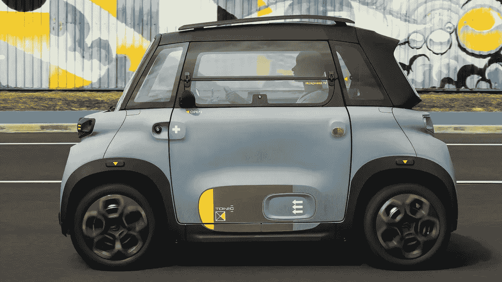

# “我的阿美族”不是玩具！

> 原文：<https://medium.com/codex/the-my-ami-is-not-a-toy-c7c785296703?source=collection_archive---------12----------------------->

## 不过，这辆电动车看起来确实很像！

[我的 Ami Tonic(雪铁龙媒体)](https://www.citroen.co.uk/content/dam/citroen/master/b2c/models/ami/tonic_streetart.jpg?imwidth=1920)

在一个小房子、极简商品和小型化已经成为常态的世界里，出现了一种独一无二的小型汽车。无论你做什么，请不要叫它玩具，它肯定不够快，不能叫一辆最高时速 28 英里的汽车。我相信我的 Ami 的正确名称是四轮车。