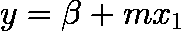
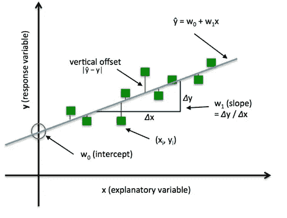
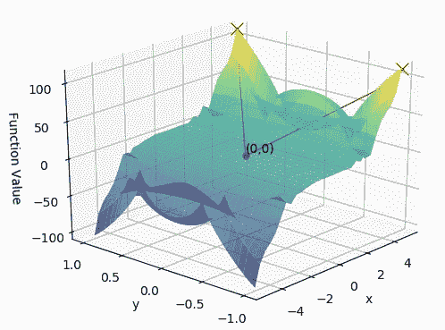
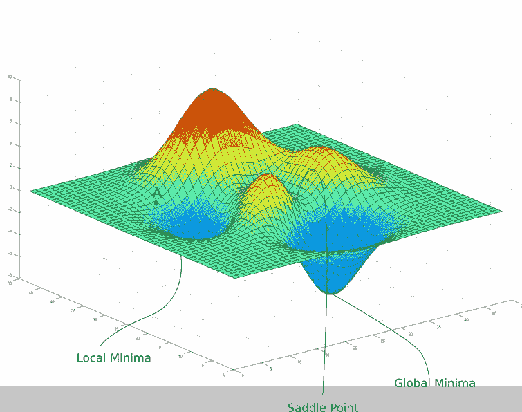
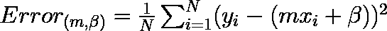
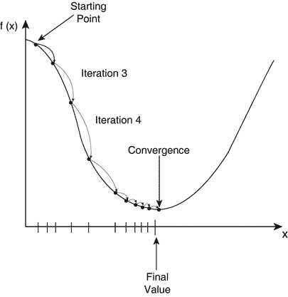
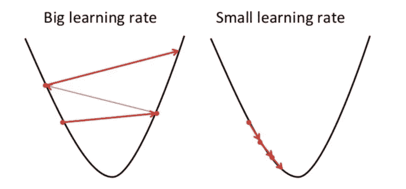
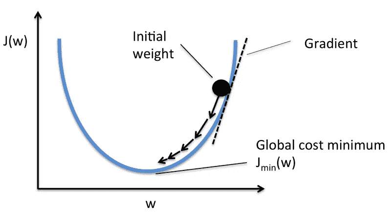

# 梯度体面的奥秘

> 原文：<https://medium.com/codex/the-mystery-that-is-gradient-decent-84a6df448e86?source=collection_archive---------13----------------------->

照片由[阿丽娜·格鲁布尼亚](https://unsplash.com/@alinnnaaaa?utm_source=medium&utm_medium=referral)在 [Unsplash](https://unsplash.com?utm_source=medium&utm_medium=referral) 上拍摄

# 梯度

梯度衡量的是，如果你稍微改变输入，函数的输出会有多大的变化。它简单地测量所有权重相对于误差变化的变化，并使用微积分迭代地调整这些值，使得它们最小化给定的函数。你也可以把梯度想成一个函数的斜率。梯度越高，斜率越陡，模型可以学习得越快。但是如果斜率为零，模型就停止学习。用更数学的方式说，梯度是对输入的偏导数。

## 价值函数

这是一种确定机器学习模型在给定每个参数的不同值的情况下表现如何的方法。在线性回归模型中，参数将是两个系数，β和 *m* :

由于成本函数是参数β和 *m* 的函数，我们可以用系数的每个值绘制出成本函数。给定每个系数的值，我们可以参考成本函数来了解机器学习模型的表现有多好。

# 它是如何工作的

**成本函数**将接受一个`*(m,β)*`对，并根据直线与我们的数据的吻合程度返回一个误差值。为了计算给定线的误差，我们将遍历数据集中的每个`*(x,y)*`点，并对每个点的 *y* 值和候选线的 *y* 值`*(at mx + b)*`之间的平方距离求和。传统的做法是平方这个距离，以确保它是积极的，并使我们的误差函数可微。

*   更适合我们的数据的线(其中更好是由我们的误差函数定义的)将产生更低的误差值。如果我们最小化这个函数，我们将得到数据的最佳线。由于我们的误差函数由两个参数`(*m* and *b*)`组成，我们可以将其视为一个二维表面。

*   这个二维空间中的每个点代表一条线。函数在每一点的高度就是那条线的误差值。一些线比其他线产生更小的误差值(即，更好地拟合我们的数据)。当我们运行梯度下降搜索时，我们将从这个表面上的某个位置开始，向下移动以找到误差最小的线。

*   横轴表示参数`(*w* and β)`，纵轴表示成本函数`*J(w, β)*`。你也可以在图像中看到梯度下降是一个凸函数。
*   我们希望找到对应于成本函数最小值的`*w*`和`β`的值(用红色箭头标记)。为了找到正确的值，我们用一些随机数和梯度下降法初始化 *w* 和β的值，然后从那个点开始。
*   然后，它在最陡的下行方向上一步接一步地前进，直到到达代价函数尽可能小的点。

## 算法

接下来，为了找到成本函数中的最低误差(最深的谷)(相对于一个权重)，我们需要调整模型的参数。利用微积分，我们知道函数的斜率是函数对某个值的导数。

我们可以看到成本函数(命名为`*Error*` ，符号为`*J*`)相对于一个权重的曲线图。现在，如果我们计算关于这一个权重的成本函数的斜率，我们得到我们需要移动的方向，以便达到局部最小值(最近的最深的谷)。

梯度(或导数)告诉我们成本函数的倾斜度或斜率。因此，为了最小化成本函数，我们向与梯度相反的方向移动。

1.  随机初始化重量 *w* 。
2.  计算成本函数 *w.r.t.* 参数的`*G*` 梯度。这是使用偏导数`*G = ∂J(w) / ∂w*`完成的。梯度值`*G*`取决于输入、模型参数的当前值和成本函数。如果你手动计算梯度，你可能需要重温微分的主题。
3.  以与`*G*`成比例的量更新权重，即`*w = w − ηG*`
4.  重复，直到成本`*J(w)*`停止降低，或者满足一些其他预定义的终止标准

> 在步骤 3 中，`η`是学习率，它决定了我们达到最小值所需的步长。我们需要非常小心这个参数。`η`的高值可能超过最小值，非常低的值将非常缓慢地达到最小值。

# 学习率

梯度下降向局部最小值方向的步长由所谓的**学习速率**决定。它决定了我们达到最佳体重的快慢。为了使梯度下降达到局部最小值，我们必须将学习率设置为一个适当的值，这个值不能太低也不能太高。

这是因为如果它采取的步骤太大，它可能不会达到局部最小值，因为它只是在梯度下降的凸函数之间来回跳动，就像你在下图左侧看到的那样。如果你设置学习率为一个非常小的值，梯度下降将最终达到局部最小值，但它可能会花费太多的时间，就像你在图像的右侧看到的那样。

> 当你开始用梯度下降法解决一个给定的问题时，只需简单地尝试 0.001，0.003，0.01，0.03，0.1，0.3，1 等等。因为它的学习率和看看哪个表现最好。

# 趋同；聚集

一旦代理人在许多步骤之后意识到成本没有改善很多，并且停留在非常接近特定点`*minima*`的位置，技术上这被称为**收敛**。最后一步的参数值称为最佳参数集，我们有一个训练好的模型。

# 梯度下降的类型

三种流行的梯度下降类型，主要区别在于它们使用的数据量。

## 批量梯度下降

也称为普通梯度下降，计算训练数据集中每个示例的误差，但只有在评估了所有训练示例后，模型才会更新。这整个过程就像一个循环，被称为一个训练时期。

> 它的优点是计算效率高，产生稳定的误差梯度和稳定的收敛性。批量梯度下降的缺点是，稳定的误差梯度有时会导致收敛状态，而不是模型能够达到的最佳状态。它还要求整个训练数据集都在内存中，并且可供算法使用。

## 随机梯度下降

在传统的梯度下降算法中，我们逐个计算每个观测值的梯度；在随机梯度下降中，我们可以随机选择随机观测值。它被称为**随机**,因为样本是随机选择的(或混洗的),而不是作为单个组(如在标准梯度下降中)或按照它们在训练集中出现的顺序。这意味着它会逐个更新每个训练示例的参数。这可以使 SGD 比批量梯度下降更快，具体取决于问题。

> 一个好处是频繁的更新允许我们有一个相当详细的改进率。随着批量梯度下降的接近，频繁的更新在计算上更加昂贵。这些更新的频率也可能导致噪声梯度，这可能导致错误率跳跃，而不是缓慢降低。

## 小批量梯度下降

是 SGD 和批量梯度下降概念的结合。它只是将训练数据集分成小批，并对这些小批中的每一批执行更新。因此，它在随机梯度下降的鲁棒性和批量梯度下降的效率之间建立了平衡。

> 常见的小批量大小范围在 50 到 256 之间，但像任何其他机器学习技术一样，没有明确的规则，因为它们可能因不同的应用而异。这是深度学习中最常见的梯度下降类型。

参考

*   [https://towards data science . com/gradient-descent-in-a-shell-EAF 8c 18212 f 0](https://towardsdatascience.com/gradient-descent-in-a-nutshell-eaf8c18212f0)
*   [(https://spin . atomic object . com/2014/06/24/gradient-descent-linear-regression](https://spin.atomicobject.com/2014/06/24/gradient-descent-linear-regression))

欢迎任何反馈或建设性的批评。