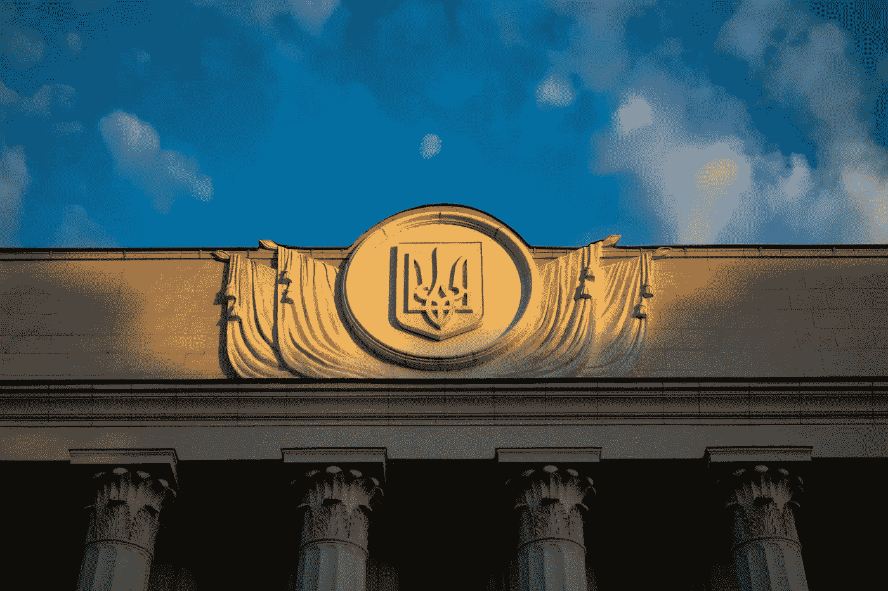
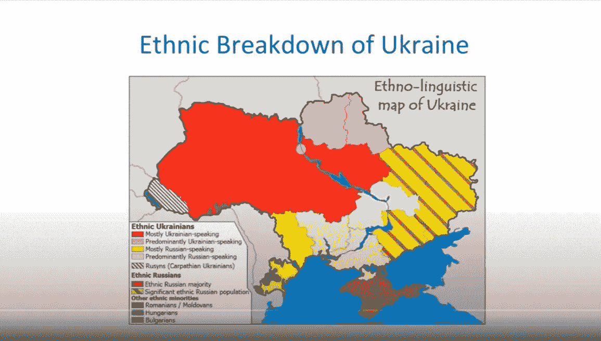
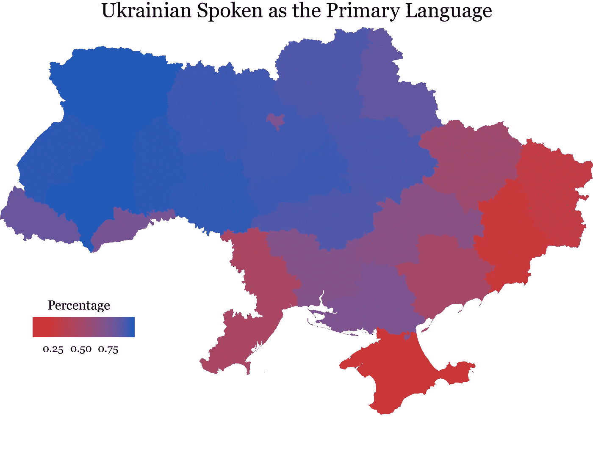
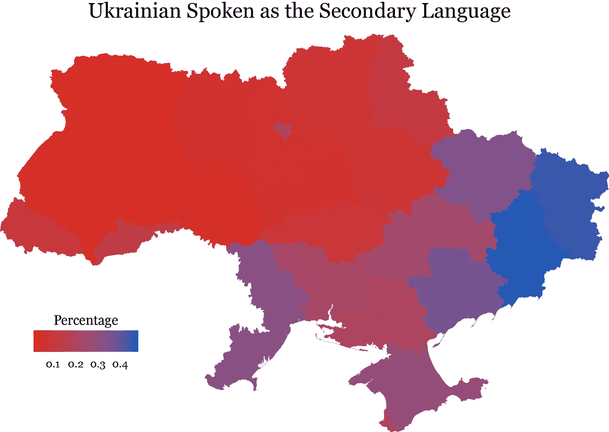
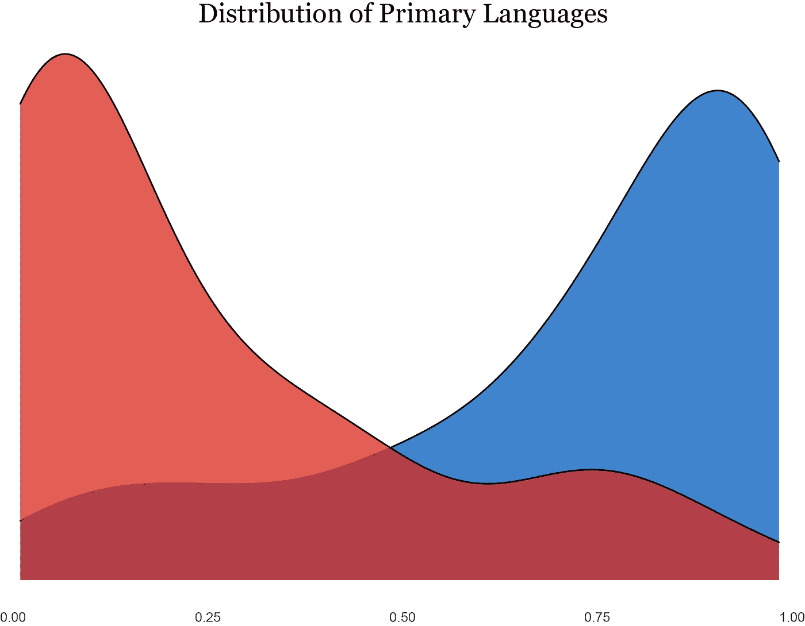
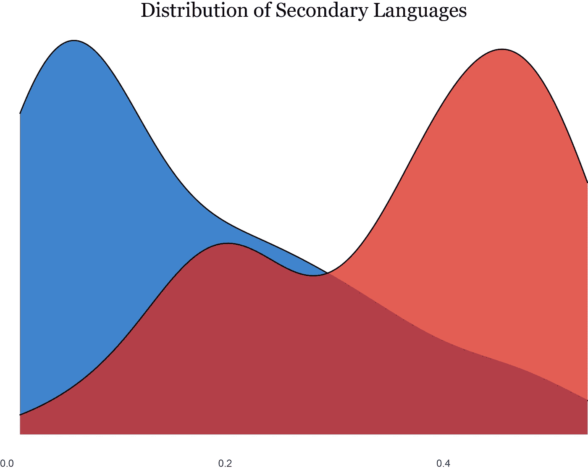

# 乌克兰语言分歧的神话

> 原文：<https://medium.com/codex/the-myth-of-ukraines-linguistic-divide-70a95fa0e0c5?source=collection_archive---------6----------------------->

懒惰的分析导致懒惰的结论。

乌克兰是宇宙的中心。我无数次从亲近的人那里听到这句话。现在比以往任何时候，这是真的。战争现阶段的前奏充满了许多关于乌克兰的(荒谬的)假设。其中一个假设是乌克兰是一个“严重分裂”的国家，正如约翰·米尔斯海默在 2015 年的演讲中所说。米尔斯海默展示了这张乌克兰民族语言分界图，以补充他的观点:

这张地图突出了一个表面上被分割的国家。然而，它是有缺陷的。

# 映射语言

我将特别关注这个问题的语言部分。我使用了来自[人道主义数据交换](https://data.humdata.org/organization/hdx)的语言数据，并首先在一张地图上绘制了乌克兰母语者的分布:

蓝色=母语为乌克兰语的比例高，红色=母语为乌克兰语的比例低

蓝色调较深的地区，以乌克兰语为主要语言的人口比例较高(红色阴影区的情况正好相反，母语为俄语的人较多)。这张地图似乎与米尔斯海默在他的讲座中使用的地图非常吻合。在米尔斯海默的地图中，被归类为“主要说乌克兰语”的地区有更高比例的母语为乌克兰语的人(> 75%)。相比之下，在米尔斯海默的地图上被归类为“主要说俄语”的地区，只有不到四分之一的人口使用乌克兰语作为他们的主要语言。例如，这种语言上的差异通常很好地映射到投票模式，并被一些人用来做出荒谬的声明，如说俄语的东部地区将张开双臂欢迎俄罗斯武装部队。

现在让我们来看看作为第二语言的乌克兰语的分布情况:

其中蓝色=作为第二语言的乌克兰语比例较高，红色=作为第二语言的乌克兰语比例较低

这张地图是我贴的第一张地图的反面(或多或少)。紫色区域保持紫色，而蓝色和红色区域切换。从这些地图中得出的结论似乎很明显。乌克兰人会说两种语言，他们的文化世界不受他们在家里说什么语言的限制。为了进一步说明这一点，让我们绘制主要语言的分布图来补充地图:

蓝色=乌克兰本土，红色=俄罗斯本土

现在让我们看看第二语言的分布:

蓝色=乌克兰语第二口语，红色=俄语第二口语

对称性再次出现。这似乎不是一个复杂的概念(该国是双语)。我不是第一个提出这一观点的人。我听得不够多，所以想强化一下概念。懒惰的思维导致懒惰的(有时是荒谬的)分析。乌克兰并不像有些人想让你相信的那样，是一个截然相反的国家，东西分裂。仅仅因为有人在东方说俄语长大，并不意味着他们渴望屈从于一个独裁者。

引用一下:

> “我是俄罗斯人。我在家说俄语。但我的 ***灵魂*** 是乌克兰人。”

这才是重点。这是关于乌克兰的*精神*，而不是语言或种族。乌克兰人不仅仅是为他们的国家而战；他们为自己的灵魂而战。他们在为超越你可以在地图上编码的数据点的东西而战。俄罗斯军队正在和一群他们无法理解的人战斗。

Слава Україні!

## 笔记

异常组织是一个在乌克兰运作的非政府组织，目前正在支持这场战争。在[脸书](https://www.facebook.com/anomaly.ua/)和[推特](https://twitter.com/AnomalyUA?s=20&t=TGsjcFinCP-aPxu7lM1qdg)上查看它们。