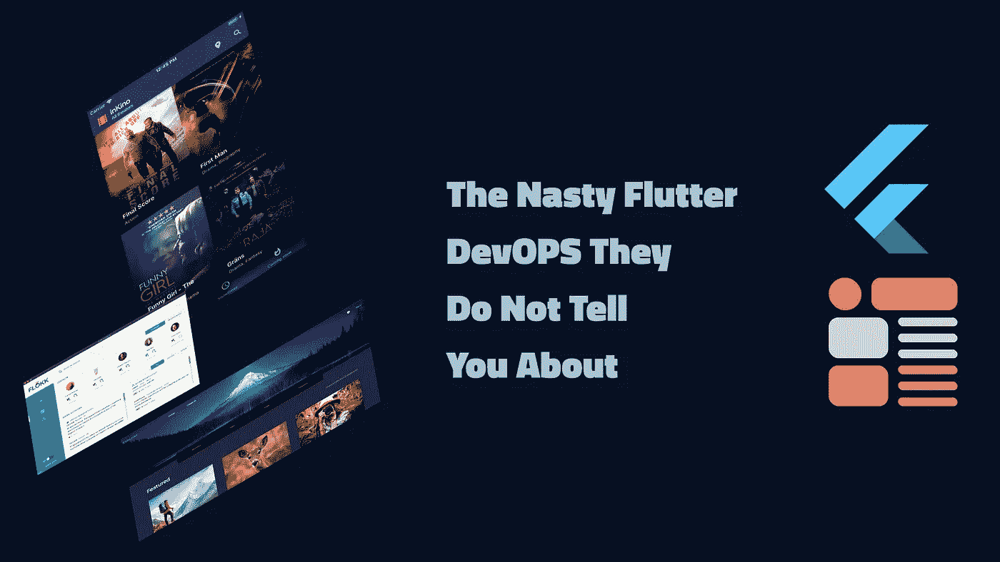

# 他们没告诉你的讨厌的颤动

> 原文：<https://medium.com/codex/the-nasty-flutter-devops-they-do-not-tell-you-about-3cd8ea4d1526?source=collection_archive---------8----------------------->

在 DevOPS 中，我们必须解决的一个问题是主题在 Flutter 中实现方式的不一致性；因为这将直接影响 UX 设计屏幕或自定义小部件的速度。

# **为什么要为 UX 设计工作流程开发运维服务**

UX 设计就像应用程序架构一样是一个可迭代的过程，因为应用程序的 UX 设计…