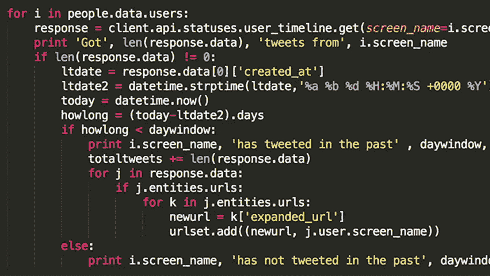

# 需要编写更少的样板代码

> 原文：<https://medium.com/codex/the-need-to-write-less-boilerplate-code-bfa5f2b13a73?source=collection_archive---------0----------------------->

从 2006 年到 2011 年，我在大学期间，我一直被我的讲师教导说，编程就是写代码。你写的代码越多越好。

> 软件开发就是写代码。如果你不写代码，那就不是合适的软件开发，因为软件开发就是写代码。