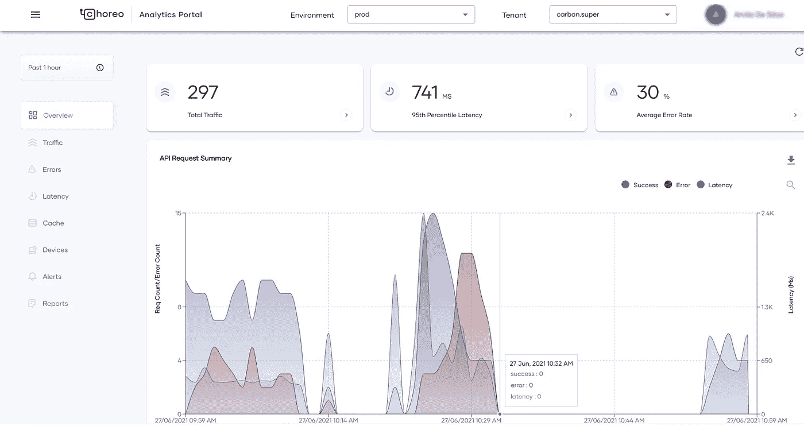
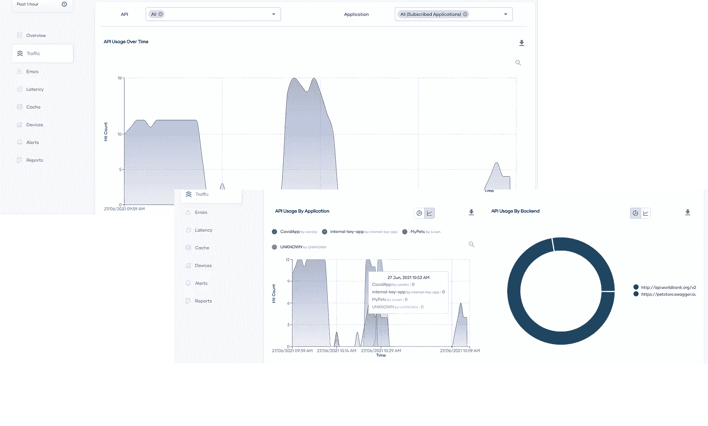
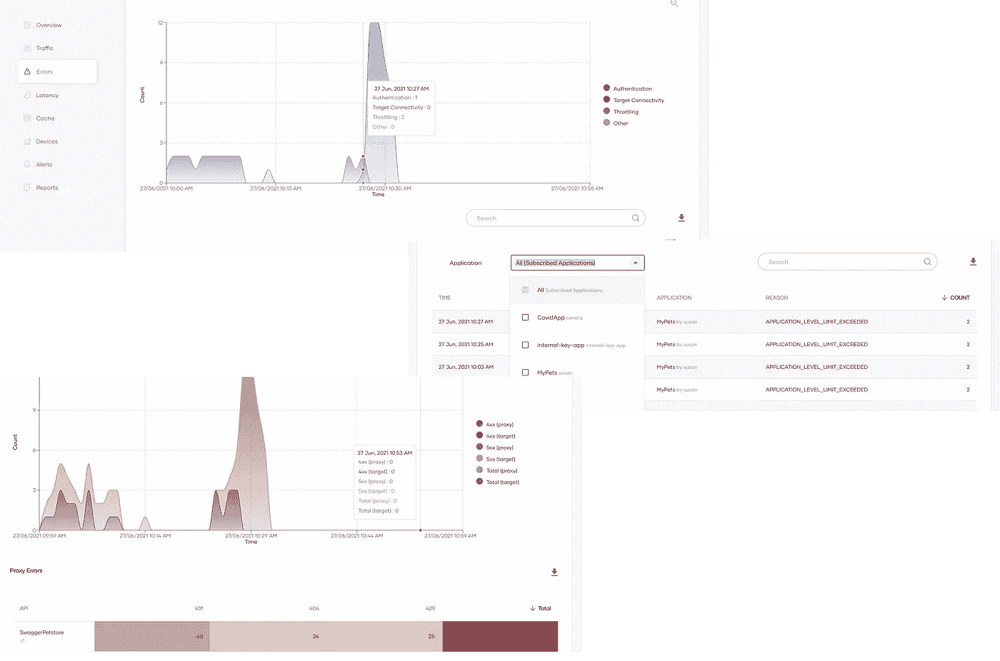
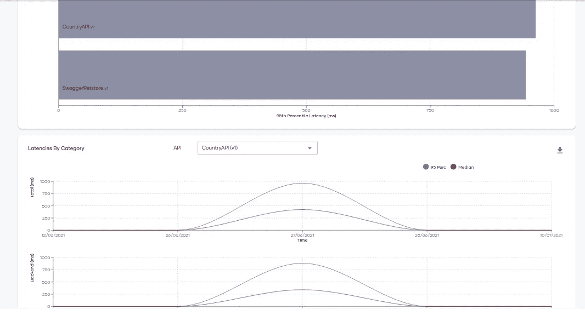
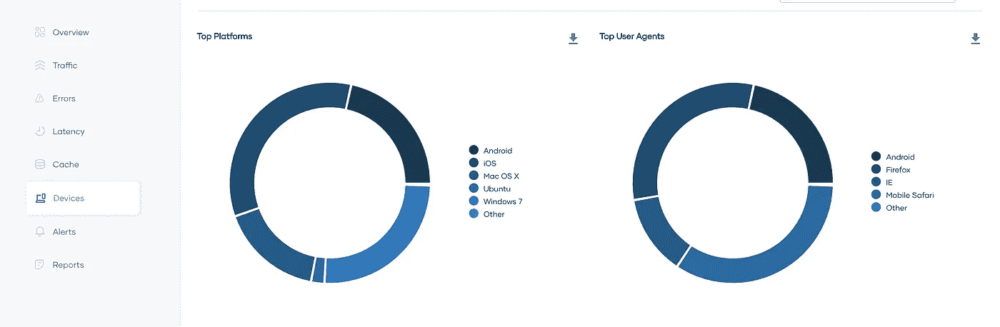
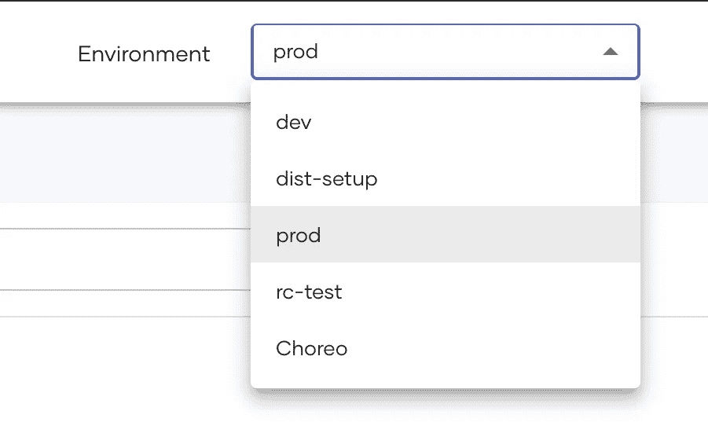

# 分析的新面貌

> 原文：<https://medium.com/codex/the-new-face-of-analytics-c22a56c357c7?source=collection_archive---------14----------------------->

## APIM 4.0 分析简介

API Manager 4.0 于 5 月 5 日发布，提供了一系列令人兴奋的特性。其中，将分析迁移到云是一个重要的变化，它允许客户享受分析的全部好处，而无需经历设置它的痛苦。随着这一举措，分析门户(或仪表板)经历了彻底的改造，使用户界面更加直观和用户友好。
通过这篇文章，我想到了突出新特性，解释云迁移背后的原因

# 从内部部署到云

那些熟悉以前的 API Manager 版本的人可能还记得 Analytics 是作为一个本地发行版提供的。虽然独立发行版帮助客户快速设置和试用，但创建生产级设置需要更多的工作。像配置高可用性、单独运行配置文件这样的事情，有时需要客户了解平台的内部细节。每当用于分析的技术发生变化时，客户都必须改变他们的 DevOps 流程，这对于显示 API 统计数据来说往往有点太多了。

新门户的登录页面

云版本消除了这一负担。如果您已经试用了新版本，您会意识到使用分析所需要的只是从门户获取一个令牌，并将其放入配置文件中。不需要下载。由于处理和存储发生在云中，您不必担心设置和管理设置。

# 新的外观 API 生态系统的窗口

云迁移带来的另一个变化是新的外观和感觉。虽然它提供了某些交互式功能，如可缩放的图表、可点击的图例和导航选项，但它提供的最大价值是图表排列的直观方式。新的门户提供了一个更广阔的视角来看待 API 生态系统的不同部分。

API 生态系统是 API 提供商、最终用户、消费者(应用程序开发人员)、合作伙伴以及所有致力于提高 API 价值主张的人的结合。甚至负责底层系统的开发运维团队和基础架构团队也成为了 it 的主要参与者。因为是不同方之间的合作发展了生态系统，所以提供各方正在寻找的统计数据对生态系统的有机增长非常重要。新门户简明地提供了这些统计数据。

**对于 API 提供商**
如果 API 被认为是数字产品，那么 API 提供商就是那些构建产品的人，他们的目标是通过将组织资产转化为 API 来创造价值。通常，他们想知道他们的 API 被采用的情况如何，这些 API 是被某个范围的消费者使用还是被某个特定的细分市场所限制，以及 API 接收了多少流量。当他们做出更改并推出新版本时，他们会比较最新版本的表现。

流量页面—加班图表和应用程序流量

流量页面提供了这些见解，允许 API 提供者按 API 和应用过滤流量。饼图显示了应用程序的流量构成，这有助于了解应用程序的采用情况。如果需要，视图可以切换到加班图表。
缓存页是新增加的，有助于判断缓存是否被有效利用。当在 API 中启用响应缓存并且响应由缓存提供时，将出现缓存命中。

**对于 DevOps/Operations**
来说，致力于保持系统正常运行的运营团队必须关注错误率、API 延迟等统计数据。如果有太多的错误，或者如果 API 需要很长时间来响应，那么就会影响 SLA。当 API 降级时，他们必须迅速找出原因。有了新的延迟和错误视图，运营团队可以快速确定问题是出在 API 还是后端。

错误页面的不同视图—有助于快速缩小问题范围

通过显示请求和响应中介延迟，延迟分解有助于进一步缩小问题的范围，这实际上给出了网关增加的延迟。如果请求中介增加，即使 API 没有定制的序列，这通常意味着键验证需要时间——这应该在基础级别上解决。

延迟页面—最慢的 API 和延迟明细

**对于 API 消费者**
如果 API 是产品，那么应用就是安排和销售它们的商店。当一个店主知道如何安排一个产品来最好地展示它的价值时，商店和产品所有者都会受益。
类似地，API 消费者(应用程序开发人员)需要统计数据来衡量他们的应用程序运行情况。流量和报告页面都提供了应用程序细分，这有助于找到产生流量的应用程序。在错误页面上，可以过滤应用程序生成的错误，通过这些错误可以识别质量问题和升级需求。
由于流量页面允许应用过滤流量，消费者可以评估最终用户是否遵循预期的用户旅程。通过一些仔细的分析，可以确定流程中断的点。

了解你的用户
了解你的最终用户来自哪里对于发展你的 API 程序至关重要。诸如他们使用的平台、大多数用户是来自网页还是移动设备、他们使用的浏览器种类等细节有助于决定如何进一步提高 reach。设备页面上的详细信息提供了一些见解，通过这些见解，客户可以获得上述一些统计数据。

设备页面—显示顶级平台和用户代理

# 邀请并分享

借助 Choreo 的力量，新的分析在共享数据和管理访问方面做出了改变。在为多个环境设置分析时，对于内部版本，必须创建单独的设置，该设置将仅显示与特定环境相关的统计信息。如果用户需要在多个环境中查看统计数据，他们将不得不登录到多个门户。然而，在新的解决方案中，环境之间的切换是一个改变下拉菜单的问题。

在以前的版本中，租户的数据以孤立的视图呈现。只有租户内的用户能够看到租户的数据。虽然从技术上来说这种分离是正确的，但实际上在 APIM 租赁被用来代表一个较大组织的不同部门。这通常会促使一组特权用户跨租户查看数据。为了更好地迎合这一点，新平台允许用户通过另一个下拉菜单在租户之间切换。

环境选择—提供对不同环境的轻松访问

新的分析解决方案是 Choreo 的一部分，这意味着邀请用户等功能是天生可用的。如果您是为您的组织设置分析的管理员用户，那么您可以选择希望查看统计数据的用户。配置分析的人不需要是 APIM 设置的管理员。

# 试一试

我没提到过配置分析从未如此简单吗？您只需登录到云门户，为环境创建一个配置密钥，并将其放在 deployment.toml 中。如果你不相信，你可以查一下[官方文件](https://apim.docs.wso2.com/en/latest/api-analytics/getting-started-guide/)。当网关启动时，它们将与服务对话并获得发布事件所需的配置。

我希望您对新的分析、它提供的功能以及它为您带来的麻烦有一个公平的想法。你可以下载 [API Manager 4.0](https://wso2.com/api-management/) 或者通过 Choreo 管理[API 来试试。如果您需要任何帮助，您可以通过](https://wso2.com/choreo/docs/apis/create-and-publish-your-first-api/)[松弛渠道](https://wso2-apim.slack.com/)或[联系表格](https://wso2.com/contact/)联系团队。