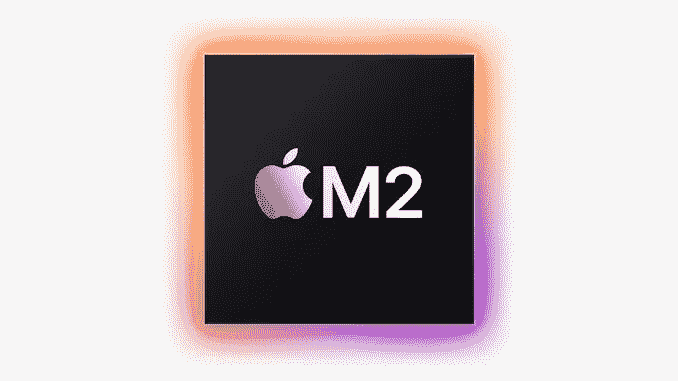

# 新款 MacBook Air

> 原文：<https://medium.com/codex/the-new-macbook-air-232d4e6c3173?source=collection_archive---------18----------------------->

## 苹果 M2 芯片加速新款 MacBook Air

苹果 M2

苹果公司推出了新的 M2 处理器，这种芯片将核心处理能力比 M1 提高了 18%，同时保持了该公司新的 MacBook Air 和 13 英寸 MacBook Pro 笔记本电脑的电池寿命。

M2 的 CPU 还提供了一个大内存，高达 24GB，而不是 M1 的 16GB。