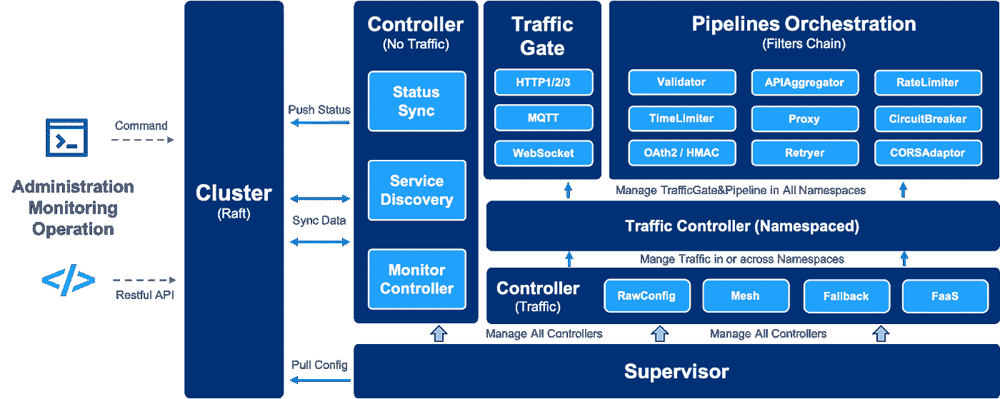

# 下一代服务网关

> 原文：<https://medium.com/codex/the-next-generation-service-gateway-7cf4bd50c9bd?source=collection_archive---------7----------------------->

如今，所有的软件架构都在向云原生架构迁移。云原生架构具有以下特征:

*   它由采用弹性设计的微服务架构构建而成。
*   按需性能和扩展能力。
*   将控制逻辑和业务逻辑完全解耦。
*   以高可用性和 99.9%以上的正常运行时间 SLA 为目标。

四类重要的事情需要通过云本地方式来很好地构建和安排。

1.  **基础设施运行时资源**。底层计算节点、存储和网络都由 container 和 Kubernetes 管理和调度。
2.  **应用数据&状态**。应用程序数据和状态需要持久或在群集范围内同步。我们可以看到主流数据库(SQL/NoSQL)、缓存、队列等现在都支持分布式集群和 HA 解决方案。
3.  **应用服务**。这些服务现在由 Kubernetes 编排，并由微服务架构管理，包括服务发现、服务配置管理、服务网关/代理、弹性&容错、活性或就绪性健康检查、可观察性(指标、日志、跟踪)等。
4.  **流量编排**。大多数在线服务需要处理来自世界各地的用户请求。这种流量会有不同的目的并访问不同的资源。因此，管理流量并使其与云原生后端服务保持一致非常重要。

关于流量协调，要成为云原生网关，它必须具备以下特性。

*   与微服务架构保持一致。
*   分布式系统技术的高可用性。
*   通过各种过滤器和 API 聚合的管道协调流量。
*   兼容云原生架构，如服务网格、FaaS 等。
*   服务可观察性—跟踪、指标(吞吐量、延迟、错误等)、访问日志。

为此，我们将引入下一代服务流量网关— [Easegress](https://github.com/megaease/easegress)

这个软件是用 Go 编写的开源软件(Apache 2.0 license)，有了 Go 编程语言，对于高并发的场景，它自然有高性能。

Easegress 的主要设计如下:

流量处理功能或过滤器可以通过插件机制来开发。

管理 API 可以在运行时将函数或过滤器组织到管道中。

有两种类型的控制器有助于管理和集成到整个云原生架构。

*   **交通控制器** —网状、FaaS 等。
*   **系统控制器** —服务发现、监控、集群等。

应用层协议支持— HTTP 1/2/3、WebSocket、MQTT

来源:[https://github . com/mega ease/ease gress/blob/main/doc/architecture . png](https://github.com/megaease/easegress/blob/main/doc/architecture.png)

此外，Easegress 具有以下云原生特性。

微服务架构合规性

*   Spring Cloud 兼容性
*   Restful API 协议——API 路由和 API 聚合。
*   服务发现集成— Eureka、Consul、Nacos、Etcd 和 Zookeeper。
*   弹性和容错(移植自 [resilience4j](https://github.com/resilience4j/resilience4j) 项目)——断路器、速率限制器、重试器、时间限制器等。

云-原生架构集成

*   Kubernetes 入口控制
*   服务网格—边车和入口控制器
*   FaaS——Knative
*   高可用性和高性能

内置的 Raft 共识和领导者选举提供了 99.99%的可用性。

*   负载平衡—循环、随机、加权随机、IP/报头哈希。
*   缓存—缓存后端服务响应。

可观察性

*   服务跟踪——内置的开放 Zipkin，以及对供应商中立的 API 的开放跟踪。
*   吞吐量— QPS/TPS m1、m5、m15 和错误率
*   潜伏期— P999、P99、P98、P95、P75、P50、P25
*   带宽—请求和响应数据大小
*   响应 HTTP 状态代码统计。

此外，Easegress 具有很好的可扩展性，很容易将定制的特性或功能添加到 Easegress 中，有三种方法可以做到这一点。

*   **过滤器或控制器。**遵循开发指南，您可以用 Go 语言开发您的过滤器和控制器。但是它需要重新编译软件。
*   **网络组装**。Easegress 支持 WASM 运行时引擎，因此，您可以用任何支持 WASM 的编程语言开发过滤器，并且 Easegress 可以在运行时加载它。
*   **功能即服务**。Easegress 支持 Knative integration，因此，除了 Easegress 之外，您还可以部署函数服务。通过与 Kubernetes 合作，这种方式似乎有点沉重，但它是一个可扩展的解决方案。

因此，Easegress 可以成为一个开发框架，你可以专注于自己的业务流量网关。

Easegress 有能力完成以下工作(包括但不限于):

*   反向代理(负载均衡)—丰富的负载均衡策略[ [doc](https://github.com/megaease/easegress/blob/main/doc/cookbook/load_balancer.md)
*   服务发现—动物园管理员、尤里卡、领事、Nacos 等。[ [单据](https://github.com/megaease/easegress/blob/main/doc/cookbook/service_proxy.md)
*   FaaS—Knative integration[[doc](https://github.com/megaease/easegress/blob/main/doc/cookbook/faas.md)
*   Kubernetes 入口控制器[ [doc](https://github.com/megaease/easegress/blob/main/doc/cookbook/k8s_ingress_controller.md)
*   管道—为请求/响应处理编排 HTTP 过滤器。
    [ [doc](https://github.com/megaease/easegress/blob/main//doc/cookbook/pipeline.md)
*   API 聚合——将许多 API 聚合成一个 API。[ [doc](https://github.com/megaease/easegress/blob/main/doc/cookbook/api_aggregator.md)
*   弹性和容错—断路器、速率限制器、重试器、时间限制器等。[ [doc](https://github.com/megaease/easegress/blob/main/doc/cookbook/resilience.md)
*   分布式跟踪—支持 APM 跟踪— Zipkin。[ [doc](https://github.com/megaease/easegress/blob/main/doc/cookbook/distributed_tracing.md)
*   压缩、缓存等性能优化。[ [单据](https://github.com/megaease/easegress/blob/main/doc/cookbook/performance.md)
*   闪购。高并发促销销售。[ [单据](https://github.com/megaease/easegress/blob/main/doc/cookbook/flash_sale.md)
*   服务网格——这被[ [Ease Mesh]](https://github.com/megaease/easemesh) 所利用——一个 Spring Cloud 兼容的网格系统。
*   工作流(IFTTT) —将许多 API 作为工作流运行。[ [单据](https://github.com/megaease/easegress/blob/main/doc/cookbook/workflow.md)
*   WebAssembly —使用 AssemblyScript 扩展 Easegress。[ [单据](https://github.com/megaease/easegress/blob/main/doc/cookbook/wasm.md)

今天，我们期待着您对这个新的流量门户的建议或关注，甚至帮助我们将这个门户变得伟大。请随时在我们的 Github—【https://github.com/megaease/easegress 中提出问题或贡献代码