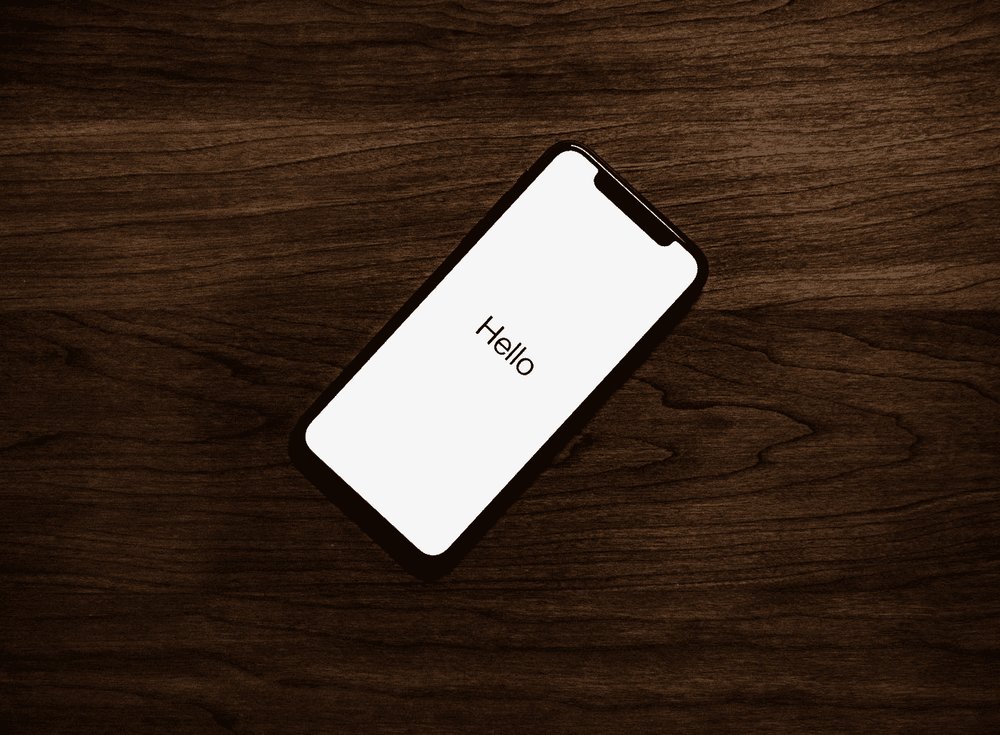

# 下一代 iPhone 将基于订阅！

> 原文：<https://medium.com/codex/the-next-iphone-will-be-subscription-based-only-f854ebddf0d0?source=collection_archive---------8----------------------->

泰勒·拉斯托维奇在 [Unsplash](https://unsplash.com?utm_source=medium&utm_medium=referral) 上的照片

根据[马克·古尔曼](https://appletrack.com/mark-gurman/) (86.4%准确，通过[彭博](https://www.bloomberg.com/news/articles/2022-03-24/apple-is-working-on-a-hardware-subscription-service-for-iphones?srnd=technology-vp))，我们将在今年晚些时候看到新的 **iPhone 14** 的订阅计划:

> “这个想法是让购买 iPhone 或 iPad 的过程等同于每月支付 iCloud storage 或 Apple Music 订阅费。苹果公司正计划让顾客用相同的苹果 ID 和应用商店账户订阅硬件