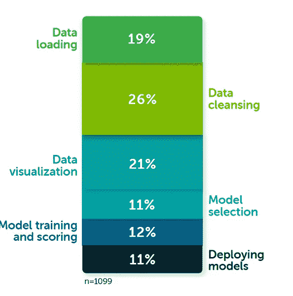

# 作为一个完全的初学者，你开始学习 ML 和 AI 所需要的 10 篇文章

> 原文：<https://medium.com/codex/the-only-10-articles-you-need-to-get-started-with-ml-and-ai-as-a-complete-beginner-af3308ac40dd?source=collection_archive---------11----------------------->

数据科学和人工智能是过去五年的热门话题。越来越多的人走上了成为数据科学家的道路。毫无疑问，数据科学家的工作被评为世界上最好的工作之一。举个例子，glassdoor 把数据科学家工作列为 2021 年美国第二好的工作！

[https://www . glass door . com/List/Best-Jobs-in-America-2021-LST _ kq 0，25.htm](https://www.glassdoor.com/List/Best-Jobs-in-America-2021-LST_KQ0,25.htm)

在这里，您将找到 10 篇文章，它们将帮助您作为一个完全的初学者开始您的数据科学之旅。在数据科学上有大量的资源和学习途径，人们很容易对应该做什么感到困惑。

我们将捕获数据科学家在工作中通常会面临的 80%的工作，限制理论，最大化实践！

数据科学家的任务范围广泛，从数据争论、数据分析到构建、审计或解释复杂的 ML 模型，甚至与 ML 工程师密切合作，将这些模型部署到生产中，以影响数百万人。现代数据科学的核心部分是构建 ML 模型，因此我们将重点关注这一部分。

我们开始吧！

# 1.数据理解和清理

你可能会感到惊讶，但数据科学家 66–79%的时间都花在获取、理解和清理数据上。

[https://www . datanami . com/2020/07/06/data-prep-still-domains-data-scientists-time-survey-finds/](https://www.datanami.com/2020/07/06/data-prep-still-dominates-data-scientists-time-survey-finds/)和[https://www . Forbes . com/sites/Gil press/2016/03/23/data-preparation-most-time-consumption-less-data-science-task-survey-says/？sh=6de133cf6f63](https://www.forbes.com/sites/gilpress/2016/03/23/data-preparation-most-time-consuming-least-enjoyable-data-science-task-survey-says/?sh=6de133cf6f63)

在这些活动中，您将:

1.  从数据源查询数据以形成数据集；
2.  理解数据集，以及每个属性的业务意义；
3.  检查丢失的值，并找出如何处理它们；
4.  使用单变量分析查看单列分布，以纠正偏态并修复异常值；
5.  了解要素间的依赖关系，并使用双变量分析处理多重共线性；
6.  处理分类数据，使其可被模型吸收；
7.  理解属性之间的复杂关系，以及这些关系如何影响业务任务。

为了涵盖与数据相关的活动，请遵循以下简单的文章:

1.1 首先了解数据探索和分析

 [## 探索性数据分析的广泛逐步指南

### 我对任何数据集执行 EDA 的个人指南

towardsdatascience.com](https://towardsdatascience.com/an-extensive-guide-to-exploratory-data-analysis-ddd99a03199e) 

1.2 通过尝试不同的示例和添加数据清理练习来巩固您的知识

 [## 使用 python 进行详细的探索性数据分析

### 使用 Kaggle 笔记本探索和运行机器学习代码|使用房价数据-高级回归…

www.kaggle.com](https://www.kaggle.com/code/ekami66/detailed-exploratory-data-analysis-with-python/notebook) 

1.3 Pandas profiling 将使您能够在几行代码下执行数据可视化

 [## 带有熊猫档案的神奇熊猫数据框报告

### 将您的基本报告提升到下一个级别

towardsdatascience.com](https://towardsdatascience.com/fantastic-pandas-data-frame-report-with-pandas-profiling-a05cde64a0e2) 

# 2.构建和理解 ML 模型

下一步是开始构建你的第一个 ML 模型。然而，你应该从哪一个开始，因为有许多算法可供选择。

根据 Kaggle 的调查，最受欢迎的机器学习模型是 logisitc 回归，这是最受欢迎的分类技术。

[https://blog . explorative . io/explorative-weekly-update-12-3-d 4 B1 d 0 f 620 b 9](https://blog.exploratory.io/exploratory-weekly-update-12-3-d4b1d0f620b9)

你不需要精通所有的算法，但是知道最重要的算法会帮助你开始你的旅程。

2.1 建立你的第一个逻辑回归模型

[https://www . data camp . com/community/tutorials/understanding-logistic-regression-python](https://www.datacamp.com/community/tutorials/understanding-logistic-regression-python)

2.2 花时间了解如何评估你的 ML 模型

 [## Python 中评估机器学习算法的度量——机器学习掌握

### 你选择用来评估机器学习算法的指标非常重要。度量标准的选择…

machinelearningmastery.com](https://machinelearningmastery.com/metrics-evaluate-machine-learning-algorithms-python/) 

2.3 了解哪些输入要素驱动着您的模型预测结果

 [## 用 SHAP 价值观解释你的模型

### 使用 SHAP 值来解释任何复杂的 ML 模型

towardsdatascience.com](https://towardsdatascience.com/explain-your-model-with-the-shap-values-bc36aac4de3d) 

# 3.优化 ML 模型以找到最佳模型

一旦你对构建、评估和解释你的第一个模型感到满意，下一步就是优化并找到最适合商业目的的模型。

3.1 探索更广泛的 ML 算法

 [## 比较最大似然算法，训练准确率> 90%

### 使用 Kaggle 笔记本探索和运行机器学习代码|使用来自 Titanic 的数据-灾难中的机器学习

www.kaggle.com](https://www.kaggle.com/code/aldemuro/comparing-ml-algorithms-train-accuracy-90/notebook#3.-Spliting-the-data) 

3.2 通过超参数调整优化您的模型

 [## 用 GridSearchCV 调整钛超参数

### 使用 Kaggle 笔记本探索和运行机器学习代码|使用来自 Titanic 的数据-灾难中的机器学习

www.kaggle.com](https://www.kaggle.com/code/ihelon/titanic-hyperparameter-tuning-with-gridsearchcv) 

# 4.将您的 ML 模型部署到生产中

最后一步是将您的 ML 模型部署到生产中。这是一个可选步骤，因为通常在大公司中，你可能有工程团队和 ML 工程师，他们负责部署 ML 模型并将它们与相关系统集成。然而，情况并不总是这样，了解端到端的过程是非常好的

 [## 如何使用 Flask 轻松部署机器学习模型

### 把你的模型从 jupyter 笔记本带到生产中

towardsdatascience.com](https://towardsdatascience.com/how-to-easily-deploy-machine-learning-models-using-flask-b95af8fe34d4) 

数据科学世界很大，在旅程开始时一定要后退一步，以确保掌握基本知识。