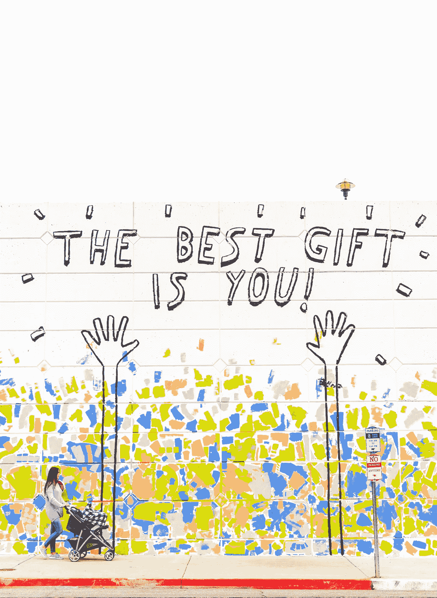

# 我在 LinkedIn 上联系的人

> 原文：<https://medium.com/codex/the-people-i-connect-with-on-linkedin-e4246ac48c35?source=collection_archive---------6----------------------->

我自己总结的什么是连线，累，或者绝对应该退休。

照片由[达科他·科尔宾](https://unsplash.com/@thedakotacorbin?utm_source=unsplash&utm_medium=referral&utm_content=creditCopyText)在 [Unsplash](https://unsplash.com/s/photos/linkedin-motivation?utm_source=unsplash&utm_medium=referral&utm_content=creditCopyText)

我不得不说，这不是我通常选择的反面乌托邦式的代表性文章形象，但我有充分的理由说明这一点。

我知道我最近写的关于 LinkedIn 的文章比平时多了一点。对于这一点，我只能道歉，如果你厌倦了听到现代的“脸书换工作”和…